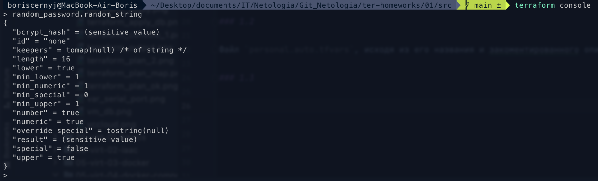
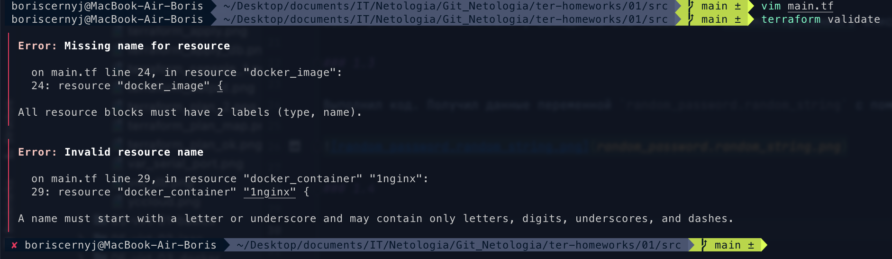
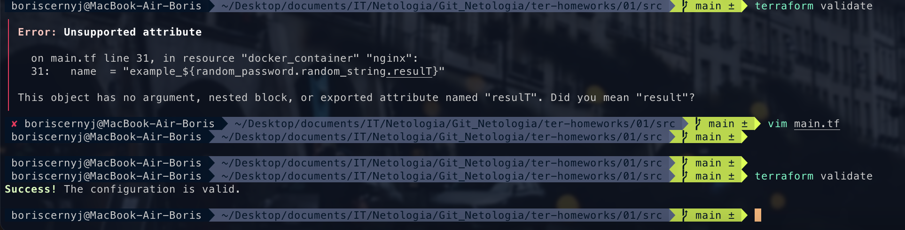
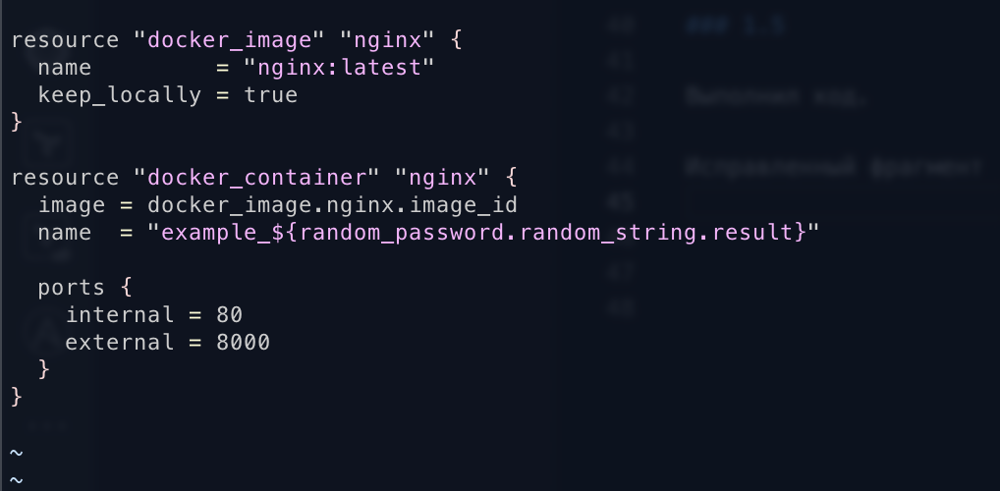
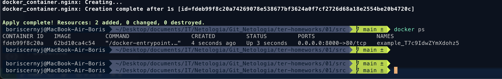
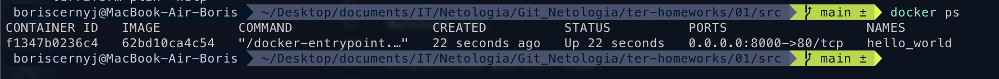
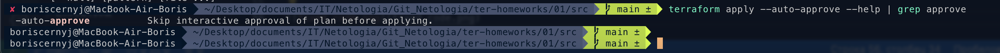
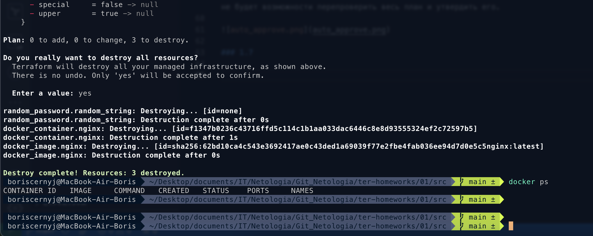
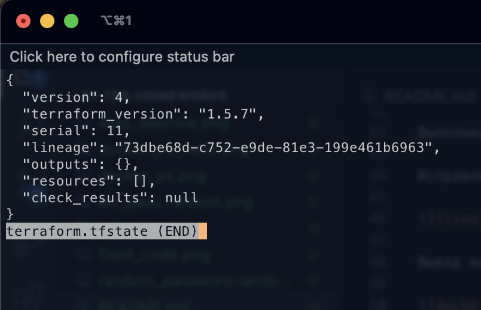
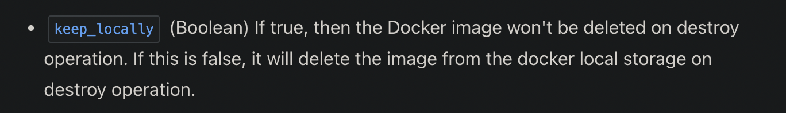

## Задача 1:
### 1.1 Скачайте зависимости, использованные в проекте.
### 1.2 В каком terraform-файле, согласно этому .gitignore, допустимо сохранить личную, секретную информацию?
### 1.3 Выполните код проекта. Найдите в state-файле секретное содержимое созданного ресурса random_password, пришлите в качестве ответа конкретный ключ и его значение.
### 1.4
### 1.5
### 1.6
### 1.7
### 1.8

## Ответ:

### 1.1

Зависимости скачал.

### 1.2

Файл `personal.auto.tfvars`, исходя из его названия и закоментированного описания

### 1.3

Выполнил код. Получил данные переменной `random_password.random_string` с помощью команды `terraform console`:

### 1.4

Ошибка `Missing name for resource` говорит о том что все блоки ресурсов должны содержать 2 лейбла (type и name) 
Ошибка `Invalid resource name` заключается в том что имя ресурса должно начинаться с буквы или нижнего подчёркивания,
и может содержать только: буквы, цифры, нижние подчёркивания и знак тире.

Ошибка `A managed resource "random_password" "random_string_FAKE" has not been declared in the root module.` говорила о том что нет таких ресурсов. Исправил имена на корректные, после чего команда `terraform validate` прошла успешно:

### 1.5

Выполнил код.

Исправленный фрагмент кода:

Вывод команды `docker ps`:

### 1.6

Заменил имя контейнера на `hello_world`:

Ключ `--auto-approve` позволяет пропустить предохранительное согласие на применение terraform плана.
А значит опасность заключается в том что если допустить ошибки в написании кода и применить план командой `terraform apply` то уже не будет возможности перепроверить весь план и утвердить его.

### 1.7

Выполнил команду `terraform destroy`:

Содержимое файла `terraform.tfstate`:

### 1.8

Обра `nginx:latest` не был удалён потому что при выполнении команды `terraform destroy` Terraform уничтожает только те ресурсы, которыми он управляет. По умолчанию, Terraform управляет удалением инфраструктурных компонентов, таких как виртуальные машины, базы данных, сетевые ресурсы и другие (которые были созданы с использованием Terraform).
Однако, Terraform не управляет настройкой или удалением Docker-образов и контейнеров напрямую. Docker-образы и контейнеры управляются собственными средствами Docker.

Скриншот документации:

