## Задача 0:
### Ознакомьтесь с документацией Yandex Cloud и запросите preview-доступ к "security-groups"

## Ответ:

С документацией ознакомился, доступ получил:

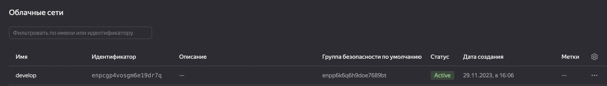

## Задача 1:
### 1.1) Изучите проект, переименуйте файл personal.auto.tfvars_example, сгенерируйте или используйте свой текущий ssh-ключ, инициализируйте проект и выполните код.
### 1.2) Ответьте, как в процессе обучения могут пригодиться параметры preemptible = true и core_fraction=5 в параметрах ВМ. Ответ в документации Yandex Cloud.

## Ответ 1.1:

Проект изучил, файл переименовал, использовал существующий ssh-ключ (записав его в переменную).
Инициализировал проект и успешно выполнил код.

Скриншот вывода команды terraform apply:

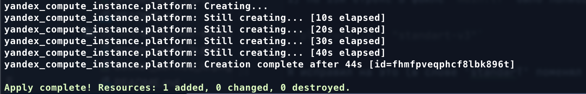

Скриншот ЛК Yandex Cloud с созданной ВМ:

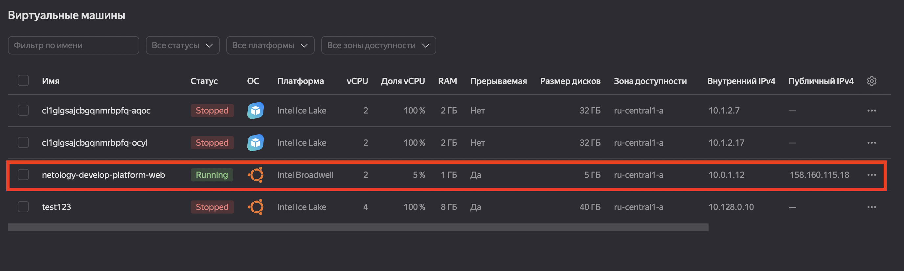

Cкриншот успешного подключения к консоли ВМ через ssh.

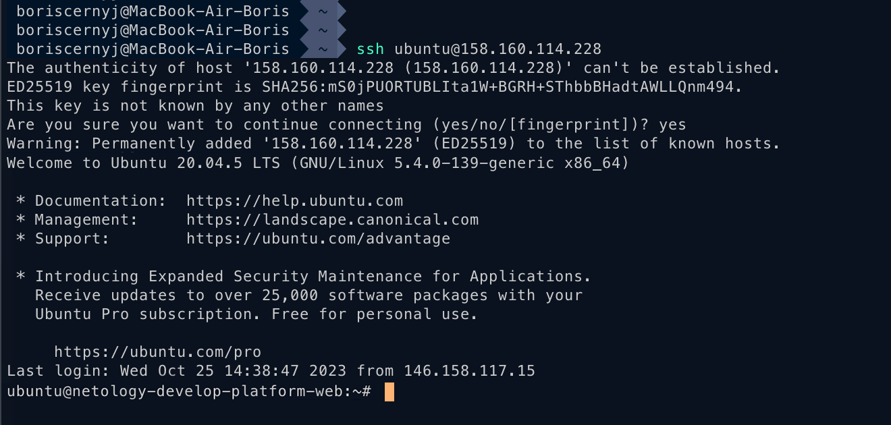

Также нашёл синтаксические ошибки:

1) на 15й строке в файле `main.tf` было написано:

`"platform_id = "standart-v3"` 

Я исправил на это (в слове 'standarT' поменял последнюю букву на 'standarD'):

`platform_id = "standard-v3"`

Затем заменил версию с `"standard-v3"` на `"standard-v1"`, и подкорректировал ресурсы ВМ:

`resources {
    cores         = 2
    memory        = 1
    core_fraction = 5
  }`

Поскольку чтобы создать ВМ с `cores = 1, memory = 1, core_fraction = 5` требуется `"standard-v1"`
(при условии что минимальные ресурсы будут `cores = 2, memory = 1, core_fraction = 5`)

## Ответ 1.2:

Данные параметры означают:
`preemptible = true` - разрешить прерывание ВМ со стороны YandexCloud в любое время без предупреждения (такие ВМ идут по большой скидке) 
`core_fraction=5` - доля (или "фракция") ресурсов процессора, выделенной определенной задаче или сервису в рамках общего вычислительного кластера.

## Задача 2:
### Изучите файлы, замените все хардкод-значения, объявите нужные переменные в файле variables.tf, проверьте terraform plan - изменений быть не должно.

## Ответ

Файлы изучил и заменил все хардкод значения.

Мои объявленные переменные (variables.tf):

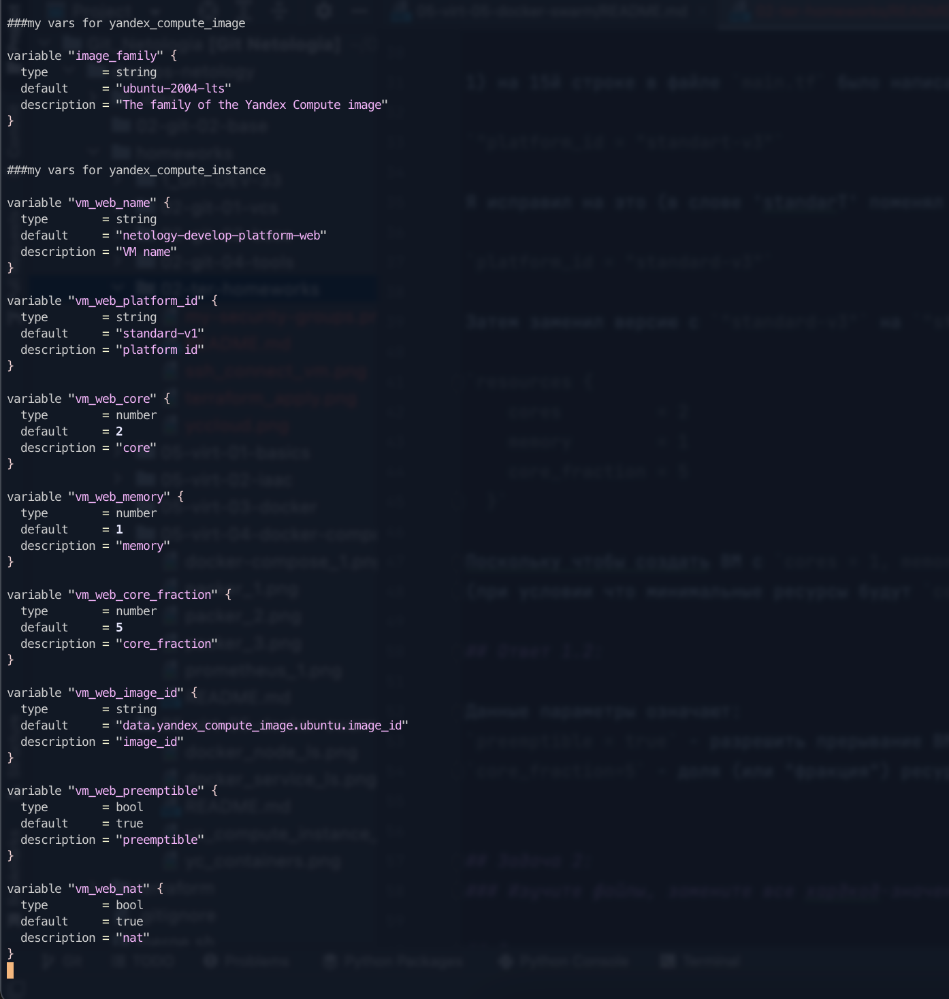

Проверил terraform plan - изменений нет.

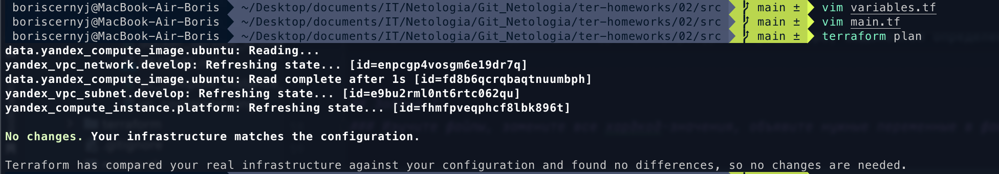

## Задача 3:
### Создать файл `vms_platform.tf` с переменными первой ВМ, на его основе создать вторую вм с именем:
`netology-develop-platform-db`
### и ресурсами:
`cores  = 2, memory = 2, core_fraction = 20`
### Объявите её переменные с префиксом vm_db_ в том же файле `vms_platform.tf` и примените изменения.

## Ответ

Файл `vms_platform.tf` с переменными для второй вм создал, указал нужные ресурсы.
Объявил её переменные.

ВМ создались успешно, вывод команды `terraform apply`:

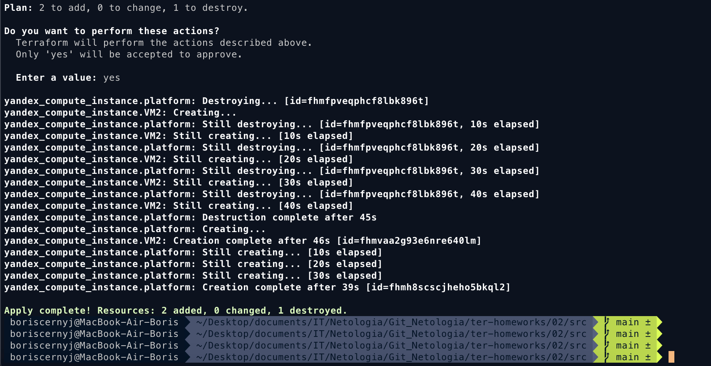

Скриншот личного кабинета с успешно созданными ВМ: 

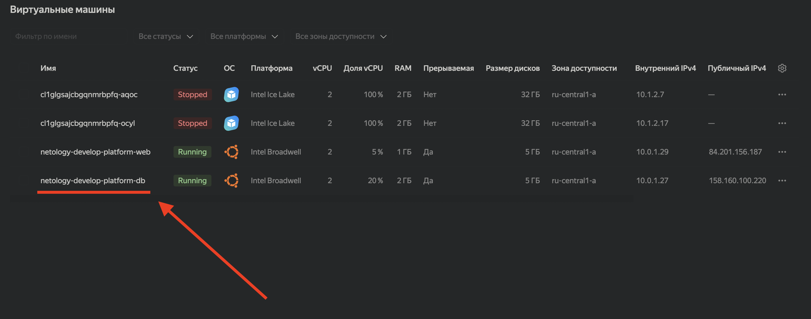

## Задача 4:
### Объявите в файле outputs.tf один output типа map, содержащий `{ instance_name = external_ip }` для каждой из ВМ.
### Примените изменения. В качестве решения приложите вывод значений ip-адресов команды `terraform output`.

## Ответ

Объявил в файле output типа map, применил изменения.
Вывод команды `terraform output`:

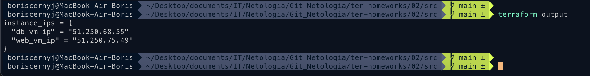

## Задача 5:
### В файле locals.tf опишите в одном local-блоке имя каждой ВМ, используйте интерполяцию ${..} с несколькими переменными по примеру из лекции.
### Замените переменные с именами ВМ из файла variables.tf на созданные вами local-переменные.
### Примените изменения.

## Ответ

Описал переменные в local-блоке в файле `locals.tf`, заменил переменные и применил изменения.
Вывод local-переменных в `terraform console`:

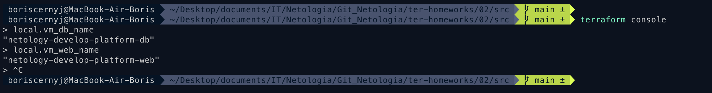

Вывод `terraform plan`:

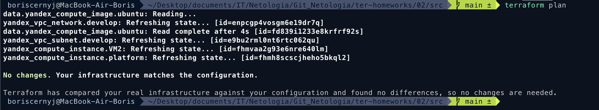

## Задача 6:
### 1) Вместо использования трёх переменных ".._cores",".._memory",".._core_fraction" в блоке resources {...}, объедините их в единую map-переменную vms_resources и внутри неё конфиги обеих ВМ в виде вложенного map.
### 2) Создайте и используйте отдельную map переменную для блока metadata, она должна быть общая для всех ваших ВМ.
### 3) Найдите и закоментируйте все, более не используемые переменные проекта.
### 4) Проверьте terraform plan. Изменений быть не должно.

## Ответ

1) Создал общую map-переменную для ресурсов ВМ (web и db):

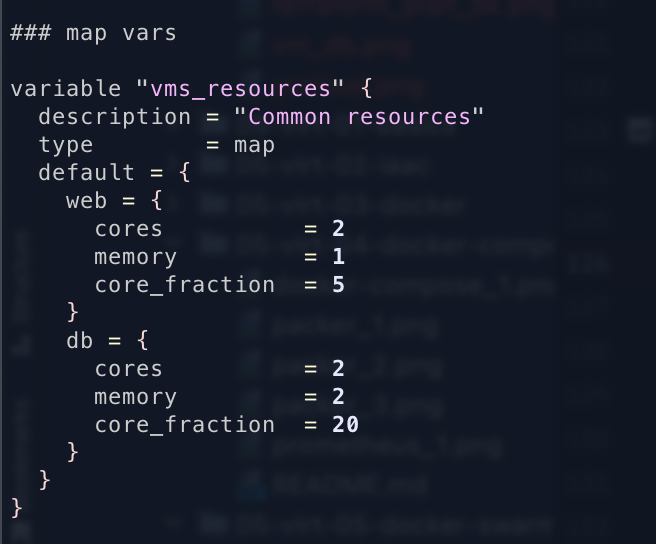

2) Также создал общую map-переменную для блока metadata.
Для этого создал в блоке `locals` переменную `ssh_keys_value`
(так как она динамическая, а значит просто так её не объявить. Поэтому добавил её в блок `locals`)

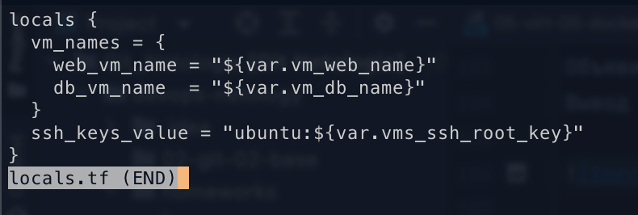

И отдельно в файле variables.tf объявил переменную для `serial-port-enable`: 

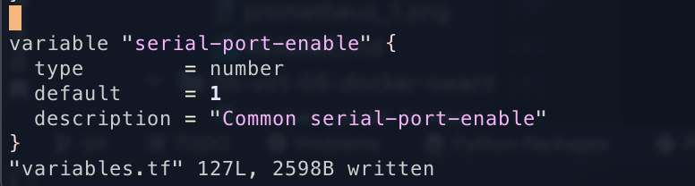

3) Закоментировал все неиспользуемые переменные, оставил нужные. Поправил файл main.tf.
 Итоговая конфигурация вм web и db:

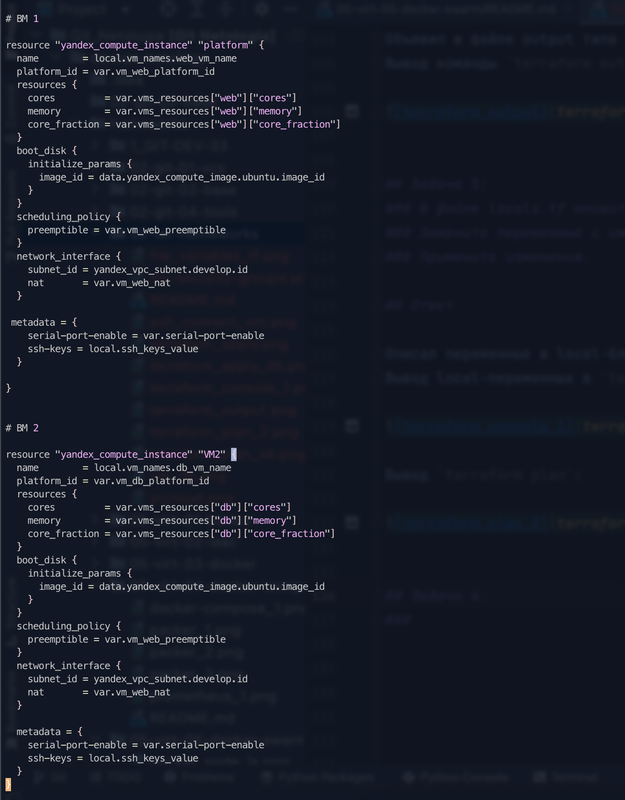

4) Ввёл команду terraform plan - изменений нет:

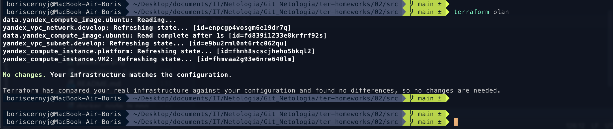

