## Задача 1:
### Изучите проект. Заполните файл personal.auto.tfvars. Инициализируйте проект, выполните код
## Задача 2:
### 2.1 Создайте файл count-vm.tf. Опишите в нём создание двух одинаковых ВМ web-1 и web-2 (не web-0 и web-1) с минимальными параметрами, используя мета-аргумент count loop. Назначьте ВМ созданную в первом задании группу безопасности.
### 2.2 Создайте файл for_each-vm.tf. Опишите в нём создание двух ВМ для баз данных с именами "main" и "replica" разных по cpu/ram/disk , используя мета-аргумент for_each loop.
## Задача 3:
### 3.1 Создайте 3 одинаковых виртуальных диска размером 1 Гб с помощью ресурса yandex_compute_disk и мета-аргумента count в файле disk_vm.tf .
### 3.2 Создайте в том же файле одиночную(использовать count или for_each запрещено из-за задания №4) ВМ c именем "storage" . Используйте блок dynamic secondary_disk{..} и мета-аргумент for_each для подключения созданных вами дополнительных дисков.
## Задача 4:
### 4.1 В файле ansible.tf создайте inventory-файл для ansible. Используйте функцию tepmplatefile и файл-шаблон для создания ansible inventory-файла из лекции. Готовый код возьмите из демонстрации к лекции demonstration2. Передайте в него в качестве переменных группы виртуальных машин из задания 2.1, 2.2 и 3.2, т. е. 5 ВМ.
### 4.2 Инвентарь должен содержать 3 группы и быть динамическим, т. е. обработать как группу из 2-х ВМ, так и 999 ВМ.
### 4.3 Добавьте в инвентарь переменную fqdn.

## Ответ:

### 1

Код выполнил, создал сеть:

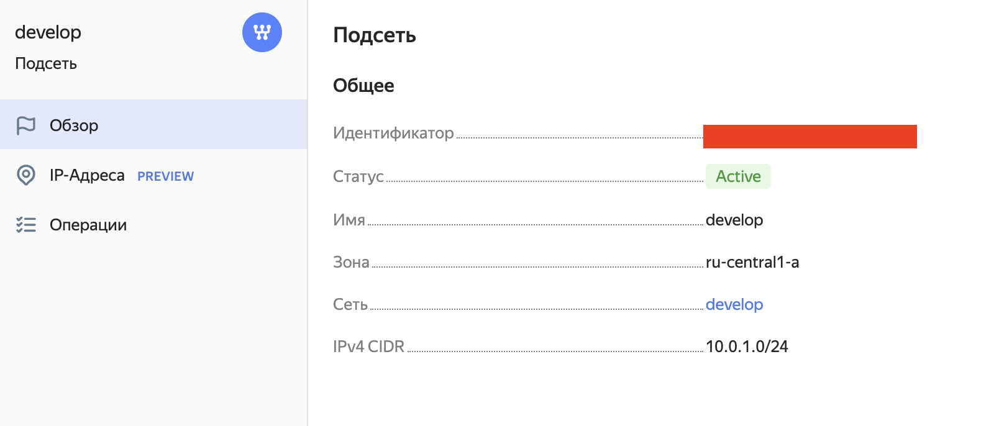

### 2 
#### 2.1
Создал две ВМ `web-1` и `web-2` используя мета-аргумент `count loop` и назначи созданную раннее группу безопасности `example_dynamic`:

ВМ:
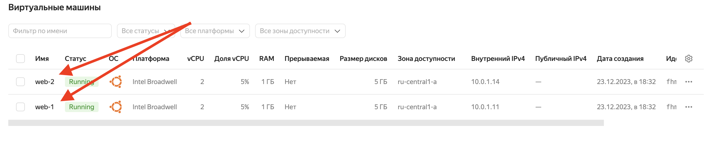

Security groups:
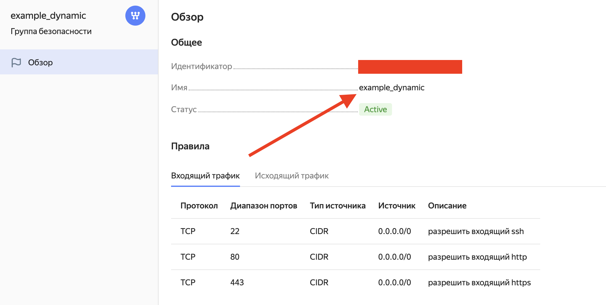

#### 2.2

Файл создал, описал 2 ВМ `main` и `replica` c разными: `cpu/ram/disk` используя `for_each loop`.

#### Использовались раннее созданные диски, так как в условиях задачи не уточняется, создавать новые прямо в коде terraform или использовать уже созданные.
#### Однако, здесь по-прежнему параметр disk используется в мета-аргументе for_each loop (согласно заданию).
Соответственно, хардкода по прежнему нет, так как id дисков скрыты переменными `each.value.disk`

Элемент кода с `for_each loop`:
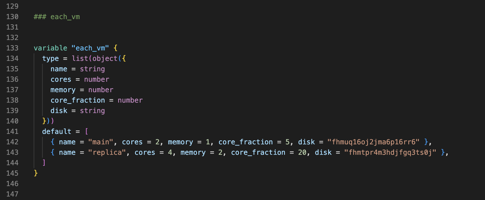

Созданные ВМ:
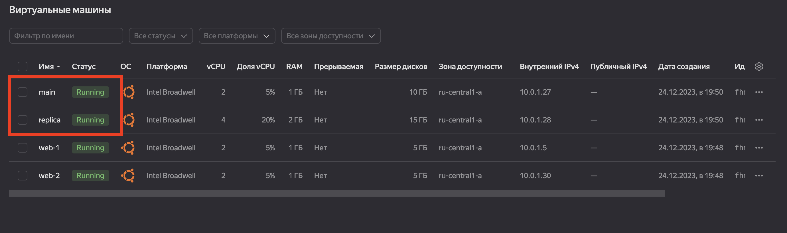

Разные `cpu/ram/disk` у `main`:
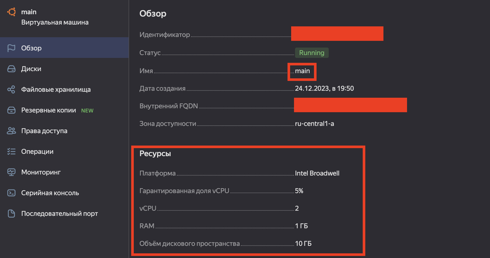

Разные `cpu/ram/disk` у `replica`:
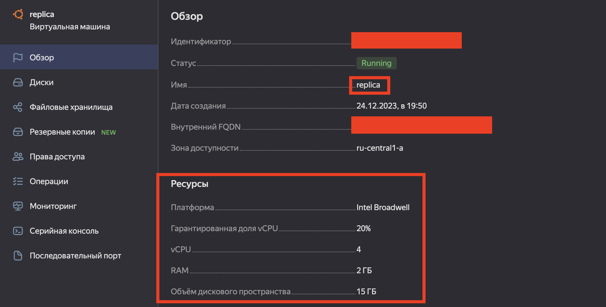

ВМ из пункта 2.1 (count-vm.tf) создаются после ВМ из пункта 2.2 (for_each-vm.tf) благодаря функции depends_on, записанной в файле `for_each-vm.tf`:
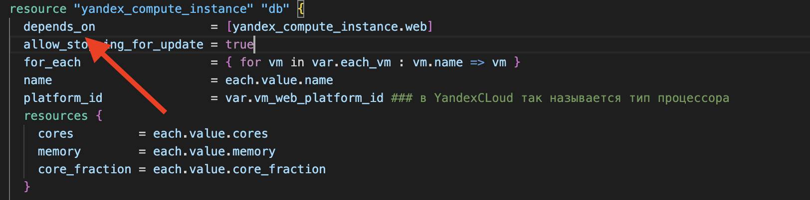

Использовал функцию file в local-переменной для считывания `pub-ключа` в блоке metadata для всех моих ВМ. Успешно выполнил код:
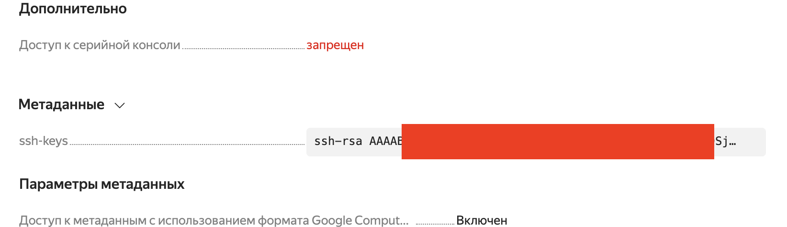

### 3 

#### 3.1

Создал 3 одинаковых виртуальных диска размером 1 Гб с помощью ресурса `yandex_compute_disk` и мета-аргумента `count` в файле `disk_vm.tf`

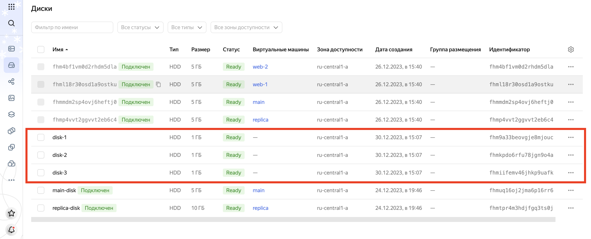

#### 3.2

Создал в том же файле одиночную ВМ c именем `storage`, используя блок `dynamic secondary_disk{..}` и мета-аргумент `for_each` для подключения созданных мною дополнительных дисков

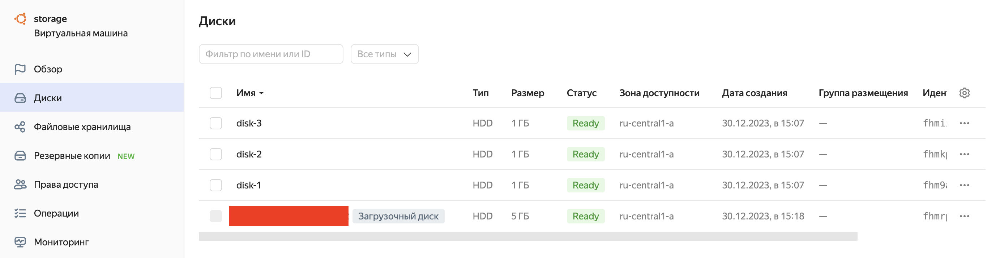

### 4
#### 4.1

Создал файл `ansible.tf` и передал в него ВМ исползуя функцию `tepmplatefile` (туда же поместил код из `demonstration2`)

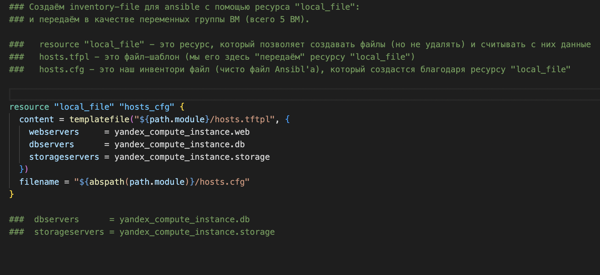

#### 4.2 

Мой шаблон динамического inventory-файла с 3я группами ВМ:

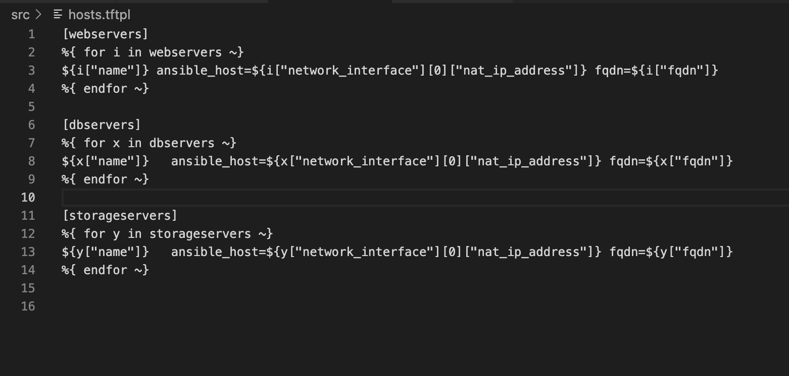

### 4.3

И туда же добавил переменную `fqdn`:

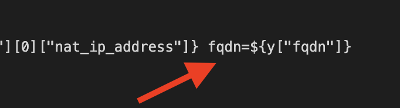

Готовый результат автоматически-созданного inventory-файла:

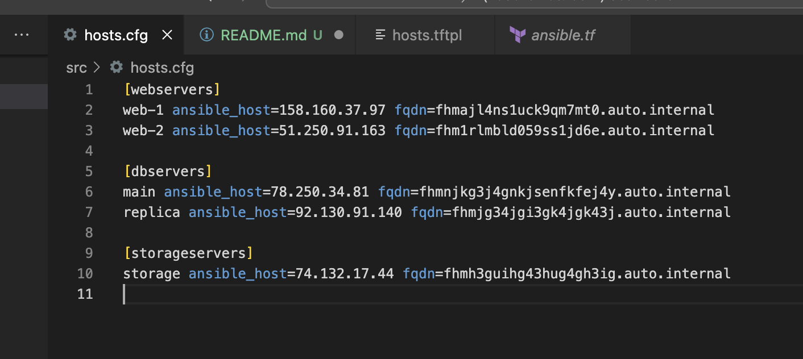

Скриншот личного кабинета с `Внешними IP адресами`:

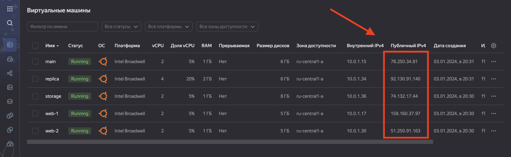
