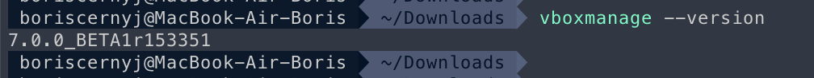
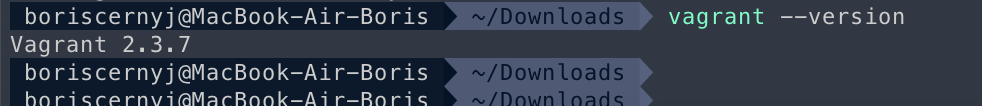
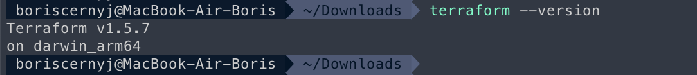
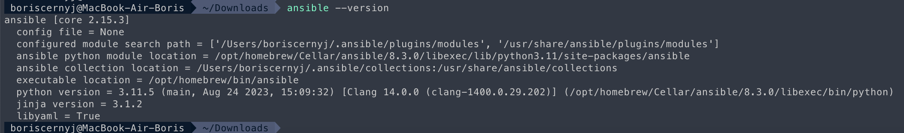
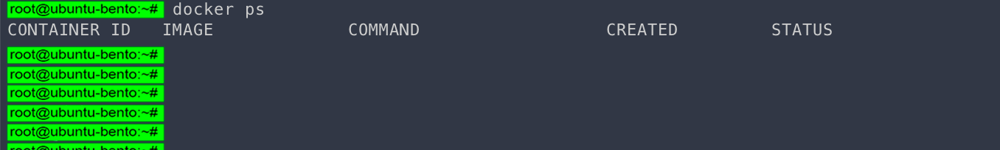
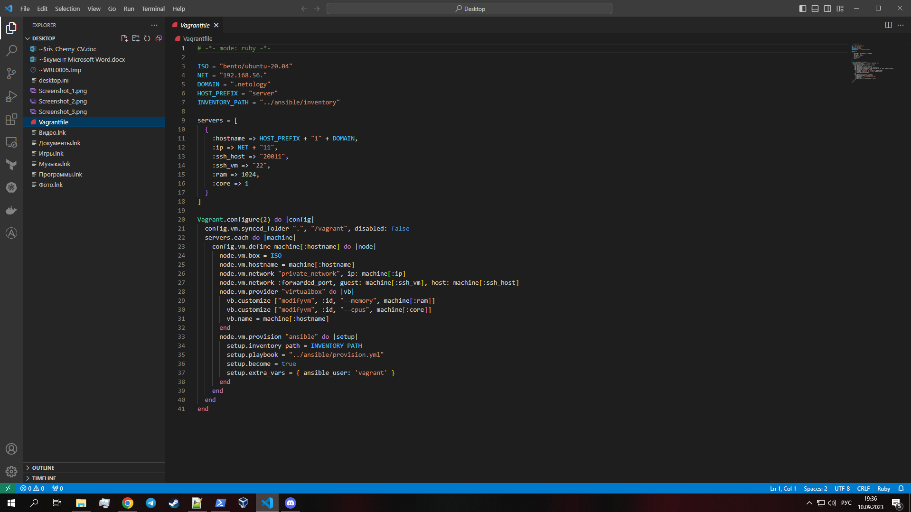
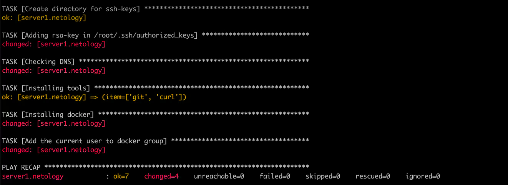
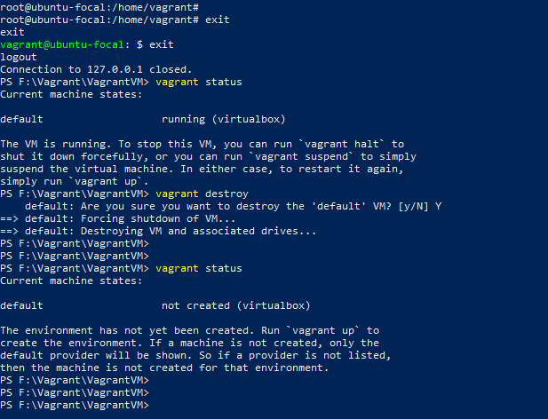

## Задача 1:
### 1) Опишите основные преимущества применения на практике IaaC-паттернов.
### 2) Какой из принципов IaaC является основополагающим?

## Ответ:

1) Всего есть 3 основным преимущества IaaC подхода: цена, скорость и уменьшение рисков.  
Уменьшение расходов относится не только к финансовой составляющей, но и к количеству времени, затраченному на рутинные операции.  
Скорость - это автоматизация, а автоматизация - это эффективное распределение и использование ресурсов для большей эффективности и меньших затрат.  
Тем самым, автоматизация позволяет добиться "Уменьшение рисков" - исключается человеческий фактор.

2) Описание инфраструктуры как код для единения принципов управления самой инфраструктуры, её упрощения, стандартизации и автоматизации.

## Задача 2:
### 1) Чем Ansible выгодно отличается от других систем управление конфигурациями?
### 2) Какой, на ваш взгляд, метод работы систем конфигурации более надёжный — push или pull?

## Ответ:

1) Основные преимущества Ansible - это простота в установке (не требующая установки агентов на каждый из конечных узлов), его распространённость, популярный .yaml формат, а также то что Ansible является open source и бесплатным инструментом (открытый исходный код).
2) С одной стороны Pull режим будет надёжнее - поскольку в Push режиме не всегда ясно, дошла ли конфигурация, и корректно ли она применилась.  
С другой стороны - Push режим гарантированно отправит на удалённые хосты конфигурацию со стороны управляюего сервера, и на нём же это будет видно.
Вероятнее всего ответ на вопрос о самом надёжном методе - Push режим. Поскольку не понятно, запросил ли абсолютно каждый удалённый хост изменения или нет,
насколько корректно они применились и прочие нюансы.

## Задача 3:
### Установите на личный компьютер: VirtualBox, Vagrant, Terraform, Ansible.
### Приложите вывод команд установленных версий каждой из программ, оформленный в Markdown

## Ответ:

1) VirtualBox (для управления VirtualBox в CLI возможно только через команду "vboxmanage")

` boriscernyj@MacBook-Air-Boris ~ vboxmanage --version`  
`7.0.0_BETA1r153351`

2) Vagrant

` boriscernyj@MacBook-Air-Boris ~ vagrant --version`  
`Vagrant 2.3.7`

3) Terraform

` boriscernyj@MacBook-Air-Boris ~ terraform --version`  
`Terraform v1.5.7`  
`on darwin_arm64`

4) Ansible

` boriscernyj@MacBook-Air-Boris ~ ansible --version`  
`ansible [core 2.15.3]`  
`  config file = None`  
`  configured module search path = ['/Users/boriscernyj/.ansible/plugins/modules', '/usr/share/ansible/plugins/modules']`  
`  ansible python module location = /opt/homebrew/Cellar/ansible/8.3.0/libexec/lib/python3.11/site-packages/ansible`  
`  ansible collection location = /Users/boriscernyj/.ansible/collections:/usr/share/ansible/collections`  
`  executable location = /opt/homebrew/bin/ansible`  
`  python version = 3.11.5 (main, Aug 24 2023, 15:09:32) [Clang 14.0.0 (clang-1400.0.29.202)] (/opt/homebrew/Cellar/ansible/8.3.0/libexec/bin/python)`  
`  jinja version = 3.1.2`  
`  libyaml = True `

## Задача 4:
### Воспроизведите практическую часть лекции самостоятельно.
### Создайте виртуальную машину.
### Зайдите внутрь ВМ, убедитесь, что Docker установлен с помощью команды

## Ответ:

Докер установлен:

Мой Vagrantfile:

Запускаю Ansible playbook:

Успешно удаляю виртуальную машину используя vagrant destroy:

