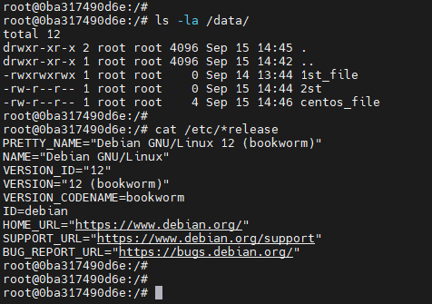
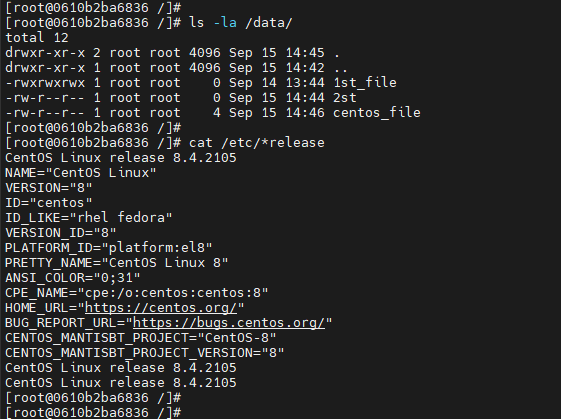
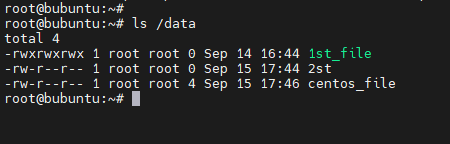

## Задача 1:
### Создать репозиторий, сделать fork от образа с nginx, реализовать функционал с .html кодом, опубликовать его.

## Ответ:

Ссылка на репозиторий:
https://hub.docker.com/r/falaning/my-nginx

Ссылка на веб-страницу (доступно из интернета):
http://92.63.97.42:3456/

## Задача 2:
### Посмотрите на сценарий ниже и ответьте на вопрос: «Подходит ли в этом сценарии использование Docker-контейнеров или лучше подойдёт виртуальная машина, физическая машина? Может быть, возможны разные варианты?»

## Ответ:

1) Высоконагруженное монолитное Java веб-приложение:
 - Виртуальная машина: Виртуальная машина лучше всего подходит для развертывания такого Java-приложения, так как приложение монолитное и высоконагруженное - а значит требует большей отказоустойчивости. Она обеспечивает изоляцию, но может быть более ресурсоемкой по сравнению с Docker-контейнерами - зато с большим функционалом.

2) Node.js веб-приложение:
 - Docker-контейнеры: Здесь Docker-контейнеры хорошо подходят для Node.js веб-приложений, так как обеспечивают легкую упаковку приложения со всеми зависимостями. Они позволяют создавать портативные и повторно используемые контейнеры для легкого развертывания на разных средах.

3) Мобильное приложение с версиями для Android и iOS:
 - Docker-контейнеры: Docker-контейнеры могут быть полезными для упаковки серверных компонентов или компонентов бэкенда, связанных с мобильным приложением. Например, контейнеры могут использоваться для развертывания сервера API, базы данных или других компонентов, которые обслуживают мобильное приложение.

4) Шина данных на базе Apache Kafka:
 - Виртуальная машина: Виртуальную машину можно использовать для предоставления окружения для Apache Kafka. Например, каждая нода Kafka может запускаться на отдельной виртуальной машине.

5) Elasticsearch-кластер для логирования продуктивного веб-приложения:
 - Docker-контейнеры: Docker-контейнеры крайне полезны для развертывания Elasticsearch-кластера. Они упрощают управление и масштабирование кластера, а также обеспечивают изоляцию между нодами кластера.

6) Мониторинг-стек на базе Prometheus и Grafana:
 - Docker-контейнеры: Docker-контейнеры идеальны для развертывания Prometheus и Grafana. Они обеспечивают изоляцию и возможность масштабирования мониторинг-составляющих. К тому же, есть уже множество готовых образов содержащих в себе каждый из перечисленных инструментов.

7) MongoDB как основное хранилище данных для Java-приложения:
 - Docker-контейнеры: Docker-контейнеры в большинстве случаев как раз и используются для развертывания MongoDB, поскольку обеспечивают необходимую изоляцию и простоту масштабирования.

8) GitLab-сервер для CI/CD и Private Docker Registry:
 - Виртуальная машина: В данной ситуации виртуальная машина лучший вариант, поскольку обеспечивает больший функционал, но может потребовать больше ресурсов.

## Задача 3:
### Запустить 2 контейнера с centos и debian, подключить к ним директорию /data.
### В контейнере centos в директории /data создать любой файл, затем отобразить этот же файл, но в контейнере debian.

## Ответ:

Файлы в контейнере Debian 

Файлы в контейнере Centos

Файлы на хост системе

