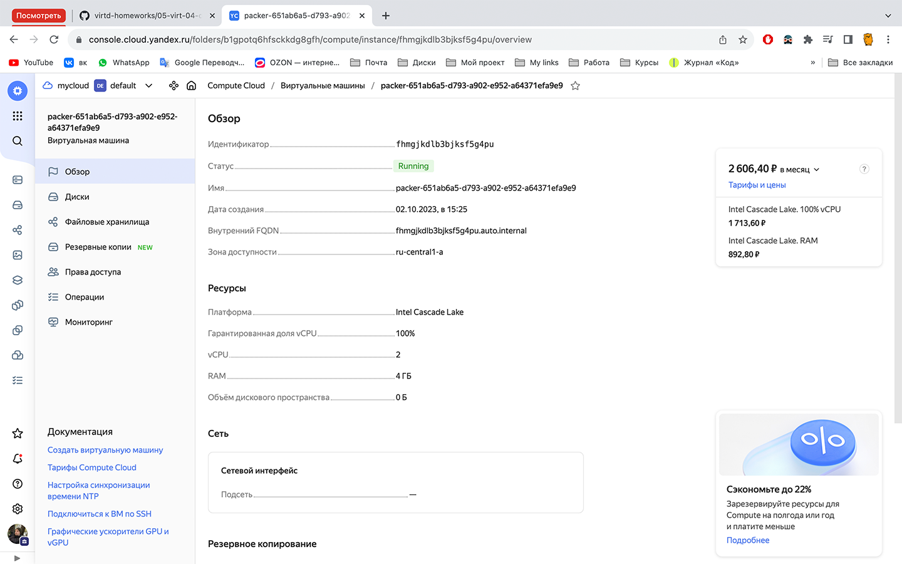
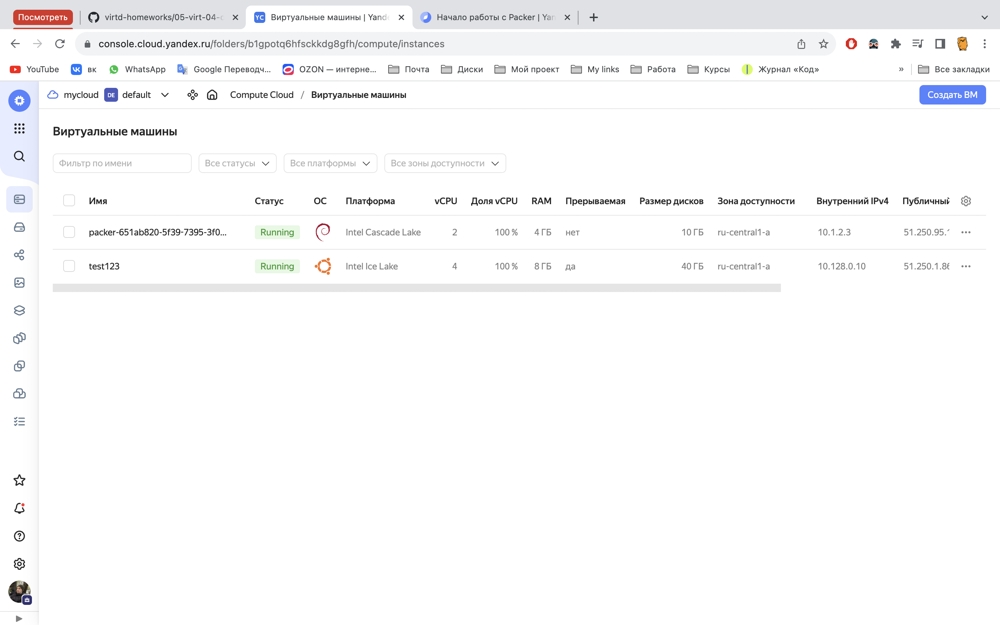
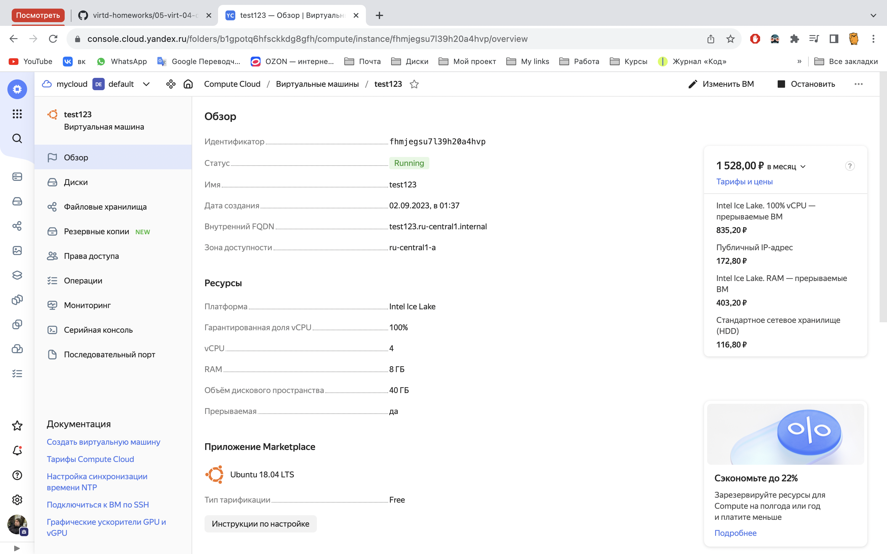
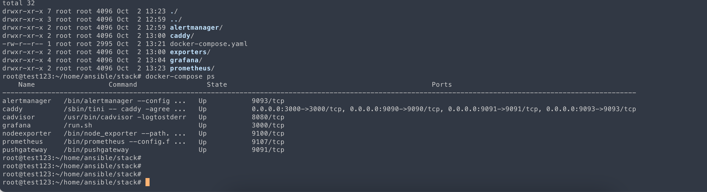
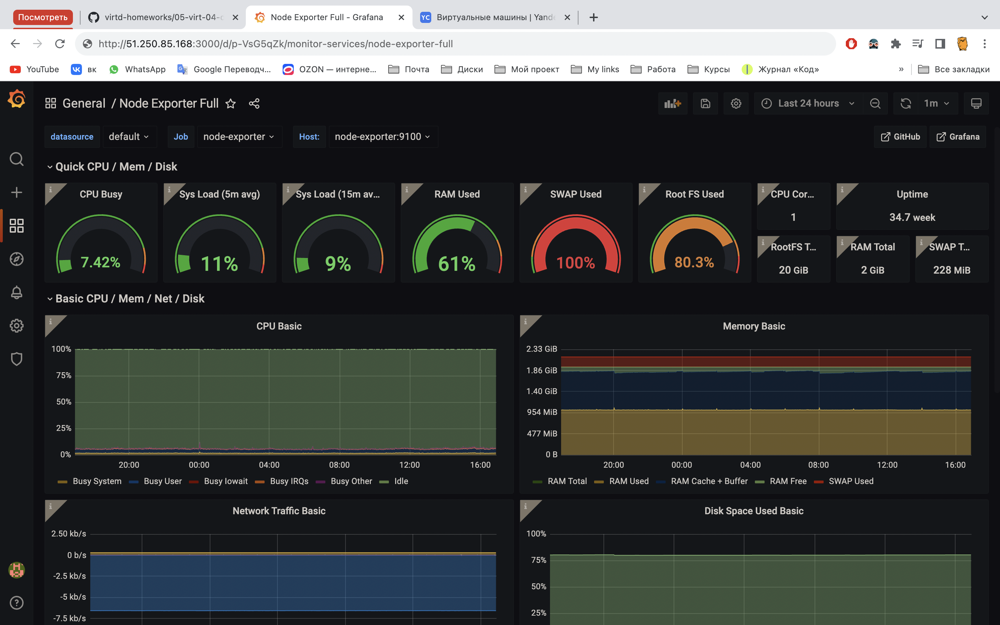

## Задача 1:
### Создайте собственный образ любой операционной системы (например, debian-11) с помощью Packer

## Ответ:

Мой образ Debian 11

## Задача 2:
### Создайте вашу первую виртуальную машину в YandexCloud с помощью web-интерфейса YandexCloud.

## Ответ:

Моя ВМ "test123" на Ubuntu, созданная с помощью Web-интерфейcа 

Cтраница свойств созданной ВМ из личного кабинета YandexCloud.

## Задача 3:
### С помощью Ansible и Docker Compose разверните на виртуальной машине из предыдущего задания систему мониторинга на основе Prometheus/Grafana. Используйте Ansible-код в директории (src/ansible).

## Ответ:

Вывод команды `docker-compose ps` (то же самое что и `docker ps`)

## Задача 4:
### Предоставить скриншот работающего веб-интерфейса Grafana с текущими метриками.

## Ответ:

Вывод работающей Grafana

