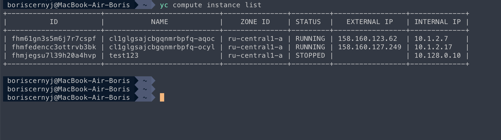

## Задача 1:
### Дайте письменые ответы на вопросы:

* В чём отличие режимов работы сервисов в Docker Swarm-кластере: replication и global?
* Какой алгоритм выбора лидера используется в Docker Swarm-кластере?
* Что такое Overlay Network?

## Ответ:

1. Режим воспроизведения (replication mode):
   - В режиме воспроизведения создается несколько реплик одного сервиса, и каждая реплика запускается на разных узлах (нодах) в кластере.
   - Количество реплик определяет количество экземпляров сервиса, которые будут работать в кластере. Например, если задано --replicas 3, то в кластере будет развернуто три реплики сервиса на разных узлах.
   - Режим воспроизведения обычно используется для горизонтального масштабирования сервиса, чтобы иметь несколько экземпляров для балансировки нагрузки и повышения отказоустойчивости.
   - В этом режиме Docker Swarm пытается поддерживать заданное количество реплик сервиса в работающем состоянии. Если одна или несколько реплик остановлены или не доступны, Docker Swarm автоматически запустит новые экземпляры сервиса на доступных узлах.

2. Режим глобального размещения (global mode):
   - В режиме глобального размещения будет создан один экземпляр сервиса на каждом узле в кластере.
   - Режим глобального размещения обычно используется для развертывания сервисов, которые должны работать на каждом узле, таких как мониторинговые агенты или лог-сборщики.
   - В этом режиме Docker Swarm автоматически создает и запускает экземпляр сервиса на каждом доступном узле и поддерживает этот экземпляр работающим.
   - Если добавляется новый узел в кластер, Docker Swarm автоматически создает и запускает экземпляр сервиса на новом узле.

## Задача 2:
### Создайте ваш первый Docker Swarm-кластер в Яндекс Облаке.

## Ответ:

Вывод команды `docker node ls`:

Вывод из Yandex Cloud CLI:

Скриншот из личного кабинета Yandex Cloud:

## Задача 3:
### Создайте ваш первый, готовый к боевой эксплуатации кластер мониторинга, состоящий из стека микросервисов.

## Ответ:

Я развернул кластер на основе стека: grafana + prometheus (node-exporter поставил чтобы учитывать текущий контейнер в мониторинге)

Вывод команды `docker service ls`:

## Задача 4:
### Выполните на лидере Docker Swarm-кластера команду, указанную ниже, и дайте письменное описание её функционала — что она делает и зачем нужна:
`docker swarm update --autolock=true`

## Ответ:

> Команда docker swarm update --autolock=true используется для включения автоматической блокировки управления Docker Swarm кластером.
> Docker Swarm имеет функциональность блокировки управления, которая позволяет защитить кластер от неавторизованного доступа и изменений в его конфигурации. Когда блокировка включена, операции управления, такие как добавление, удаление или изменение сервисов, секретов, конфигураций и других аспектов кластера, могут быть выполнены только при наличии правильного ключа блокировки.  
> Когда вы используете команду docker swarm update --autolock=true, вы включаете автоматическую блокировку управления кластером. Это означает, что после включения автоматической блокировки, Docker Swarm не будет выполнять операции управления без предоставления правильного ключа блокировки.
