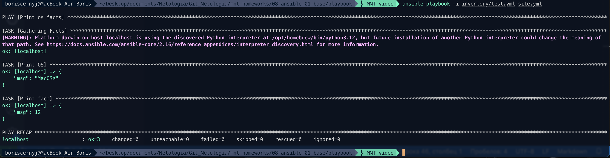

## Задача 1

### Попробуйте запустить playbook на окружении из test.yml, зафиксируйте значение, которое имеет факт some_fact для указанного хоста при выполнении playbook

## Задача 2

### Найдите файл с переменными (group_vars), в котором задаётся найденное в первом пункте значение, и поменяйте его на all default fact

## Задача 3

### Воспользуйтесь подготовленным (используется docker) или создайте собственное окружение для проведения дальнейших испытаний

## Задача 4

### Проведите запуск playbook на окружении из prod.yml. Зафиксируйте полученные значения some_fact для каждого из managed host

## Задача 5

### Добавьте факты в group_vars каждой из групп хостов так, чтобы для some_fact получились значения: для deb — deb default fact, для el — el default fact

## Задача 6

### Повторите запуск playbook на окружении prod.yml. Убедитесь, что выдаются корректные значения для всех хостов

## Задача 7

### При помощи ansible-vault зашифруйте факты в group_vars/deb и group_vars/el с паролем netology

## Задача 8

### Запустите playbook на окружении prod.yml. При запуске ansible должен запросить у вас пароль. Убедитесь в работоспособности

## Задача 9

### Посмотрите при помощи ansible-doc список плагинов для подключения. Выберите подходящий для работы на control node

## Задача 10

### В prod.yml добавьте новую группу хостов с именем local, в ней разместите localhost с необходимым типом подключения

## Задача 11

### Запустите playbook на окружении prod.yml. При запуске ansible должен запросить у вас пароль. Убедитесь, что факты some_fact для каждого из хостов определены из верных group_vars

## Задача 12

### Заполните README.md ответами на вопросы. Сделайте git push в ветку master. В ответе отправьте ссылку на ваш открытый репозиторий с изменённым playbook и заполненным README.md

## Задача 13

### Предоставьте скриншоты результатов запуска команд

## Ответ

### 1

Запустил playbook, зафиксировал значение факта: 12



### 2

Нашёл нужный файл с переменными (`all/examp.yml`) и  поменял в нём найдённое значение на `all default fact`:


### 3

Вместо Docker-окружения создал собственное виртуальное окружение у хостинг-провайдера `YandexCloud`:


И переписал `inventory/prod.yml` под свои хосты:


### 4

Запустил playbook на окружении из `prod.yml`. Зафиксируйте полученные значения `some_fact` для каждого из managed host:

```
ok: [centos7] => {
    "msg": "el"
}
ok: [ubuntu] => {
    "msg": "deb"
}
```

Вывод плейбука:


### 5

Добавил факты в `group_vars` так, чтобы для `some_fact` получились значения: `deb — deb default fact`,  `el — el default fact`

Для `deb`:


Для `el`:


### 6

Запустил playbook на окружении `prod.yml`. Значения корректные:


### 7

Зашифруйте факты в `group_vars/deb` и `group_vars/el` с паролем: `netology`


### 8

Запустил playbook на окружении `prod.yml`. Пароль был запрошен и принят с помощью флага `--ask-vault-pass`:


### 9

Посмотрите список плагинов, подходящий для control node - `local` (`ansible.builtin.local`)


### 10

Добавил в `prod.yml` новую группу хостов с именем `local`, там же разместил `localhost` с необходимым типом подключения.


### 11

Запустил playbook на окружении `prod.yml`. Факты также определены верно:


### 12

Заполнил данный `README.md`, сделал `git push` в ветку master.


### 13

Предоставляю скриншоты результатов запуска команд в данном `README.md` файле.
Здесь же есть директория `playbook` со всем кодом.


