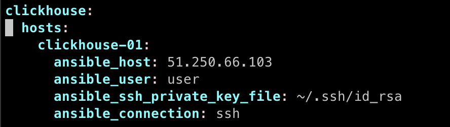
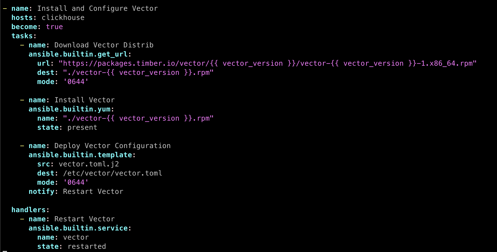
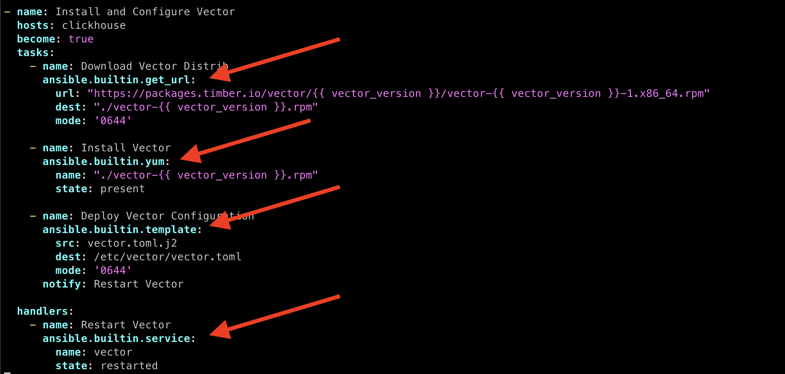
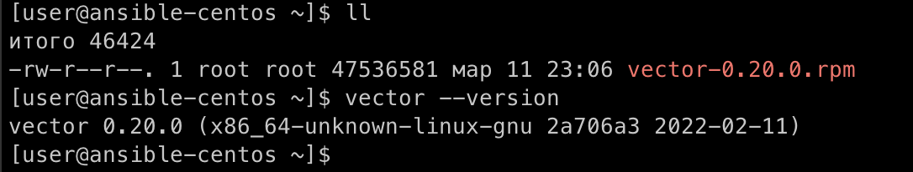
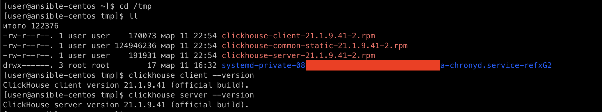
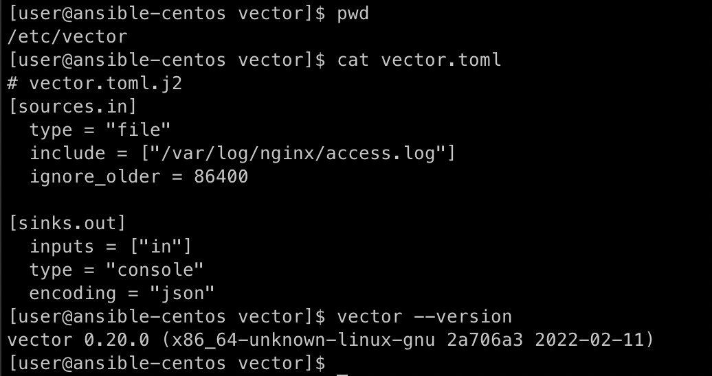
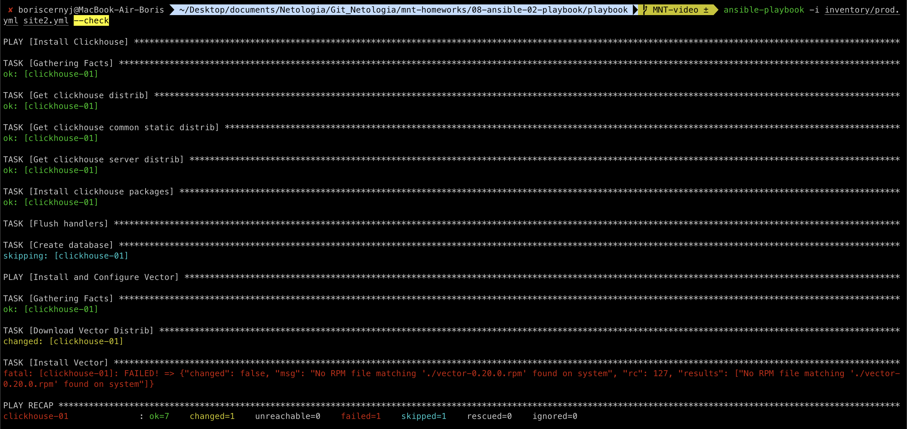
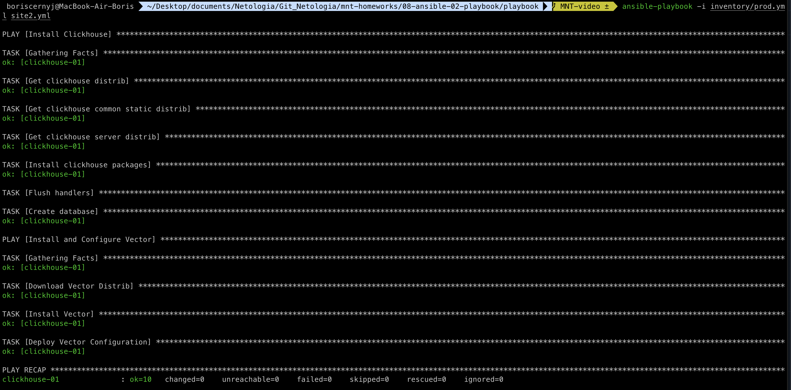

## Задачи

### Задача 1

Подготовьте свой inventory-файл prod.yml.

### Задача 2

Допишите playbook: нужно сделать ещё один play, который устанавливает и настраивает vector. Конфигурация vector должна деплоиться через template файл jinja2. Также нужно сделать handler на перезапуск vector в случае изменения конфигурации.

### Задача 3

При создании tasks рекомендую использовать модули: get_url, template, unarchive, file.

### Задача 4

Tasks должны: скачать дистрибутив нужной версии, выполнить распаковку в выбранную директорию, установить vector.

### Задача 5

Запустите ansible-lint site.yml и исправьте ошибки, если они есть.

### Задача 6

Попробуйте запустить playbook на этом окружении с флагом --check.

### Задача 7

Запустите playbook на prod.yml окружении с флагом --diff. Убедитесь, что изменения на системе произведены.

### Задача 8

Повторно запустите playbook с флагом --diff и убедитесь, что playbook идемпотентен.

### Задача 9

Подготовьте README.md-файл по своему playbook.

### Задача 10

Готовый playbook выложите в свой репозиторий, поставьте тег 08-ansible-02-playbook на фиксирующий коммит, в ответ предоставьте ссылку на него.

## Ответ

### 1

Подготовил inventory-файл prod.yml.
Использовал ВМ на `CentOS 7`:



### 2

Дописал playbook, сделал дополнительный play на установку и настройку `vector`. Также, конфиг деплоиться через template файл `jinja2`. Сделал handler на перезапуск vector в случае изменения конфигурации.



### 3

В play использовал модули: `get_url, template, yum, service.`



### 4

Tasks скачивают дистрибутив версии `0.20.0`, распаковывают в корневую директорию (получается `./vector-0.20.0.rpm`), после чего происходит установка с помощью модуля `yum`.

Итог: Vector (как и Clickhouse) установлен на хост, также задеплоен конфигурационный файл `vector.toml.j2` (который на хосте сохраняется как `vector.toml`)

Работающий Vector:



Работающий Clickhouse:



Конфиг файл на хосте:



### 5

Запустил `ansible-lint` и исправил следующие ошибки (после исправления запустил playbook повторно и он применился корректно):

```
WARNING  Listing 8 violation(s) that are fatal
name[missing]: All tasks should be named.
site.yml:11 Task/Handler: block/always/rescue

risky-file-permissions: File permissions unset or incorrect.
site.yml:12 Task/Handler: Get clickhouse distrib

risky-file-permissions: File permissions unset or incorrect.
site.yml:18 Task/Handler: Get clickhouse distrib

fqcn[action-core]: Use FQCN for builtin module actions (meta).
site.yml:30 Use ansible.builtin.meta or ansible.legacy.meta instead.

jinja[spacing]: Jinja2 spacing could be improved: create_db.rc != 0 and create_db.rc !=82 -> create_db.rc != 0 and create_db.rc != 82 (warning)
site.yml:32 Jinja2 template rewrite recommendation: create_db.rc != 0 and create_db.rc != 82.

risky-file-permissions: File permissions unset or incorrect.
site.yml:44 Task/Handler: Download Vector distrib

risky-file-permissions: File permissions unset or incorrect.
site.yml:54 Task/Handler: Deploy Vector configuration

name[casing]: All names should start with an uppercase letter.
site.yml:61 Task/Handler: restart vector

Read documentation for instructions on how to ignore specific rule violations.

                    Rule Violation Summary
 count tag                    profile    rule associated tags
     1 jinja[spacing]         basic      formatting (warning)
     1 name[missing]          basic      idiom
     1 name[casing]           moderate   idiom
     4 risky-file-permissions safety     unpredictability
     1 fqcn[action-core]      production formatting

Failed: 7 failure(s), 1 warning(s) on 1 files. Last profile that met the validation criteria was 'min'.
```

### 6

Также ранее запускал playbook с флагом `--check`:



### 7

Ещё запускал playbook с флагом `--diff`, изменения применились.

Запуск playbook с флагом `--diff`:

```
$ ansible-playbook -i inventory/prod.yml site2.yml --diff

PLAY [Install Clickhouse] ********************************************************************************************************************************************************

TASK [Gathering Facts] ***********************************************************************************************************************************************************
ok: [clickhouse-01]

TASK [Get clickhouse distrib] ****************************************************************************************************************************************************
ok: [clickhouse-01]

TASK [Get clickhouse common static distrib] **************************************************************************************************************************************
ok: [clickhouse-01]

TASK [Get clickhouse server distrib] *********************************************************************************************************************************************
ok: [clickhouse-01]

TASK [Install clickhouse packages] ***********************************************************************************************************************************************
ok: [clickhouse-01]

TASK [Flush handlers] ************************************************************************************************************************************************************

TASK [Create database] ***********************************************************************************************************************************************************
ok: [clickhouse-01]

PLAY [Install and Configure Vector] **********************************************************************************************************************************************

TASK [Gathering Facts] ***********************************************************************************************************************************************************
ok: [clickhouse-01]

TASK [Download Vector Distrib] ***************************************************************************************************************************************************
changed: [clickhouse-01]

TASK [Install Vector] ************************************************************************************************************************************************************
changed: [clickhouse-01]

TASK [Deploy Vector Configuration] ***********************************************************************************************************************************************
--- before: /etc/vector/vector.toml
+++ after: /Users/boriscernyj/.ansible/tmp/ansible-local-4707313vl6px6/tmpax0v7b44/vector.toml.j2
@@ -1,44 +1,10 @@
-#                                    __   __  __
-#                                    \ \ / / / /
-#                                     \ V / / /
-#                                      \_/  \/
-#
-#                                    V E C T O R
-#                                   Configuration
-#
-# ------------------------------------------------------------------------------
-# Website: https://vector.dev
-# Docs: https://vector.dev/docs
-# Chat: https://chat.vector.dev
-# ------------------------------------------------------------------------------
+# vector.toml.j2
+[sources.in]
+  type = "file"
+  include = ["/var/log/nginx/access.log"]
+  ignore_older = 86400

-# Change this to use a non-default directory for Vector data storage:
-# data_dir = "/var/lib/vector"
-
-# Random Syslog-formatted logs
-[sources.dummy_logs]
-type = "demo_logs"
-format = "syslog"
-interval = 1
-
-# Parse Syslog logs
-# See the Vector Remap Language reference for more info: https://vrl.dev
-[transforms.parse_logs]
-type = "remap"
-inputs = ["dummy_logs"]
-source = '''
-. = parse_syslog!(string!(.message))
-'''
-
-# Print parsed logs to stdout
-[sinks.print]
-type = "console"
-inputs = ["parse_logs"]
-encoding.codec = "json"
-
-# Vector's GraphQL API (disabled by default)
-# Uncomment to try it out with the `vector top` command or
-# in your browser at http://localhost:8686
-#[api]
-#enabled = true
-#address = "127.0.0.1:8686"
+[sinks.out]
+  inputs = ["in"]
+  type = "console"
+  encoding = "json"

changed: [clickhouse-01]

RUNNING HANDLER [Restart Vector] *************************************************************************************************************************************************
changed: [clickhouse-01]

PLAY RECAP ***********************************************************************************************************************************************************************
clickhouse-01              : ok=11   changed=4    unreachable=0    failed=0    skipped=0    rescued=0    ignored=0
```

Применённые изменения:


### 8

После того как был запущен playbook и установлен `Clickhouse` и `Vector` повторно запустил playbook с флагом `--diff`. Playbook идемпотентен:


### 9

Подготовил данный README.md-файл.

### 10

Выложил свой playbook в личный репозиторий, поставил тег `08-ansible-02-playbook` на фиксирующий коммит.
