## Задачи

### Задача 1

Допишите playbook: нужно сделать ещё один play, который устанавливает и настраивает LightHouse.

### Задача 2

При создании tasks рекомендую использовать модули: `get_url`, `template`, `yum`, `apt`.

### Задача 3

Tasks должны: скачать статику LightHouse, установить Nginx или любой другой веб-сервер, настроить его конфиг для открытия LightHouse, запустить веб-сервер.

### Задача 4

Подготовьте свой inventory-файл `prod.yml`.

### Задача 5

Запустите `ansible-lint site.yml` и исправьте ошибки, если они есть.

### Задача 6

Попробуйте запустить playbook на этом окружении с флагом `--check`.

### Задача 7

Запустите playbook на `prod.yml` окружении с флагом `--diff`. Убедитесь, что изменения на системе произведены.

### Задача 8

Повторно запустите playbook с флагом `--diff` и убедитесь, что playbook идемпотентен.

### Задача 9

Подготовьте README.md-файл по своему playbook. В нём должно быть описано: что делает playbook, какие у него есть параметры и теги.

### Задача 10

Готовый playbook выложите в свой репозиторий, поставьте тег 08-ansible-03-yandex на фиксирующий коммит, в ответ предоставьте ссылку на него.

## Ответ

### 1

#### Дополнил свой site.yml, дописав два play

`Install nginx` - устанавливает nginx (который необходим для `LightHouse`) на хост `lighthouse-01`
`Install Lighthouse` - устанавливает и настраивает `LightHouse` на тот же хост `lighthouse-01`

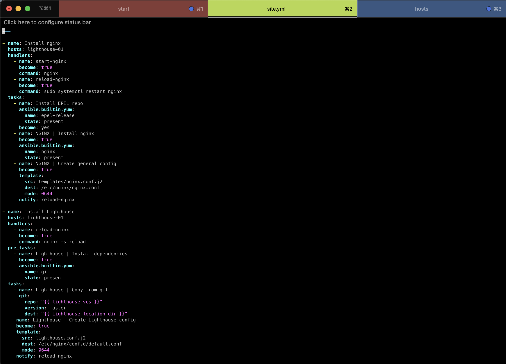

### 2

#### В своём playbook я использовал следующие модули

`get_url`, `template`, `yum` и `git` (`apt` не использовал так как ВМ на `CentOS 7`)

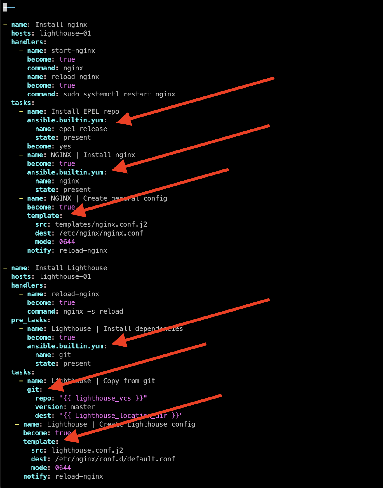

### 3

#### Данные таски

##### скачивают статику LightHouse

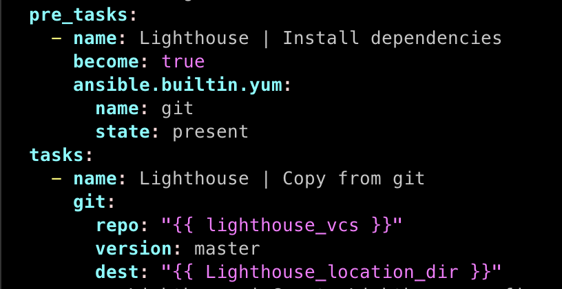

##### установливают Nginx

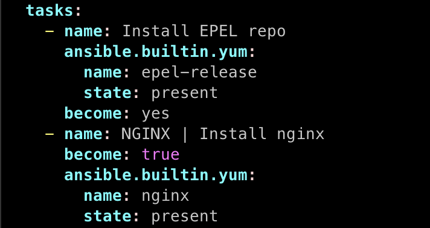

##### настраивают его конфиг для открытия LightHouse

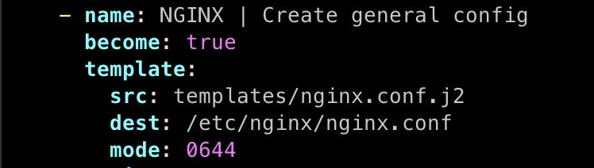

##### запускают веб-сервер

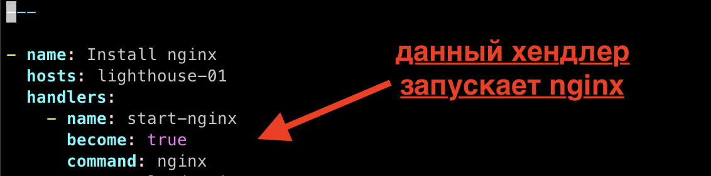

### 4

#### Подготовил свой inventory-файл `prod.yml`

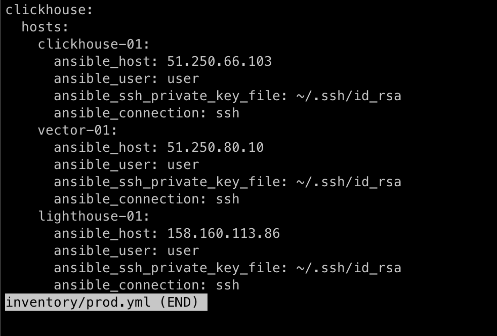

#### Создал 3 ВМ в Yandex Cloud

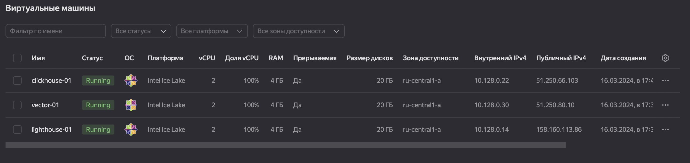

### 5

#### Запустил `ansible-lint site.yml`

Обнаружил одну орфографическую ошибку в слове `notify` (было `"notiify"`).
Исправил ошибку и затем успешно запустил playbook.

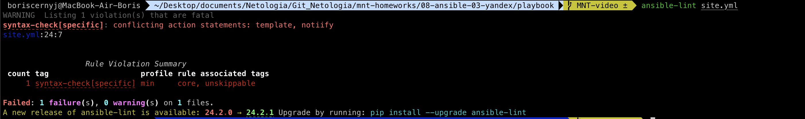

### 6

#### Запустил playbook с флагом `--check`

Убедился что всё работает:

```
 boriscernyj@MacBook-Air-Boris  ~/Desktop/documents/Netologia/Git_Netologia/mnt-homeworks/08-ansible-03-yandex/playbook   MNT-video ±  ansible-playbook -i inventory/prod.yml site.yml --check

PLAY [Install nginx] *************************************************************************************************************************************************************

TASK [Gathering Facts] ***********************************************************************************************************************************************************
ok: [lighthouse-01]

TASK [Install EPEL repo] *********************************************************************************************************************************************************
ok: [lighthouse-01]

TASK [NGINX | Install nginx] *****************************************************************************************************************************************************
ok: [lighthouse-01]

TASK [NGINX | Create general config] *********************************************************************************************************************************************
ok: [lighthouse-01]

PLAY [Install Lighthouse] ********************************************************************************************************************************************************

TASK [Gathering Facts] ***********************************************************************************************************************************************************
ok: [lighthouse-01]

TASK [Lighthouse | Install dependencies] *****************************************************************************************************************************************
ok: [lighthouse-01]

TASK [Lighthouse | Copy from git] ************************************************************************************************************************************************
ok: [lighthouse-01]

PLAY [Install Clickhouse] ********************************************************************************************************************************************************

TASK [Gathering Facts] ***********************************************************************************************************************************************************
ok: [clickhouse-01]

TASK [Get clickhouse distrib] ****************************************************************************************************************************************************
ok: [clickhouse-01]

TASK [Get clickhouse common static distrib] **************************************************************************************************************************************
ok: [clickhouse-01]

TASK [Get clickhouse server distrib] *********************************************************************************************************************************************
ok: [clickhouse-01]

TASK [Install clickhouse packages] ***********************************************************************************************************************************************
ok: [clickhouse-01]

TASK [Flush handlers] ************************************************************************************************************************************************************

TASK [Create database] ***********************************************************************************************************************************************************
skipping: [clickhouse-01]

PLAY [Install and Configure Vector] **********************************************************************************************************************************************

TASK [Gathering Facts] ***********************************************************************************************************************************************************
ok: [vector-01]

TASK [Download Vector Distrib] ***************************************************************************************************************************************************
ok: [vector-01]

TASK [Install Vector] ************************************************************************************************************************************************************
ok: [vector-01]

TASK [Deploy Vector Configuration] ***********************************************************************************************************************************************
ok: [vector-01]

PLAY RECAP ***********************************************************************************************************************************************************************
clickhouse-01              : ok=5    changed=0    unreachable=0    failed=0    skipped=1    rescued=0    ignored=0
lighthouse-01              : ok=7    changed=0    unreachable=0    failed=0    skipped=0    rescued=0    ignored=0
vector-01                  : ok=4    changed=0    unreachable=0    failed=0    skipped=0    rescued=0    ignored=0

 boriscernyj@MacBook-Air-Boris  ~/Desktop/documents/Netologia/Git_Netologia/mnt-homeworks/08-ansible-03-yandex/playbook   MNT-video ± 
```

### 7

#### Запустил playbook на `prod.yml` окружении с флагом `--diff`

Изменения были применены (nginx.conf был заменён со стандартного на нужный). Изменения в системе были произведены:

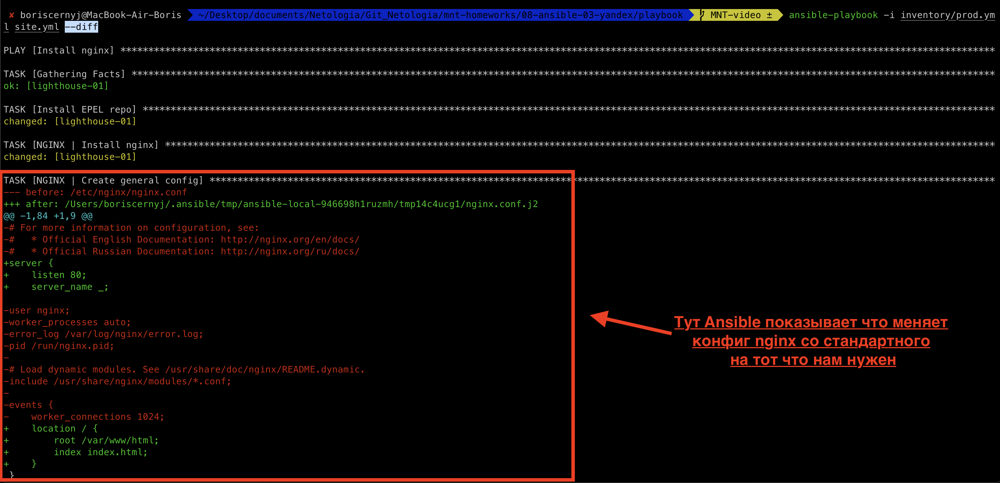

### 8

#### Повторно запустил playbook на `prod.yml` окружении с флагом `--diff`

Убедился что playbook идемпотентен. Все таски выполнились успешно.

```
 boriscernyj@MacBook-Air-Boris  ~/Desktop/documents/Netologia/Git_Netologia/mnt-homeworks/08-ansible-03-yandex/playbook   MNT-video ±  ansible-playbook -i inventory/prod.yml site.yml --diff

PLAY [Install nginx] *************************************************************************************************************************************************************

TASK [Gathering Facts] ***********************************************************************************************************************************************************
ok: [lighthouse-01]

TASK [Install EPEL repo] *********************************************************************************************************************************************************
ok: [lighthouse-01]

TASK [NGINX | Install nginx] *****************************************************************************************************************************************************
ok: [lighthouse-01]

TASK [NGINX | Create general config] *********************************************************************************************************************************************
ok: [lighthouse-01]

PLAY [Install Lighthouse] ********************************************************************************************************************************************************

TASK [Gathering Facts] ***********************************************************************************************************************************************************
ok: [lighthouse-01]

TASK [Lighthouse | Install dependencies] *****************************************************************************************************************************************
changed: [lighthouse-01]

TASK [Lighthouse | Copy from git] ************************************************************************************************************************************************
>> Newly checked out d701335c25cd1bb9b5155711190bad8ab852c2ce
changed: [lighthouse-01]

PLAY [Install Clickhouse] ********************************************************************************************************************************************************

TASK [Gathering Facts] ***********************************************************************************************************************************************************
ok: [clickhouse-01]

TASK [Get clickhouse distrib] ****************************************************************************************************************************************************
changed: [clickhouse-01]

TASK [Get clickhouse common static distrib] **************************************************************************************************************************************
changed: [clickhouse-01]

TASK [Get clickhouse server distrib] *********************************************************************************************************************************************
changed: [clickhouse-01]

TASK [Install clickhouse packages] ***********************************************************************************************************************************************
changed: [clickhouse-01]

TASK [Flush handlers] ************************************************************************************************************************************************************

RUNNING HANDLER [Start clickhouse service] ***************************************************************************************************************************************
changed: [clickhouse-01]

TASK [Create database] ***********************************************************************************************************************************************************
changed: [clickhouse-01]

PLAY [Install and Configure Vector] **********************************************************************************************************************************************

TASK [Gathering Facts] ***********************************************************************************************************************************************************
ok: [vector-01]

TASK [Download Vector Distrib] ***************************************************************************************************************************************************
changed: [vector-01]

TASK [Install Vector] ************************************************************************************************************************************************************
changed: [vector-01]

TASK [Deploy Vector Configuration] ***********************************************************************************************************************************************
--- before: /etc/vector/vector.toml
+++ after: /Users/boriscernyj/.ansible/tmp/ansible-local-95191_g3tgxze/tmp_ky6ofre/vector.toml.j2
@@ -1,44 +1,10 @@
-#                                    __   __  __
-#                                    \ \ / / / /
-#                                     \ V / / /
-#                                      \_/  \/
-#
-#                                    V E C T O R
-#                                   Configuration
-#
-# ------------------------------------------------------------------------------
-# Website: https://vector.dev
-# Docs: https://vector.dev/docs
-# Chat: https://chat.vector.dev
-# ------------------------------------------------------------------------------
+# vector.toml.j2
+[sources.in]
+  type = "file"
+  include = ["/var/log/nginx/access.log"]
+  ignore_older = 86400

-# Change this to use a non-default directory for Vector data storage:
-# data_dir = "/var/lib/vector"
-
-# Random Syslog-formatted logs
-[sources.dummy_logs]
-type = "demo_logs"
-format = "syslog"
-interval = 1
-
-# Parse Syslog logs
-# See the Vector Remap Language reference for more info: https://vrl.dev
-[transforms.parse_logs]
-type = "remap"
-inputs = ["dummy_logs"]
-source = '''
-. = parse_syslog!(string!(.message))
-'''
-
-# Print parsed logs to stdout
-[sinks.print]
-type = "console"
-inputs = ["parse_logs"]
-encoding.codec = "json"
-
-# Vector's GraphQL API (disabled by default)
-# Uncomment to try it out with the `vector top` command or
-# in your browser at http://localhost:8686
-#[api]
-#enabled = true
-#address = "127.0.0.1:8686"
+[sinks.out]
+  inputs = ["in"]
+  type = "console"
+  encoding = "json"

changed: [vector-01]

RUNNING HANDLER [Restart Vector] *************************************************************************************************************************************************
changed: [vector-01]

PLAY RECAP ***********************************************************************************************************************************************************************
clickhouse-01              : ok=7    changed=6    unreachable=0    failed=0    skipped=0    rescued=0    ignored=0
lighthouse-01              : ok=7    changed=2    unreachable=0    failed=0    skipped=0    rescued=0    ignored=0
vector-01                  : ok=5    changed=4    unreachable=0    failed=0    skipped=0    rescued=0    ignored=0

 
 boriscernyj@MacBook-Air-Boris  ~/Desktop/documents/Netologia/Git_Netologia/mnt-homeworks/08-ansible-03-yandex/playbook   MNT-video ± 
```

#### Далее запустил `Lighthouse` через браузер

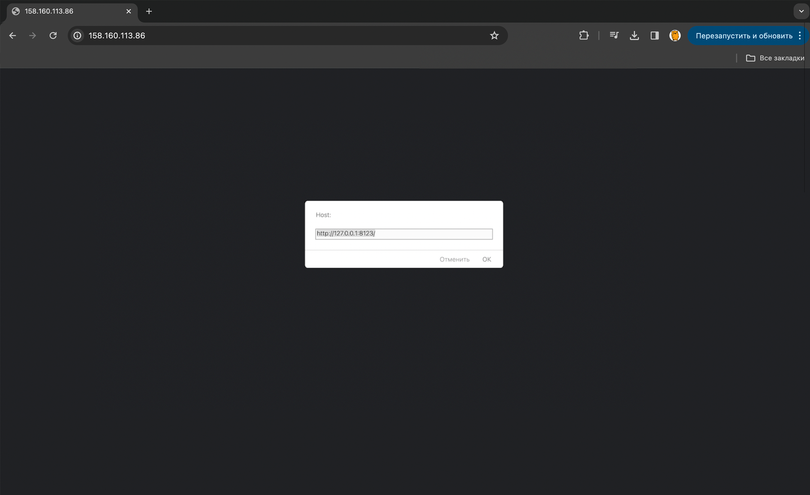

### 9

#### Подготовил этот README.md-файл по своему playbook

Описал что делает playbook, какие у него есть параметры и теги.

### 10

#### Playbook выложил в свой репозиторий

Поставьте тег `08-ansible-03-yandex` на фиксирующий коммит и предоставил ссылку на сам playbook.
