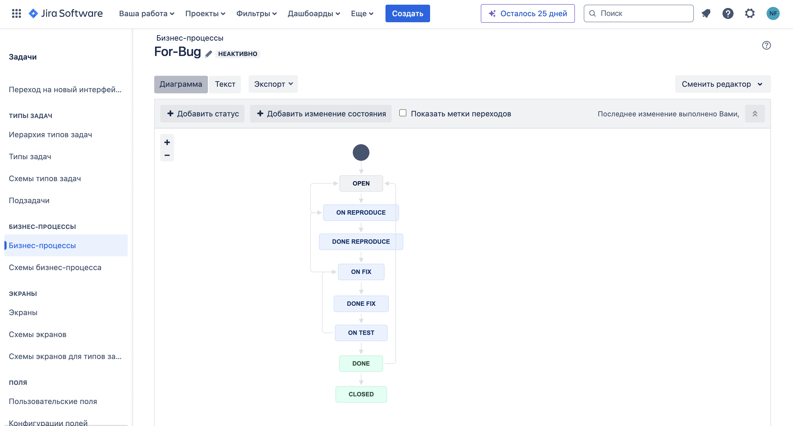
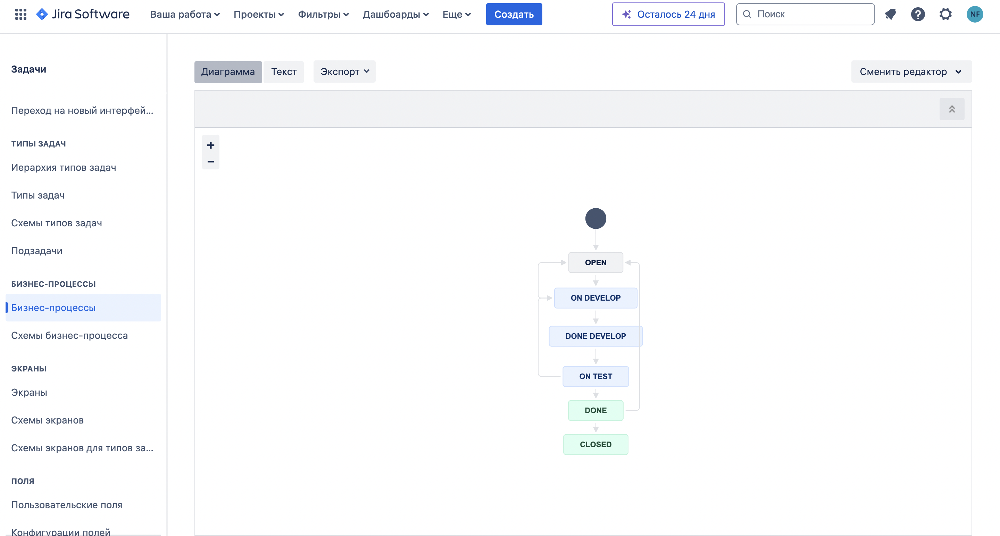
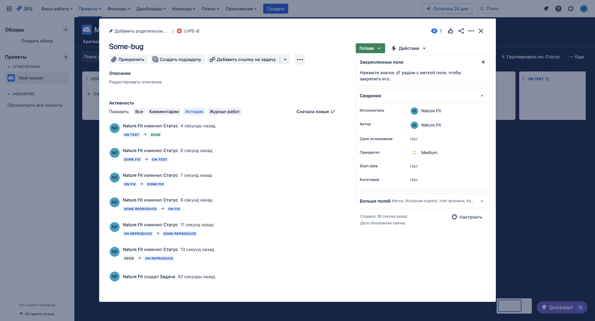
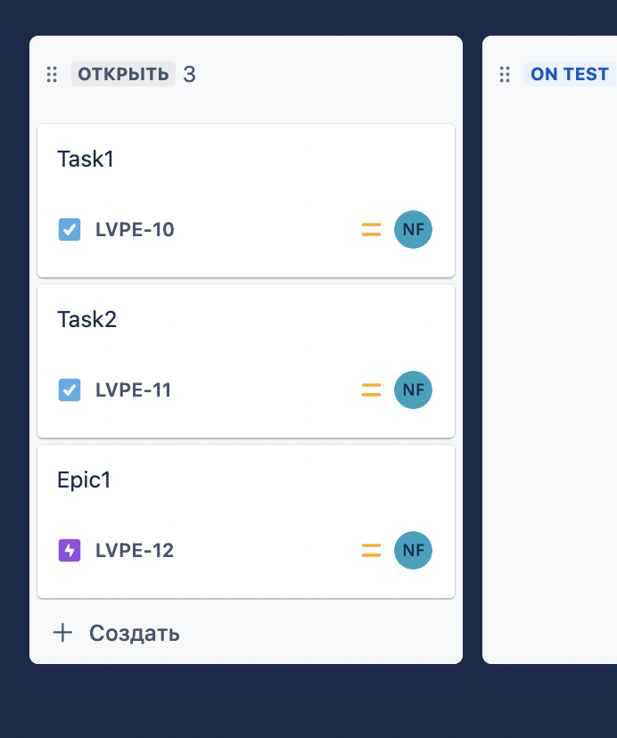
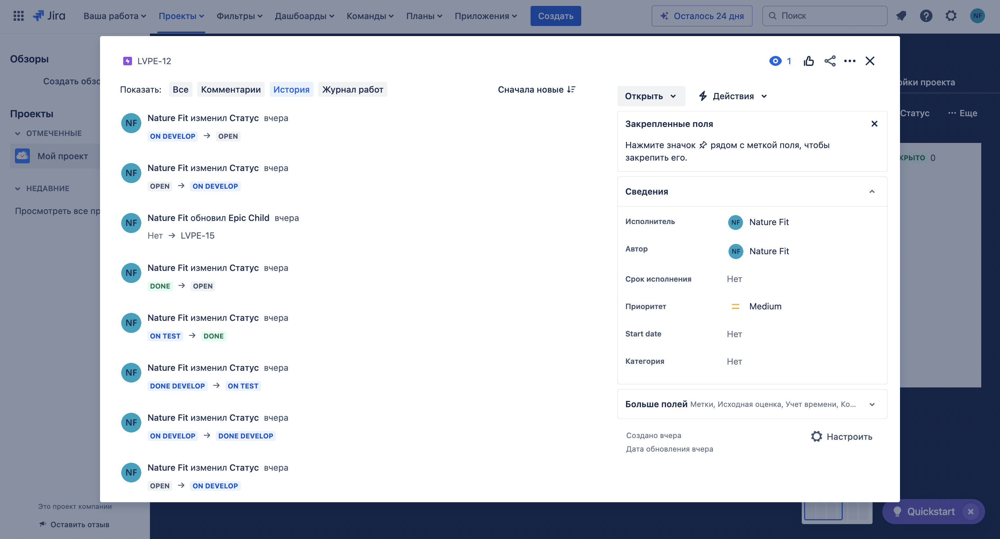
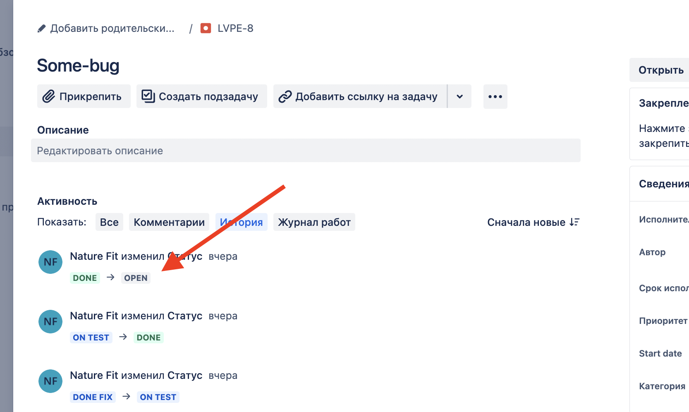
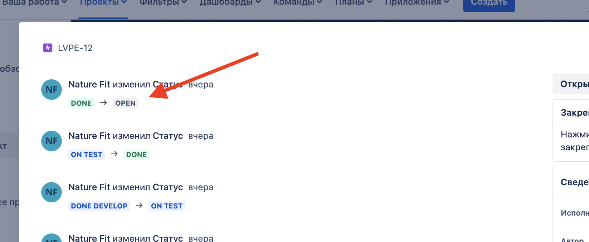
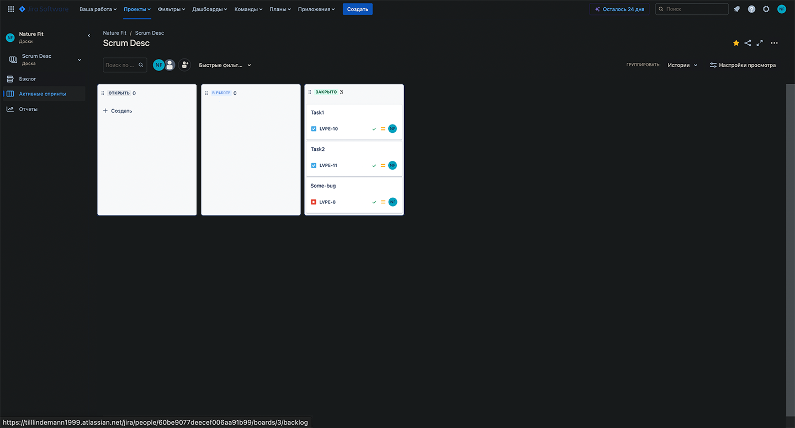

## Задачи

### Основная часть

Необходимо создать собственные workflow для двух типов задач: bug и остальные типы задач. Задачи типа bug должны проходить жизненный цикл:

```
Open -> On reproduce.
On reproduce -> Open, Done reproduce.
Done reproduce -> On fix.
On fix -> On reproduce, Done fix.
Done fix -> On test.
On test -> On fix, Done.
Done -> Closed, Open.
```

Остальные задачи должны проходить по упрощённому workflow:

```
Open -> On develop.
On develop -> Open, Done develop.
Done develop -> On test.
On test -> On develop, Done.
Done -> Closed, Open.
```

### Что нужно сделать

### Задача 1

Создайте задачу с типом bug, попытайтесь провести его по всему workflow до Done.

### Задача 2

Создайте задачу с типом epic, к ней привяжите несколько задач с типом task, проведите их по всему workflow до Done.

### Задача 3

При проведении обеих задач по статусам используйте kanban.

### Задача 4

Верните задачи в статус Open.

### Задача 5

Перейдите в Scrum, запланируйте новый спринт, состоящий из задач эпика и одного бага, стартуйте спринт, проведите задачи до состояния Closed. Закройте спринт.

### Задача 6

Если всё отработалось в рамках ожидания — выгрузите схемы workflow для импорта в XML. Файлы с workflow и скриншоты workflow приложите к решению задания.

## Ответ

Создал собственные workflow:

`Для Bug`


`Для остальных типов задач`


### 1

#### Создал задачу с типом bug и провёл его по всему workflow до Done



### 2

#### Создал задачу с типом epic, привязал к ней несколько задач с типом task и провёл их по всему workflow до Done

Создал 2 задачи `Task1`, `Task2` и 1 эпик `Epic1`:


Затем провёл по всему workflow до статуса `Done`:


### 3

#### При проведении обеих задач по статусам использовал созданную доску kanban


### 4

#### Вернул задачи в статус Open

Вернул задачу bug в статус `Open`


Вернул остальные задачи в статус `Open`


### 5

#### Перешел в Scrum доску и запланировал новый спринт который состоит из задач эпика и одного бага. Стартовал спринт. Провёл задачи до состояния Closed. Закрыл спринт



### 6

#### Всё прошло успешно, дополнительно выгрузил в репозиторий схемы workflow для импорта в .xml файлы с workflow и скриншоты в данный README.md файл


