## Задачи

### Подготовка к выполнению

1. Создать два VM: для `jenkins-master` и `jenkins-agent`.
2. Установить **Jenkins** при помощи ***playbook***.
3. Запустить и проверить работоспособность.
4. Сделать первоначальную настройку.

### Основная часть

1. Сделать `Freestyle Job`, который будет запускать `molecule test` из любого вашего репозитория с ролью.
2. Сделать `Declarative Pipeline Job`, который будет запускать `molecule test` из любого вашего репозитория с ролью.
3. Перенести `Declarative Pipeline` в репозиторий в файл `Jenkinsfile`.
4. Создать `Multibranch Pipeline` на запуск `Jenkinsfile` из репозитория.
5. Создать `Scripted Pipeline`, наполнить его скриптом из `pipeline`.
6. Внести необходимые изменения, чтобы `Pipeline` запускал `ansible-playbook` без флагов `--check --diff`, если не установлен параметр при запуске джобы (`prod_run = True`). По умолчанию параметр имеет значение `False` и запускает прогон с флагами `--check --diff`.
7. Проверить работоспособность, исправить ошибки, исправленный `Pipeline` вложить в репозиторий в файл `ScriptedJenkinsfile`.
8. Отправить ссылку на репозиторий с ролью и `Declarative Pipeline` и `Scripted Pipeline`.
9. Сопроводите процесс настройки скриншотами для каждого пункта задания!!

----------------------------------------------------------------------------------------------------

## Ответ

### Подготовка к выполнению

1. Создал две VM: для `jenkins-master` и `jenkins-agent`:

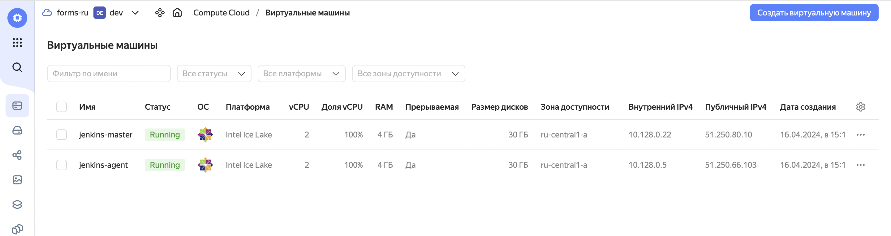

2. Установил **Jenkins** при помощи ***playbook***:

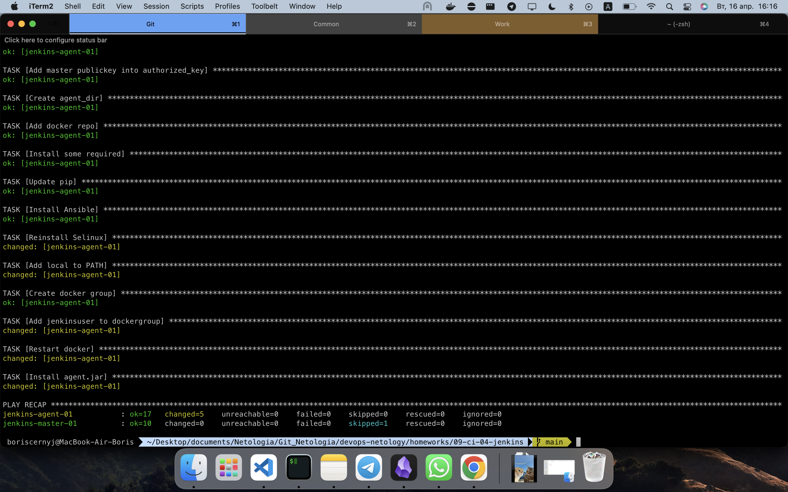

3. Запустил и проверил работоспособность.

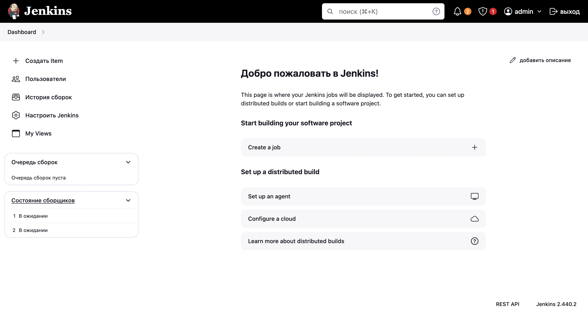

4. Сделал первоначальную настройку.

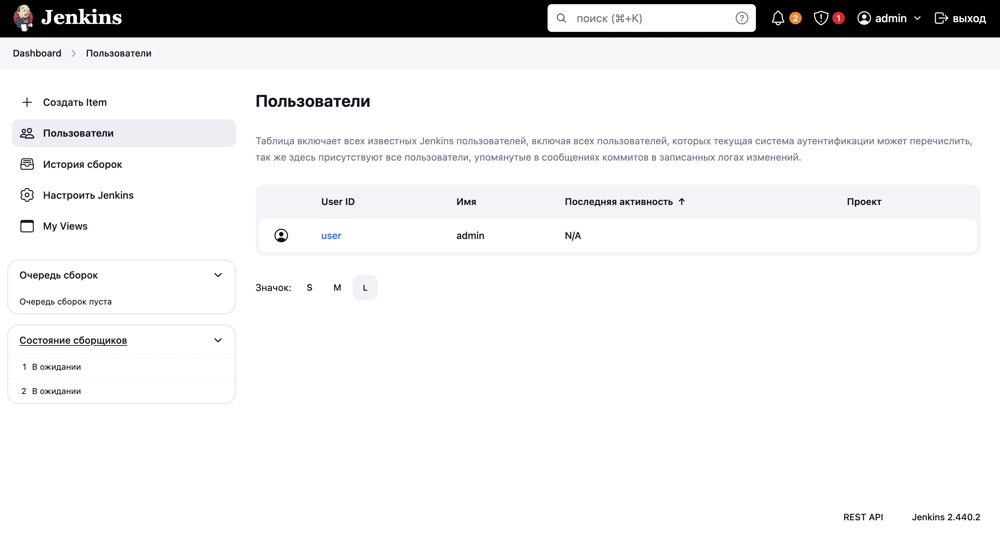

### Основная часть

1. Сделал и успешно заупстил`Freestyle Job`, который запускает `molecule test` из моего github-репозитория с ролью (я использовал `homeworks/08-ansible-02-playbook` репозиторий из предыдущих уроков по `ansible`, там же была взята роль).

Сам `Freestyle Job`:
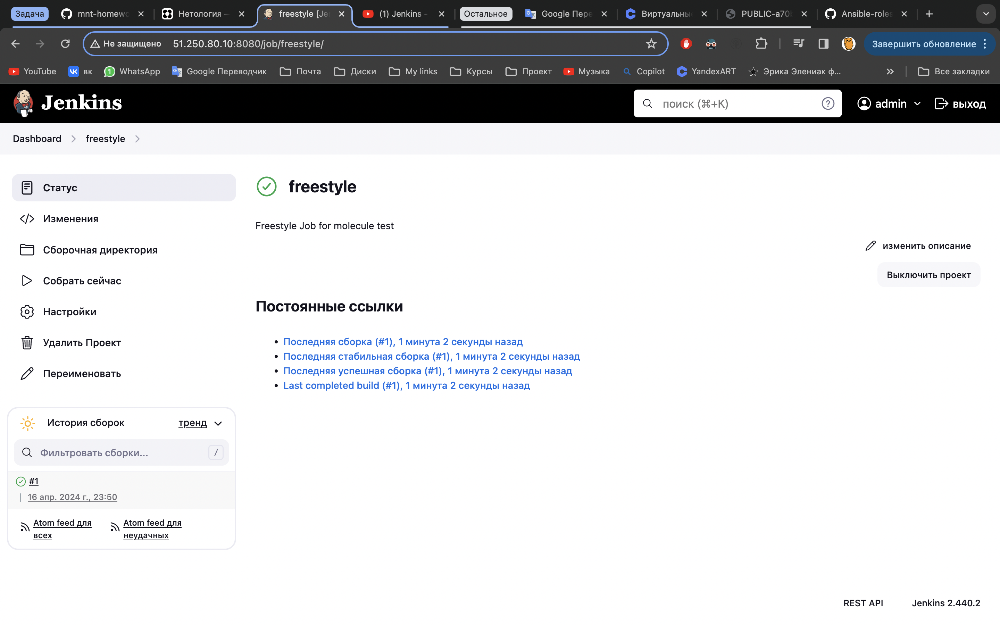

Мой github-репозиторий где я взял роль:
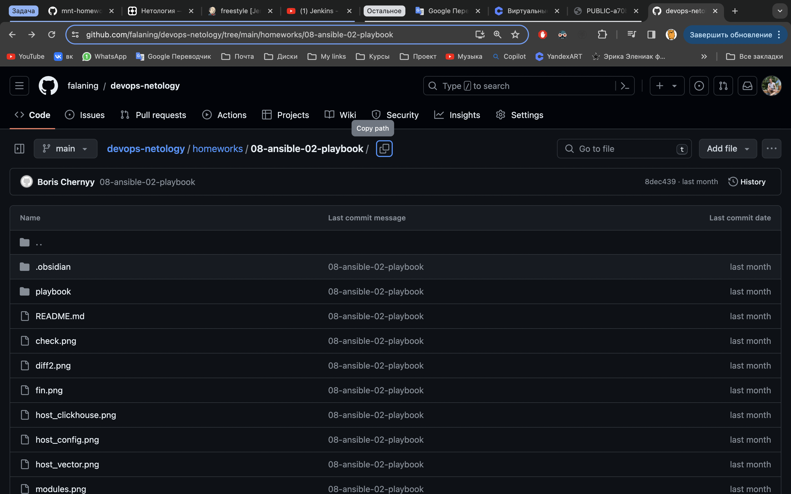

2. Сделал `Declarative Pipeline Job`, который запускает `molecule test` из моего репозитория `homeworks/08-ansible-02-playbook`.

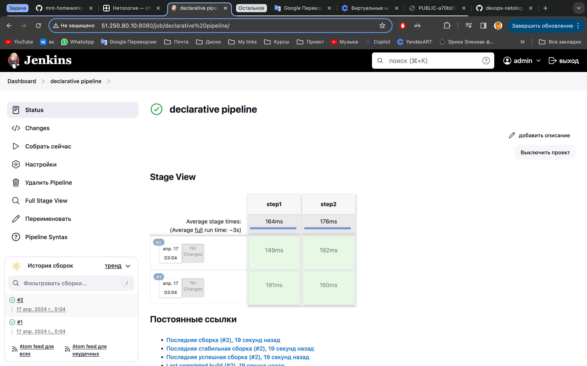

3. Перенёс `Declarative Pipeline` в репозиторий в файл `Jenkinsfile`.

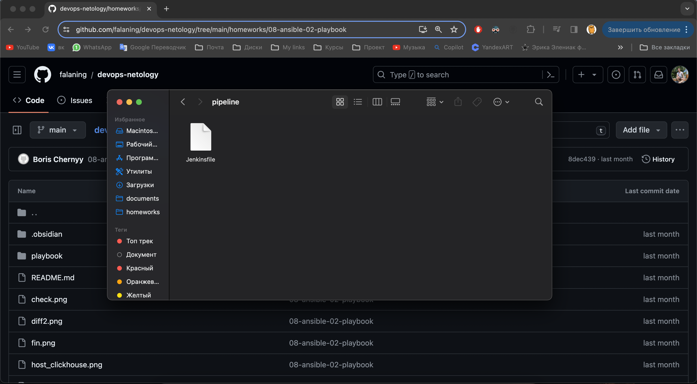

4. Создал `Multibranch Pipeline` на запуск `Jenkinsfile` из моего github-репозитория.

5. Создал `Scripted Pipeline` и наполнил его скриптом из `pipeline`.

Конфигурирование пайплайна:
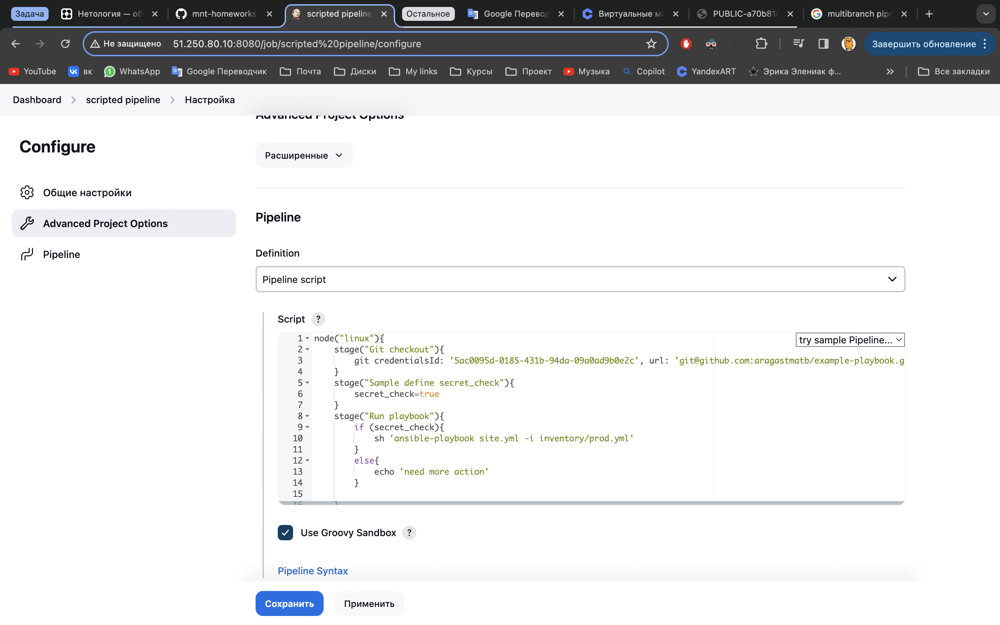

Сам пайплайн:
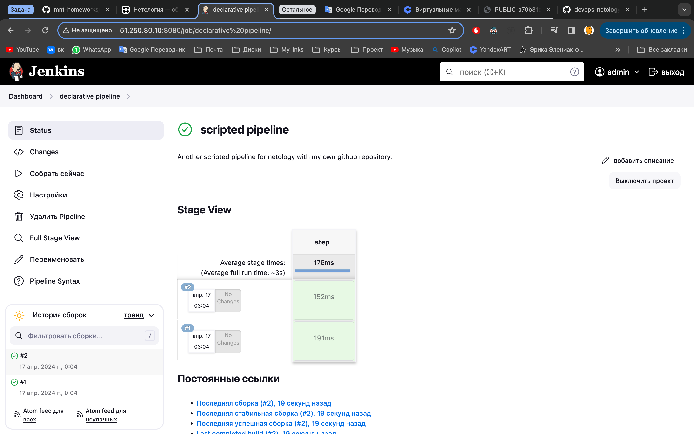

6. Внёс необходимые изменения: `Pipeline` запускает `ansible-playbook` без флагов `--check --diff`:

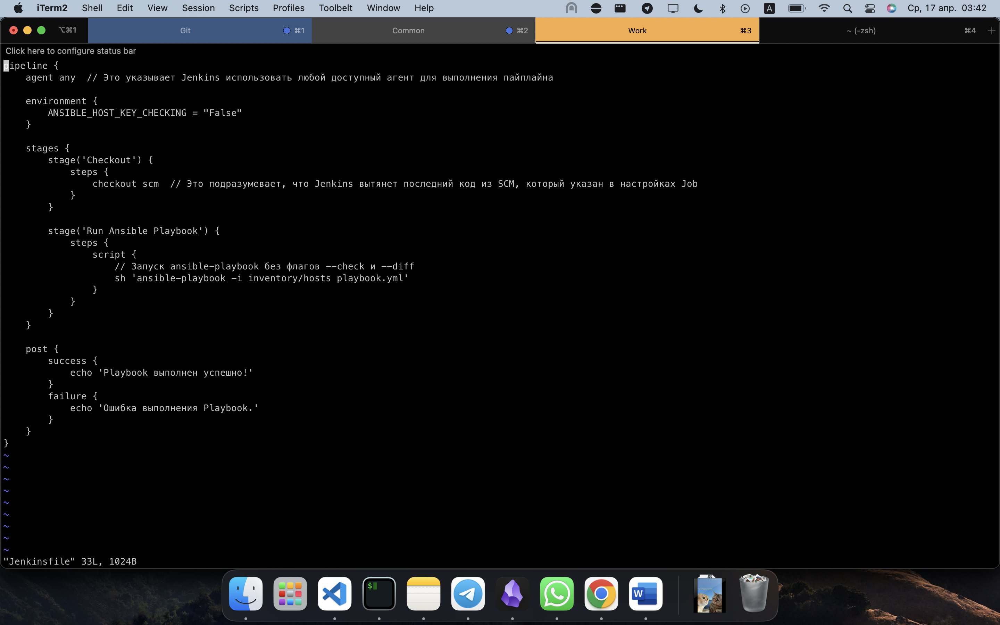

Также дополнительно отключил рукопожатие:
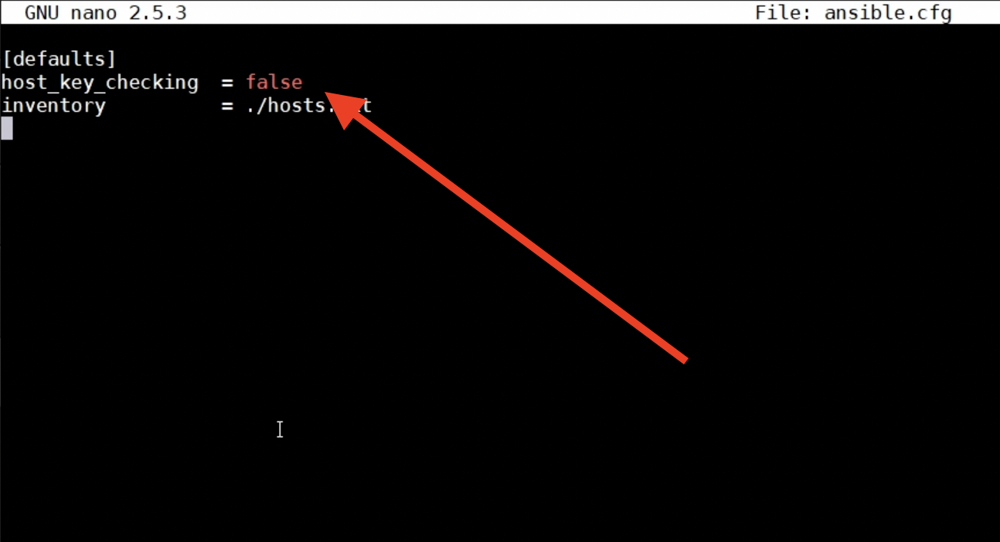

7. Проверить работоспособность, исправить ошибки, исправленный `Pipeline` вложить в репозиторий в файл `ScriptedJenkinsfile`.

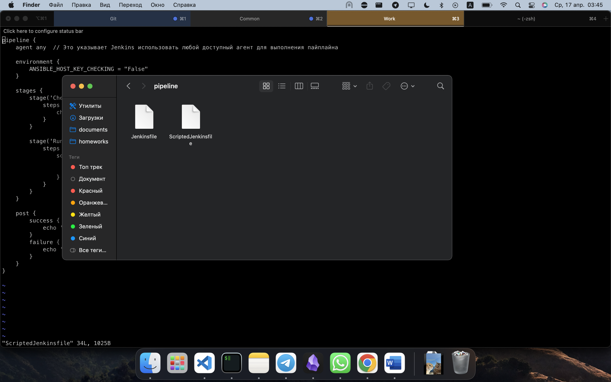

8. Отправялю ссылку на репозиторий с ролью и `Declarative Pipeline` и `Scripted Pipeline`.

И также прикладываю файл роли и jenkins файлы:
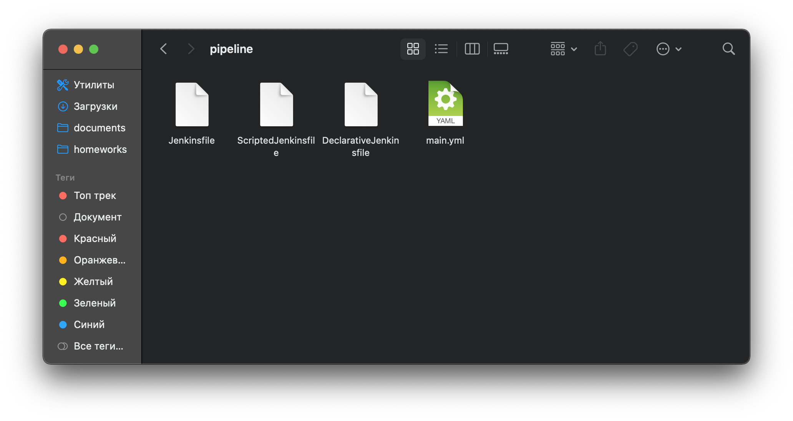

9. Весь процесс настройки сопровождён скриншотами для каждого пункта задания.

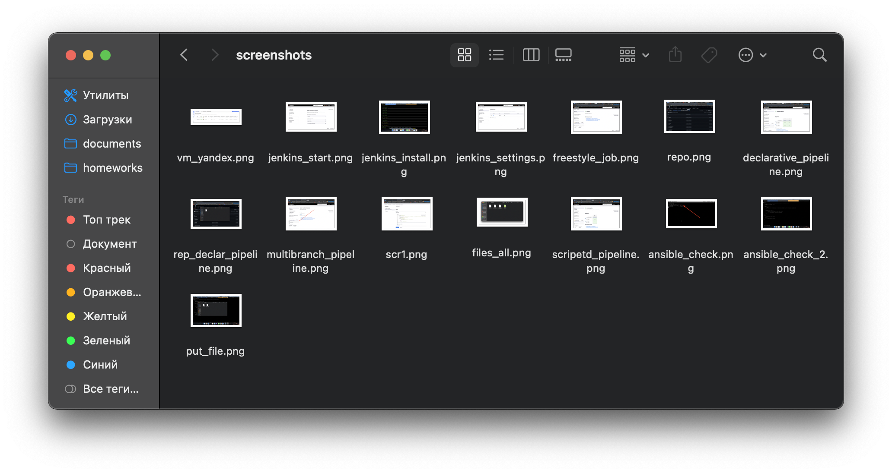
