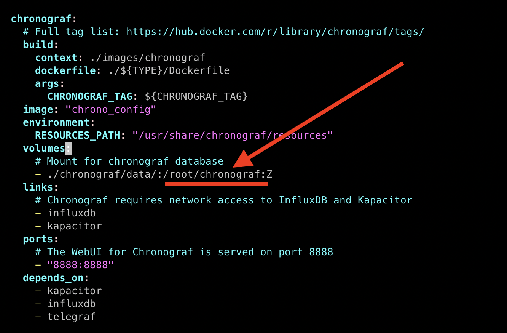
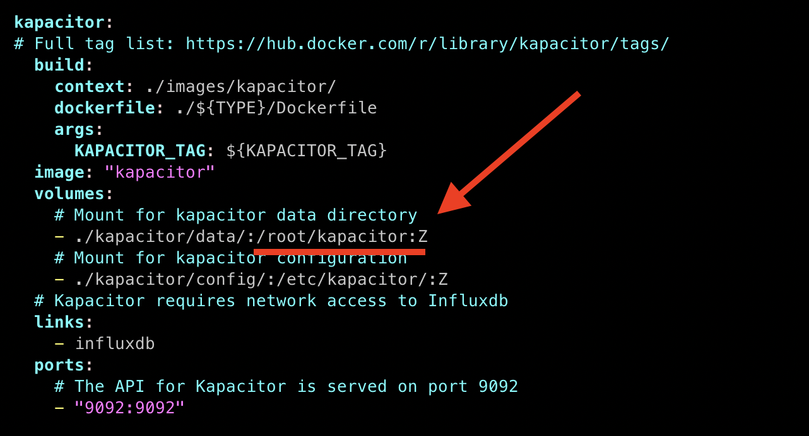
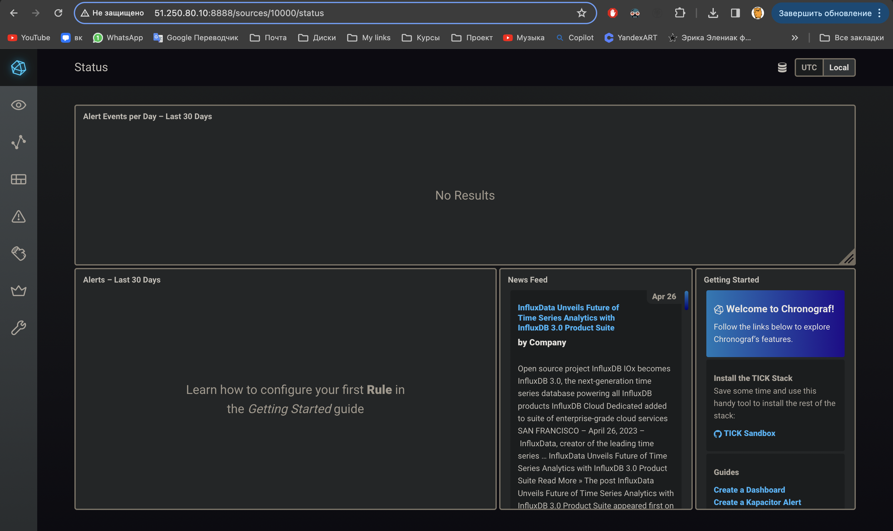
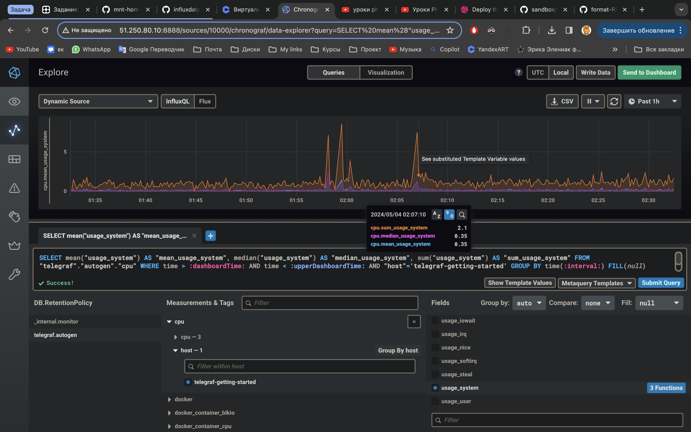
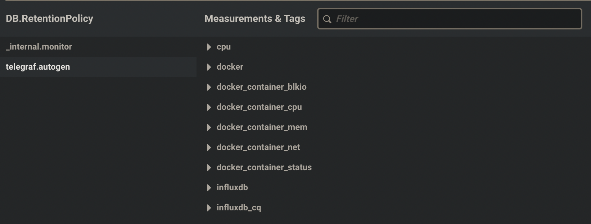

## Домашняя работа

### Обязательные задания

#### Задание 1

Вас пригласили настроить мониторинг на проект. На онбординге вам рассказали, что проект представляет из себя платформу для вычислений с выдачей текстовых отчетов, которые сохраняются на диск. Взаимодействие с платформой осуществляется по протоколу http. Также вам отметили, что вычисления загружают ЦПУ. Какой минимальный набор метрик вы выведите в мониторинг и почему?

#### Ответ

Минимальный набор метрик для мониторинга:

- CPU Usage (%): Так как вычисления загружают ЦПУ, важно отслеживать загрузку процессора.
- Disk Usage: Важно мониторить свободное место на диске, так как отчеты сохраняются на диск.
- Memory Usage: Так как любые вычисления могут потреблять оперативную память.
- HTTP Response Time: Время ответа на запросы по HTTP для мониторинга производительности взаимодействия с платформой.
- Error Rates: Количество ошибочных HTTP ответов (например, 5xx серверные ошибки).

#### Задание 2

Менеджер продукта посмотрев на ваши метрики сказал, что ему непонятно что такое RAM/inodes/CPUla. Также он сказал, что хочет понимать, насколько мы выполняем свои обязанности перед клиентами и какое качество обслуживания. Что вы можете ему предложить?

#### Ответ

Ответ менеджеру продукта:

- SLA Metrics: Введение показателей, напрямую связанных с уровнем обслуживания (SLA), таких как процент успешно обработанных запросов или доступность системы.
- Business Metrics: Предложить метрики, связанные с бизнес-процессами, например, среднее время обработки отчета, количество сгенерированных отчетов за период и т.д.

#### Задание 3

Вашей DevOps команде в этом году не выделили финансирование на построение системы сбора логов. Разработчики в свою очередь хотят видеть все ошибки, которые выдают их приложения. Какое решение вы можете предпринять в этой ситуации, чтобы разработчики получали ошибки приложения?

#### Ответ

Решение без системы сбора логов:

- Простая агрегация логов: Использование простых скриптов для сбора и агрегации логов на централизованном сервере или использование базовых возможностей, таких как rsyslog, для пересылки логов.
- Стандартные инструменты ОС: Вы можете использовать logrotate для управления размером логов и их архивацией.

#### Задание 4

Вы, как опытный SRE, сделали мониторинг, куда вывели отображения выполнения SLA=99% по http кодам ответов. Вычисляете этот параметр по следующей формуле: summ_2xx_requests/summ_all_requests. Данный параметр не поднимается выше 70%, но при этом в вашей системе нет кодов ответа 5xx и 4xx. Где у вас ошибка?

#### Ответ

Ошибки в метрике SLA:

- Неучтенные HTTP методы: Возможно, в расчетах не учитываются некоторые методы (например, OPTIONS, HEAD), которые обычно не возвращают ошибок.
- Рекомендация: Проверьте фильтры и убедитесь, что все активные запросы учитываются в метрике.

#### Задание 5

Опишите основные плюсы и минусы pull и push систем мониторинга.

#### Ответ

**Push системы**

- Плюсы: Быстрая реакция на события, меньшая нагрузка на центральный сервер.
- Минусы: Трудности с масштабированием, зависимость от клиентов в отправке данных.

**Pull системы**

- Плюсы: Легче управлять конфигурацией, более надежная система безопасности.
- Минусы: Потенциальная задержка в получении данных, в зависимости от интервала опроса.

#### Задание 6

Какие из ниже перечисленных систем относятся к push модели, а какие к pull? А может есть гибридные?

- Prometheus
- TICK
- Zabbix
- VictoriaMetrics
- Nagios

#### Ответ

1. **Prometheus**

Prometheus больше склонен к **pull** модели, где он сам инициирует сбор данных с конечных точек, которые поддерживают HTTP и предоставляют метрики в нужном формате. Однако, Prometheus также поддерживает push модель через так называемый "Pushgateway", где временные данные (например, из батчевых процессов) могут быть отправлены в Prometheus.

2. **TICK**

TICK - это стек, состоящий из четырех компонентов (Telegraf, InfluxDB, Chronograf, Kapacitor). Основным сборщиком данных здесь является Telegraf, который поддерживает и **pull**, и **push** модели. Он может активно запрашивать метрики или принимать данные отправленные другими системами.

3. **Zabbix**

Zabbix поддерживает обе модели! Агенты Zabbix могут как отправлять данные на сервер посредством **push** модели, так и отвечать на запросы сервера в модели **pull**. Это делает Zabbix очень гибким в плане конфигурации мониторинга.  

4. **VictoriaMetrics**

VictoriaMetrics чаще использует **push** модель. Это система предназначена для приема больших объемов данных, и она поддерживает интеграцию с различными агентами и системами, которые отправляют данные в VictoriaMetrics.

5. **Nagios**

Nagios использует **pull** модель, где сервер Nagios инициирует запросы к мониторингу агентов для получения информации.

**Итог:**

- **Pull модель**: Prometheus (его основная модель), Nagios

- **Push модель**: VictoriaMetrics

- **Обе модели**: Zabbix, TICK (через Telegraf)

#### Задание 7

Склонируйте себе репозиторий и запустите TICK-стэк, используя технологии docker и docker-compose.
В виде решения на это упражнение приведите скриншот веб-интерфейса ПО chronograf (<http://localhost:8888>).
P.S.: если при запуске некоторые контейнеры будут падать с ошибкой - проставьте им режим Z, например ./data:/var/lib:Z

#### Ответ

Контейнеры запустились, хотя изначально не хотели стартовать `kapacitor` и `chronograf`, но я посмотрел логи командой `docker-compose logs`:

```
chronograf_1     | time="2024-05-03T22:26:19Z" level=error msg="Unable to create bolt clientUnable to open boltdb; is there a chronograf already running?  open /var/lib/chronograf/chronograf-v1.db: permission denied"

kapacitor_1      | ts=2024-05-03T22:26:27.166Z lvl=error msg="encountered error" service=run err="create server: failed to save cluster ID: open /var/lib/kapacitor/cluster.id: permission denied"
kapacitor_1      | run: create server: failed to save cluster ID: open /var/lib/kapacitor/cluster.id: permission denied
```

Обе ошибки указывали на то что контейнерам не хватало прав на запись. Добавить в конце записи `volumes` `:Z` в `docker-compose.yml` не помогло, и тогда я заменил `/var/lib` директории на `/root/kapacitor` и `/root/chronograf` (заранее создав их самостоятельно на сервере).

Запись для контейнера `kapacitor`


Запись для контейнера `chronograf`


И всё **сработало**! :grin:



Мой `docker-compose.yml` прикладываю в ту же директорию где и данный `README.md`

#### Задание 8

Перейдите в веб-интерфейс Chronograf (<http://localhost:8888>) и откройте вкладку Data explorer.

- Нажмите на кнопку Add a query
- Изучите вывод интерфейса и выберите БД telegraf.autogen
- В measurments выберите cpu->host->telegraf-getting-started, а в fields выберите usage_system. Внизу появится график утилизации cpu.
- Вверху вы можете увидеть запрос, аналогичный SQL-синтаксису. Поэкспериментируйте с запросом, попробуйте изменить группировку и интервал наблюдений.
- Для выполнения задания приведите скриншот с отображением метрик утилизации cpu из веб-интерфейса.

#### Ответ

Вывел отображением метрик утилизации cpu. Поэксперементировав, добавил значения:

- `cpu.sum_usage_system`
- `cpu.mean_usage_system`
- `cpu.median_usage_system`



#### Задание 9

Изучите список telegraf inputs. Добавьте в конфигурацию telegraf следующий плагин - docker.
Дополнительно вам может потребоваться донастройка контейнера telegraf в docker-compose.yml дополнительного volume и режима privileged.
После настройки перезапустите telegraf, обновите веб интерфейс и приведите скриншотом список `measurments` в веб-интерфейсе базы telegraf.autogen . Там должны появиться метрики, связанные с docker.
Факультативно можете изучить какие метрики собирает telegraf после выполнения данного задания.

#### Ответ

Добавил в конфигурацию плагин `docker`, скриншот списка `measurments` базы `telegraf.autogen`:


