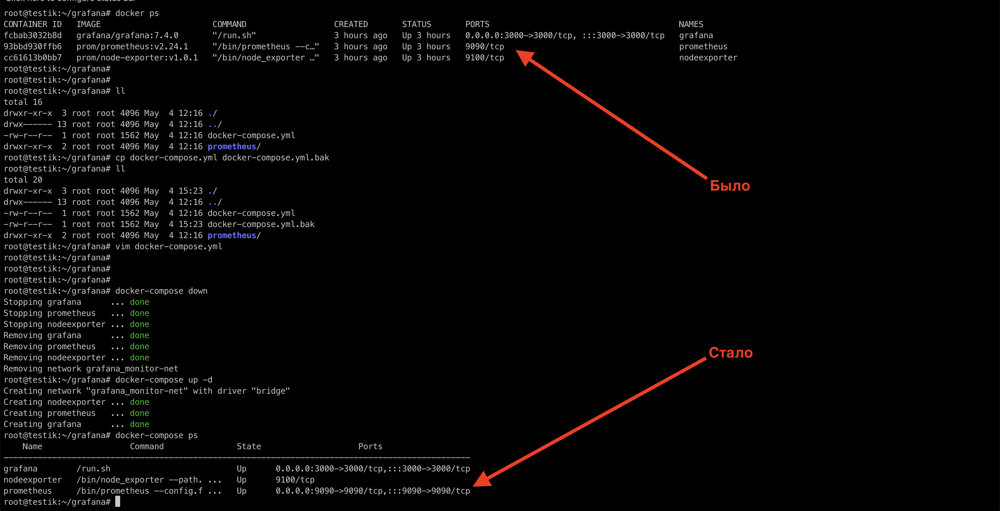

## Домашняя работа

### Обязательные задания

#### Задание 1

1. Используя директорию `help` внутри этого домашнего задания, запустите связку prometheus-grafana.
2. Зайдите в веб-интерфейс grafana, используя авторизационные данные, указанные в манифесте docker-compose.
3. Подключите поднятый вами prometheus, как источник данных.
4. Решение домашнего задания — скриншот веб-интерфейса grafana со списком подключенных Datasource.

#### Ответ

Поднял мониторинг `prometheus-grafana`, во вкладке `Data Dources` подключил `prometheus` как источник данных


Однако сначала веб страница `prometheus` не открывалась, и соответственно при добавлении его как источник данных появлялась ошибка. Я проверил порты контейнеров и обнаружил что порт `prometheus` `9090` не был проброшен. Я его сделал доступным для внешней сети и всё получилось. Свой `docker-compose.yml` прикладываю в ту же директорию где расположен данный `README.md` файл.


Вот что изменил в `docker-compose.yml`:



#### Задание 2

Изучите самостоятельно ресурсы:

```
- PromQL tutorial for beginners and humans.
- Understanding Machine CPU usage.
- Introduction to PromQL, the Prometheus query language.
```

Создайте Dashboard и в ней создайте Panels:

- Утилизация CPU для nodeexporter (в процентах, 100-idle);
- CPULA 1/5/15;
- Количество свободной оперативной памяти;
- Количество места на файловой системе.

Для решения этого задания приведите promql-запросы для выдачи этих метрик, а также скриншот получившейся Dashboard.

#### Ответ

**Promql-запросы:**

1) Утилизация CPU для nodeexporter (в процентах, 100-idle);
`100 - (avg by (instance) (irate(node_cpu_seconds_total{mode="idle"}[5m])) * 100)`

2) CPULA 1/5/15;
`node_load1 / node_load5 / node_load15`

3) Количество свободной оперативной памяти;
`node_memory_MemAvailable_bytes`

4) Количество места на файловой системе.
`node_filesystem_avail_bytes{fstype="ext4", mountpoint="/"}`

Cкриншот моего Dashboard:


**Примечание:**
Для вычесления количество места на файловой системе в запросе `node_filesystem_avail_bytes{fstype="ext4", mountpoint="/"}` была указана файловая система `ext4` (а не, например, `xfs`), так как на моём сервере стоит именно такая файловая система


#### Задание 3

Создайте для каждой Dashboard подходящее правило alert — можно обратиться к первой лекции в блоке «Мониторинг».
В качестве решения задания приведите скриншот вашей итоговой Dashboard.

#### Ответ

Добавил алерты ко всем Panels в моём Dashboard.

Dashboard:


Alerts:


В выбрал `Notification channels` метод `email` (чтобы оповещения приходили ко мне на почту):


**Примечание:**

Так как в исходных данных используется версия `grafana:7.4.0` то у неё нет пункта `Сontact Points`. Обновлять grafana не стал, решил пользоваться старым интерфейсем:


#### Задание 4

1. Сохраните ваш Dashboard. Для этого перейдите в настройки Dashboard, выберите в боковом меню «JSON MODEL». Далее скопируйте отображаемое json-содержимое в отдельный файл и сохраните его.
2. В качестве решения задания приведите листинг этого файла.

#### Ответ

Сохранил Dashboard в ту же директорию где расопложен данный `README.md` под именем `json_model.json`


Само окно с настройками grafana:


Листинг кода:

```
{
  "annotations": {
    "list": [
      {
        "builtIn": 1,
        "datasource": "-- Grafana --",
        "enable": true,
        "hide": true,
        "iconColor": "rgba(0, 211, 255, 1)",
        "name": "Annotations & Alerts",
        "type": "dashboard"
      }
    ]
  },
  "editable": true,
  "gnetId": null,
  "graphTooltip": 0,
  "id": null,
  "links": [],
  "panels": [
    {
      "datasource": null,
      "fieldConfig": {
        "defaults": {
          "custom": {}
        },
        "overrides": []
      },
      "gridPos": {
        "h": 3,
        "w": 24,
        "x": 0,
        "y": 0
      },
      "id": 1,
      "title": "",
      "type": "welcome"
    },
    {
      "datasource": null,
      "fieldConfig": {
        "defaults": {
          "custom": {}
        },
        "overrides": []
      },
      "gridPos": {
        "h": 9,
        "w": 24,
        "x": 0,
        "y": 3
      },
      "id": 123123,
      "type": "gettingstarted"
    },
    {
      "datasource": null,
      "fieldConfig": {
        "defaults": {
          "custom": {}
        },
        "overrides": []
      },
      "gridPos": {
        "h": 15,
        "w": 12,
        "x": 0,
        "y": 12
      },
      "id": 3,
      "links": [],
      "options": {
        "folderId": 0,
        "maxItems": 30,
        "query": "",
        "showHeadings": true,
        "showRecentlyViewed": true,
        "showSearch": false,
        "showStarred": true,
        "tags": []
      },
      "pluginVersion": "7.4.0",
      "tags": [],
      "title": "Dashboards",
      "type": "dashlist"
    },
    {
      "datasource": null,
      "fieldConfig": {
        "defaults": {
          "custom": {}
        },
        "overrides": []
      },
      "gridPos": {
        "h": 15,
        "w": 12,
        "x": 12,
        "y": 12
      },
      "id": 4,
      "links": [],
      "options": {
        "feedUrl": "https://grafana.com/blog/news.xml"
      },
      "title": "Latest from the blog",
      "type": "news"
    }
  ],
  "schemaVersion": 27,
  "style": "dark",
  "tags": [],
  "templating": {
    "list": []
  },
  "time": {
    "from": "now-6h",
    "to": "now"
  },
  "timepicker": {
    "hidden": true,
    "refresh_intervals": [
      "5s",
      "10s",
      "30s",
      "1m",
      "5m",
      "15m",
      "30m",
      "1h",
      "2h",
      "1d"
    ],
    "time_options": [
      "5m",
      "15m",
      "1h",
      "6h",
      "12h",
      "24h",
      "2d",
      "7d",
      "30d"
    ],
    "type": "timepicker"
  },
  "timezone": "browser",
  "title": "Home",
  "uid": null,
  "version": 0
}
```
