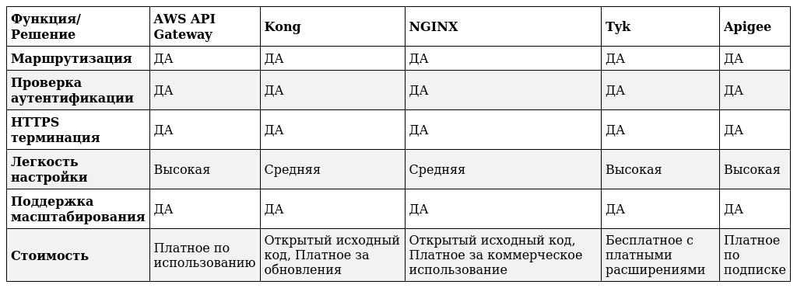
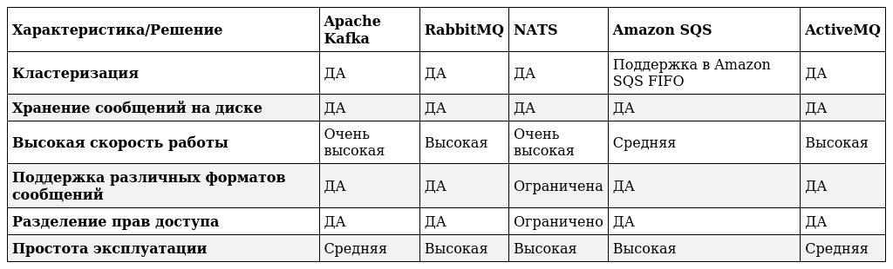

## Домашняя работа

#### Задание 1: API Gateway

#### Ответ

#### Cравнительная таблица

1. AWS API Gateway:
   - Маршрутизация: Поддержка настройки маршрутов для различных сервисов по конфигурационным правилам.
   - Аутентификация: Работает с AWS Cognito, OAuth, и другими методами аутентификации.
   - HTTPS терминация: Полная поддержка, включая сертификаты AWS.

2. Kong:
   - Маршрутизация: Маршрутизация через Lua скрипты или плагины.
   - Аутентификация: Имеет множество плагинов для проверки JWT, OAuth2 и других методов.
   - HTTPS терминация: Поддержка через конфигурацию и плагины.

3. NGINX:
   - Маршрутизация: Позволяет настраивать маршруты через конфигурационные файлы.
   - Аутентификация: Поддержка через внешние модули и плагины.
   - HTTPS терминация: Поддержка через конфигурацию NGINX.

4. Tyk:
   - Маршрутизация: Гибкая маршрутизация через конфигурационные файлы.
   - Аутентификация: Поддерживает различные методы аутентификации, включая JWТ и OAuth.
   - HTTPS терминация: Полная поддержка.

5. Apigee:
   - Маршрутизация: Полная поддержка маршрутизации запросов.
   - Аутентификация: Поддержка различных методов, включая OAuth2.
   - HTTPS терминация: Полная поддержка через Apigee Edge.

#### Объяснение решения

Исходя из требований, все рассматриваемые решения поддерживают необходимые функции (маршрутизация, аутентификация, HTTPS терминация). Однако, выбор будет зависеть от дополнительных факторов:

- AWS API Gateway: Удобно для тех, кто уже использует AWS инфраструктуру. Высокая степень интеграции с другими AWS сервисами, но возможны высокие затраты при масштабировании.
- Kong: Хороший выбор для тех, кто ищет гибкость и хочет использовать open-source решения. Легко интегрируется с различными системами аутентификации.
- NGINX: Надежное и проверенное решение, особенно хорошее для тех, кто имеет опыт работы с NGINX.
- Tyk: Баланс между open-source и коммерческими возможностями. Простой в настройке.
- Apigee: Подходит для корпоративных клиентов, которые нуждаются в высоком уровне поддержки и возможности интеграции с множеством других сервисов.

Kong выглядит как лучший вариант, если тебе нужно open-source решение с гибкими возможностями и хорошей поддержкой аутентификации. Если ты уже используешь AWS, то AWS API Gateway может быть удобным выбором из-за легкой интеграции с другими сервисами.

#### Задание 2: Брокер сообщений

#### Ответ

#### Cравнительная таблица

1. Apache Kafka:
   - Кластеризация: Встроенная поддержка, высоко надежная и масштабируемая.
   - Хранение сообщений: Сообщения хранятся на диске, что обеспечивает высокую устойчивость.
   - Высокая скорость работы: Оптимизирован для высокой пропускной способности.
   - Поддержка форматов: JSON, Avro, Protobuf и другие.
   - Разделение прав доступа: Поддержка создания и управления ACL.
   - Простота эксплуатации: Может потребовать значительного опыта для настройки и эксплуатации.

2. RabbitMQ:
   - Кластеризация: Поддерживает различные топологии кластеров.
   - Хранение сообщений: Сообщения могут быть сохранены на диске.
   - Высокая скорость работы: Высокая, но может уступать Kafka на больших масштабах.
   - Поддержка форматов: JSON, XML, текстовые, бинарные и любые другие.
   - Разделение прав доступа: Поддерживает сложные политики доступа.
   - Простота эксплуатации: Очень прост в эксплуатации, имеет хорошую документацию.

3. NATS:
   - Кластеризация: Поддержка кластеризации, в особенности JetStream.
   - Хранение сообщений: Для некоторых режимов работы, поддержка JetStream для хранения на диске.
   - Высокая скорость работы: Очень высокая скорость, низкая латентность.
   - Поддержка форматов: Ограничена простыми текстовыми и бинарными форматами.
   - Разделение прав доступа: Ограниченные возможности.
   - Простота эксплуатации: Простота в установке и эксплуатации, но с ограниченными функциями ACL.

4. Amazon SQS:
   - Кластеризация: Встроенная в Amazon инфраструктуру, поддержка FIFO очередей.
   - Хранение сообщений: Да, через Amazon S3.
   - Высокая скорость работы: Высокая, но может быть ограничена дизайном использования.
   - Поддержка форматов: JSON, XML, текстовые, любые другие через SQS транзакции.
   - Разделение прав доступа: Управляется IAM и другими Amazon методами.
   - Простота эксплуатации: Очень прост в эксплуатации, полностью управляемый сервис.

5. ActiveMQ:
   - Кластеризация: Поддержка через классическую кластеризацию и мастер/слейв архитектуру.
   - Хранение сообщений: Да.
   - Высокая скорость работы: Высокая, но на больших нагрузках может уступать Kafka.
   - Поддержка форматов: JSON, XML, текстовые, бинарные.
   - Разделение прав доступа: Поддержка сложных политик доступа.
   - Простота эксплуатации: Средняя, может требовать некоторых усилий для управления.

#### Объяснение решения

Из анализа видно, что все решения могут удовлетворить основным требованиям, но при этом есть различия в простоте эксплуатации и возможностях.

Для наиболее широкого круга задач я бы рекомендовал RabbitMQ. Он удовлетворяет всем требованиям, включая кластеризацию, хранение сообщений на диске, высокую скорость работы и поддержку различных форматов сообщений. Кроме того, RabbitMQ легко в эксплуатации и имеет надежную систему разделения прав доступа.

Если основным вашим приоритетом является максимальная пропускная способность и высокая надежность на больших объемах данных, то Apache Kafka может быть лучшим выбором. Однако, нужно быть готовыми к более сложной настройке и эксплуатации.
