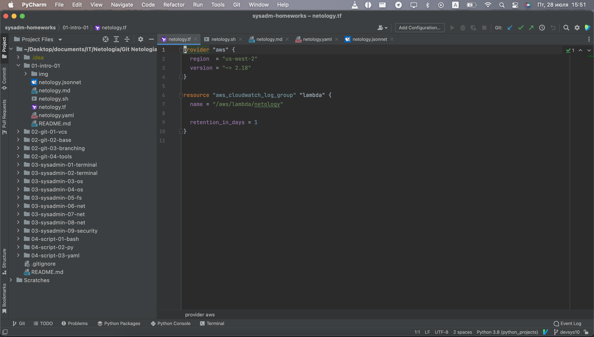
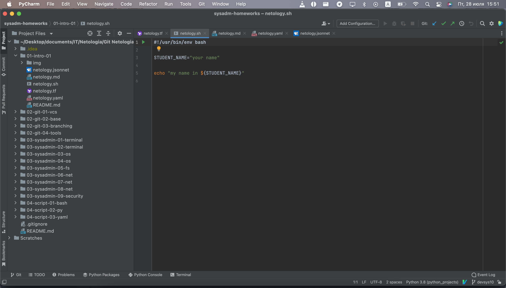
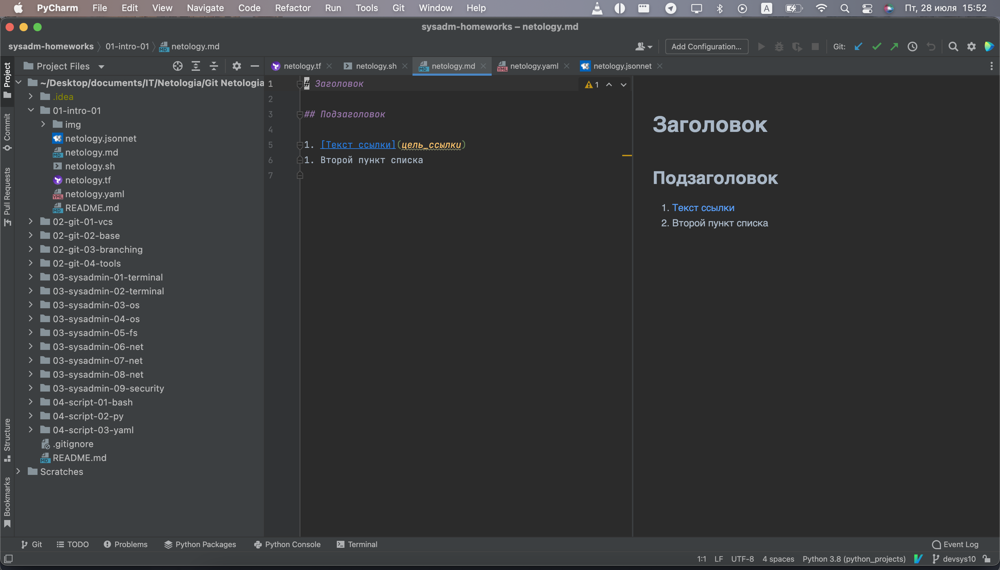
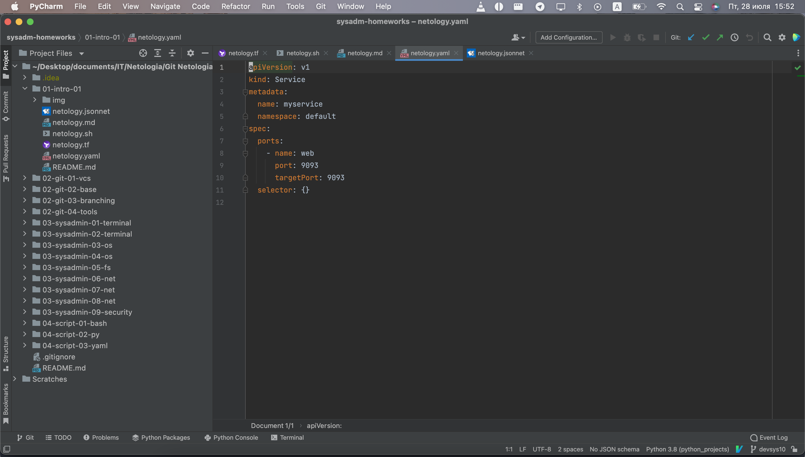
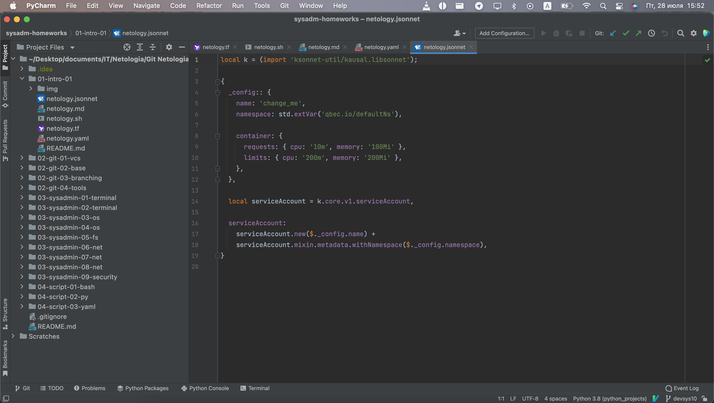
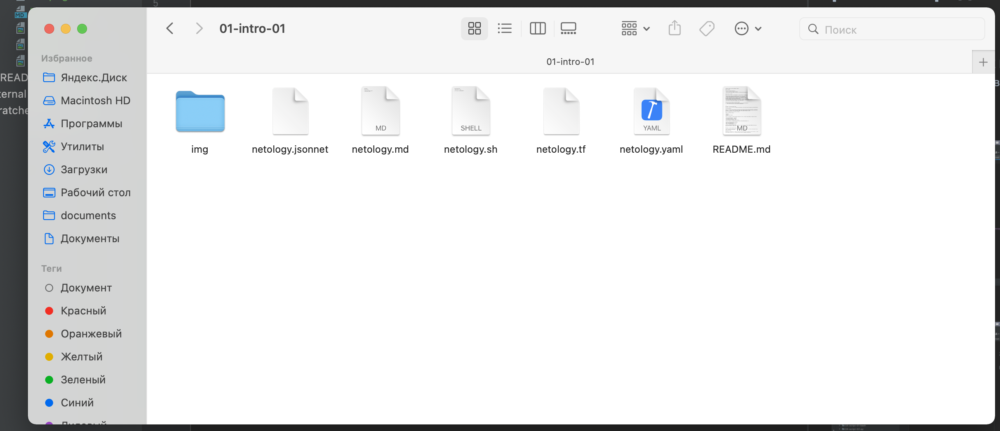

## Задание 1."Подготовка рабочей среды"

### Решение:
Прикладываю скриншоты IDE PyCharm CE c установленными (в соответствии с заданием) модулями: 

Модуль "Terraform"

Модуль "Bash"

Модуль "Markdown"

Модуль "Yaml"

Модуль "Jsonnet"

Также прикладываю скриншот с файлами модулей:

##Задание 2."Описание жизненного цикла задачи (разработки нового функционала)"

###Решение:

Жизненный цикл разработки программного обеспечения:

1. Анализ:
- 1.1 Обсуждение и согласование с клиентом требуемых целей для проекта: может представлять из себя разработка нового функционала или же поддержка существующего, старт полностью нового проекта, переезд проекта на более новые технологии и т.д.
- 1.2 Постановка задачи: вам нужно создать задачу в СУП (Система Управления Проектами) таких как Jira, Trello, etc., с описанием задачи и постановкой сроков выполнения (установкой дедлайнов). В качестве альтернатив может использоваться Bitrix24, или прочие трекеры задач.

2. Планирование:
- 2.1 Оценка: необходимо рассчитать все затраты, которые уйдут на выполнения данной работы. Скооперировавшись с разработчиками и менеджером проекта, происходит оценка объёма работ, под который выделяются ресурсы, такие как: технические ресурсы (например оплата аренды серверов под тестовые среды), часы (т.е. время сотрудников, потраченное на данную задачу), скилы (понимание возможности предоставить ту или иную услугу, поиск альтернатив (например согласование выбора Базы Данных, на какой технологии будет работать проект - CMS или Фреймворк, если говорить о Web-приложении)
- 2.2 Расстановка задач: распределение тасков на разработчиков и менеджеров, для выполнения поставленных задач, обычно этим занимается Проектный менеджер.

3. Процесс разработки:
- 3.1 Создание ветки: разработчикам поручается создание ветки в СКВ (Системах Контроля Версий) для данной задачи, таких как: Git, Gitlab, Github, bitbucket, etc. 
- 3.2 Разработка необходимого функционала: разработчики начинают писать код проекта, согласно требованиям в ТЗ.
- 3.3 Непрерывный контроль версий: по мере написания кода в рамках ТЗ, разработчики делают merge (объединяют второстепенные ветки с основной веткой разработки)
- 3.3 Предварительная подготовка перед выкладкой кода: тестирование кода разработчиками на локальном окружении (например на рабочем устройстве)

4. Тестирование кода:
- 4.1 Push (выкладка) кода в тестовую среду: создаётся тестовая среда (например выделяется VPS сервер у какого-нибудь облачного провайдера) где разработчики выкладывают свой код для тестировщиков.
- 4.2 Тестирование кода: отдел тестировщиков занимается тестированием функционала, согласно ТЗ, после чего документируют обнаруженные несоответствия и ошибки.
- 4.3 Исправление багов и несоответствий: отдел разработчиков анализирует и фиксит ошибки, задокументированные тестировщиками.  

5. Проверка кода:
- 5.1 Проверка ответственным за код проекта: им может быть и Тимлид, и Старший программист и т.д. Проводит он codereview (проверка кода), проверяет функционал, заявленный в ТЗ на соответствие всем требованиям, обеспечивает корректность функционала. Если есть несоответствие - он отправляет код на доработку обратно разработчикам. Проектный менеджер так же принимает участие в проверке выполненной работы разработчиков, поскольку он ответственен за то, что из себя представляет сам проект.
- 5.2 Подготовка к деплою: в случае если ответственный за код проекта одобряет работы, начинается подготовка к деплою (раскатке) кода на прод.

6. Деплой проекта на прод и его backup:
- 6.1 Деплой (выкладка) на прод: DevOps инженер (в данном случае вы) создаёте автоматизированный процесс деплоя (выкладки) артефакта (скомпилированного кода) на prod-сервер (готовую рабочую среду для заказчика), следуя процессу  CI/CD (непрерывной доставки и развёртывания кода на прод-среду). Здесь могут быть задействованы такие инструменты, как: jenkins, ansible, artifactory, k8s, docker, git.
- 6.2 Мониторинг процессов: далее предстоит следить за работоспособностью всей системы и автоматизированных процессов, для обеспечения работоспособности, согласно согласованной RPO и RTO («Recovery Point Objective» - Показатель точки восстановления и «Recovery Time Objective» - Время точки восстановления)
- 6.3 Backup (Откат изменений): в случае необходимости отката изменений (например в случае поломки функционала), вы проводите backup (откат) до предыдущей рабочей версии.

   Во всём процессе разработки продукта происходит взаимодействие между проектным менеджером, ответственным за код проекта, разработчиками, тестировщиками и DevOps-инженером). Данное описание обобщено, поскольку всегда есть разница в количестве специалистов (это может быть один сотрудник, или целый отдел), различные направления в разработке, методологии процессов и прочие особенности какой-либо стартап-команды.
