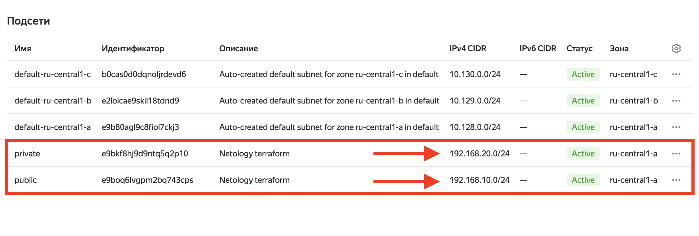

## Домашняя работа

#### Задание 1. Yandex Cloud

1) Создать пустую VPC. Выбрать зону.
2) Публичная подсеть.

- Создать в VPC subnet с названием public, сетью 192.168.10.0/24.
- Создать в этой подсети NAT-инстанс, присвоив ему адрес 192.168.10.254. В качестве image_id использовать fd80mrhj8fl2oe87o4e1.
- Создать в этой публичной подсети виртуалку с публичным IP, подключиться к ней и убедиться, что есть доступ к интернету.

3) Приватная подсеть.

- Создать в VPC subnet с названием private, сетью 192.168.20.0/24.
- Создать route table. Добавить статический маршрут, направляющий весь исходящий трафик private сети в NAT-инстанс.
- Создать в этой приватной подсети виртуалку с внутренним IP, подключиться к ней через виртуалку, созданную ранее, и убедиться, что есть доступ к интернету.

#### Ответ

#### Задание 1

##### 0) Предварительная настройка

Для начала настроил необходимые переменные окружения для аутентификации в Yandex Cloud в `~/.zshrc` файде. Добавил туда следующие строки:

```
export YC_TOKEN=<мой OAuth токен>
export YC_ENDPOINT=api.cloud.yandex.net:443
```

Затем для выполнения задания написал 3 файла Terraform конфигов: `main.tf`, `variables.tf` и `outputs.tf`.

##### 1) В `main.tf` создал всю основную инфраструктуру на проекте

```
provider "yandex" {
  token     = var.yc_token
  cloud_id  = var.yc_cloud_id
  folder_id = var.yc_folder_id
  zone      = var.yc_zone
}

resource "yandex_vpc_network" "main" {
  name = "my-vpc"
}

resource "yandex_vpc_subnet" "public" {
  name           = "public"
  zone           = var.yc_zone
  network_id     = yandex_vpc_network.main.id
  v4_cidr_blocks = ["192.168.10.0/24"]
}

resource "yandex_vpc_subnet" "private" {
  name           = "private"
  zone           = var.yc_zone
  network_id     = yandex_vpc_network.main.id
  v4_cidr_blocks = ["192.168.20.0/24"]
}

resource "yandex_compute_instance" "nat" {
  name          = "nat-instance"
  platform_id   = "standard-v1"
  subnet_id     = yandex_vpc_subnet.public.id
  hostname      = "nat-instance"
  zone          = var.yc_zone
  
  resources {
    cores  = 2
    memory = 4
  }

  boot_disk {
    initialize_params {
      image_id = "fd80mrhj8fl2oe87o4e1"
    }
  }

  network_interface {
    subnet_id = yandex_vpc_subnet.public.id
    nat       = true
    ip_address = "192.168.10.254"
  }

  metadata = {
    ssh-keys = "ubuntu:${file(var.path_to_public_key)}"
  }
}

resource "yandex_compute_instance" "public_vm" {
  name          = "public-vm"
  platform_id   = "standard-v1"
  subnet_id     = yandex_vpc_subnet.public.id
  hostname      = "public-vm"
  zone          = var.yc_zone
  allow_stopping_for_update = true
  
  resources {
    cores  = 2
    memory = 4
  }

  boot_disk {
    initialize_params {
      image_id = "fd80mrhj8fl2oe87o4e1"
    }
  }

  network_interface {
    subnet_id = yandex_vpc_subnet.public.id
    nat       = true
  }

  metadata = {
    ssh-keys = "ubuntu:${file(var.path_to_public_key)}"
  }
}

resource "yandex_vpc_route_table" "private" {
  name      = "private-route-table"
  network_id = yandex_vpc_network.main.id

  static_route {
    destination_prefix = "0.0.0.0/0"
    next_hop_address   = "192.168.10.254"
  }
}

resource "yandex_compute_instance" "private_vm" {
  name          = "private-vm"
  platform_id   = "standard-v1"
  subnet_id     = yandex_vpc_subnet.private.id
  hostname      = "private-vm"
  zone          = var.yc_zone
  allow_stopping_for_update = true
  
  resources {
    cores  = 2
    memory = 4
  }

  boot_disk {
    initialize_params {
      image_id = "fd80mrhj8fl2oe87o4e1"
    }
  }

  network_interface {
    subnet_id      = yandex_vpc_subnet.private.id
  }

  metadata = {
    ssh-keys = "ubuntu:${file(var.path_to_public_key)}"
  }
}
```

##### 2) Потом в `variables.tf` определил переменные

```
variable "yc_token" {
  description = "Yandex Cloud OAuth token"
}

variable "yc_cloud_id" {
  description = "ID of the Yandex Cloud"
}

variable "yc_folder_id" {
  description = "ID of the Yandex Cloud Folder"
}

variable "yc_zone" {
  description = "Zone where resources will be created"
  default     = "ru-central1-a"
}

variable "path_to_public_key" {
  description = "Path to the public SSH key"
}
```

##### 3) Затем в`outputs.tf` добавил информацию о созданных ресурсах

```
output "public_vm_ip" {
  value = yandex_compute_instance.public_vm.network_interface[0].nat_ip_address
}

output "nat_instance_ip" {
  value = yandex_compute_instance.nat.network_interface[0].primary_v4_address.address
}
```

##### 4) Применил написанные конфиги командами

Инициализировал: `terraform init`


Применил: `terraform apply`


##### 5) Созданные ресурсы

VPC `dev`:


Subnet `public` (192.168.10.0/24) и `private` (192.168.20.0/24):



Информация об образе с id: `fd80mrhj8fl2oe87o4e1`


Созданные NAT-инстанс c образом `fd80mrhj8fl2oe87o4e1` и адресом `192.168.10.254`, ВМ в **public** сети и публичным IP, ВМ в **private** сети.


Подключился к ВМ в **public** сети, убедился что есть доступ к интернету:


Созданный route table:


Подключился ВМ в **private** сети. Убедился что также есть доступ в интернет:


##### Финальные конфиги

```
-rw-r--r--  1 boriscernyj  staff   2,4K 15 авг 16:56 main.tf
-rw-r--r--  1 boriscernyj  staff   222B 15 авг 16:57 outputs.tf
-rw-r--r--  1 boriscernyj  staff   404B 15 авг 16:57 variables.tf
```

##### 6) Правки

1) Убрал у машины **private** подсети публичный адрес:


2) Привязал подсети к таблице маршрутизации, используя атрибут ресурса подсети `route_table_id`:


3) Проверил, всё работает:


