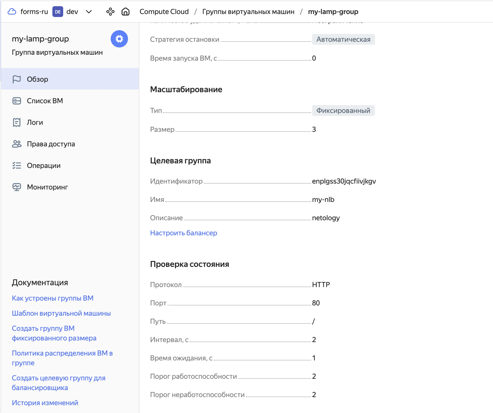

## Домашняя работа

#### Задание 1. Yandex Cloud

1) Создать бакет Object Storage и разместить в нём файл с картинкой:

- Создать бакет в Object Storage с произвольным именем (например, имя_студента_дата).
- Положить в бакет файл с картинкой.
- Сделать файл доступным из интернета.

2) Создать группу ВМ в public подсети фиксированного размера с шаблоном LAMP и веб-страницей, содержащей ссылку на картинку из бакета:

- Создать Instance Group с тремя ВМ и шаблоном LAMP. Для LAMP рекомендуется использовать image_id = fd827b91d99psvq5fjit.
- Для создания стартовой веб-страницы рекомендуется использовать раздел user_data в meta_data.
- Разместить в стартовой веб-странице шаблонной ВМ ссылку на картинку из бакета.
- Настроить проверку состояния ВМ.

3) Подключить группу к сетевому балансировщику:

- Создать сетевой балансировщик.
- Проверить работоспособность, удалив одну или несколько ВМ.

#### Ответ

#### Задание 1

##### 1) Создание бакета и загрузка файла с картинкой

Создал провайдер `Yandex`, создал бакет с именем `borischerny210824` и положил туда файл с картинкой `image.jpg`.
Сделал публичным доступ на чтение файлов с помощью атрибута `acl     = "public-read"`


Бакет `borischerny210824`:


Картинка `image.jpg` внутри бакета:


##### 2) Создание группы ВМ и развертывание LAMP

Дополнил `main.tf`: добавил ресурсы `yandex_compute_instance_group` и `yandex_compute_instance_group_health_check`. Создал группу ВМ с использованием LAMP шаблона и добавил стартовую веб-страницу с ссылкой на картинку из бакета.

Группа ВМ `my-lamp-group`:


Страница с картинкой работает:


Блок `yandex_compute_instance_group`:


Блок `yandex_compute_instance_group_health_check`:


##### 3) Создание сетевого балансировщика

Созданный балансер `my-nlb` подключён к группе ВМ `my-lamp-group`.
Также подключена **Проверка состояния**.



После удаления одной из ВМ страница всё так же доступна, так как происходит редирект на одну из 2х рабочих ВМ:


Код где создаётся сетевой балансировщик.


##### 4) Добавление файлов `variables.tf` и `outputs.tf`

Файл с переменными:


Вывод значений:


##### Финальные конфиги

```
-rw-r--r--  1 boriscernyj  staff   2,1K 23 авг 15:36 main.tf
-rw-r--r--  1 boriscernyj  staff   399B 23 авг 15:37 outputs.tf
-rw-r--r--  1 boriscernyj  staff   353B 23 авг 15:40 variables.tf
```
