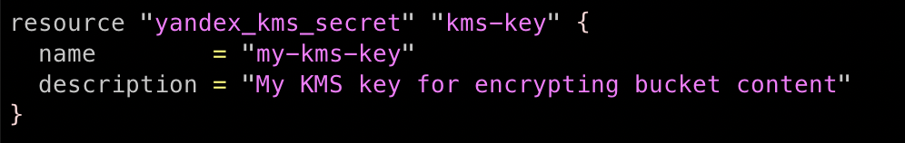
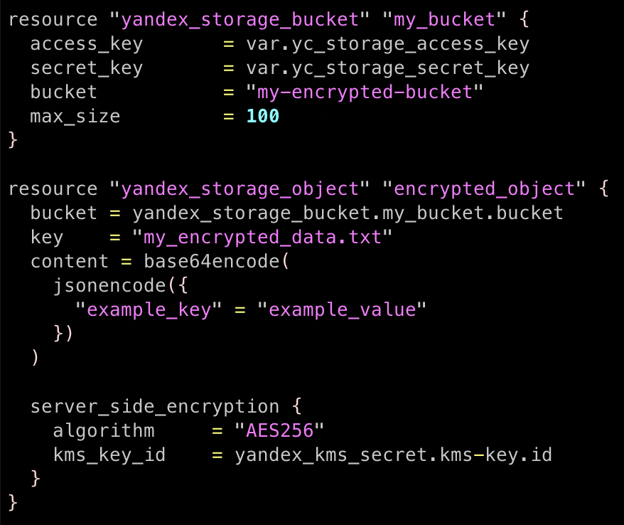
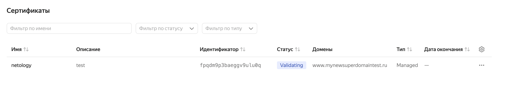
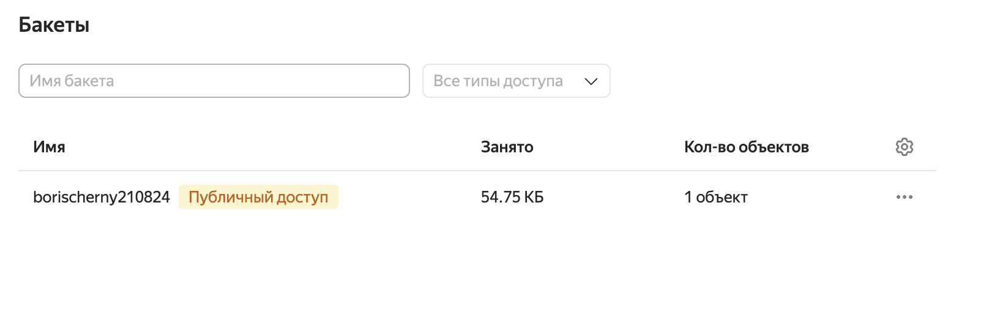
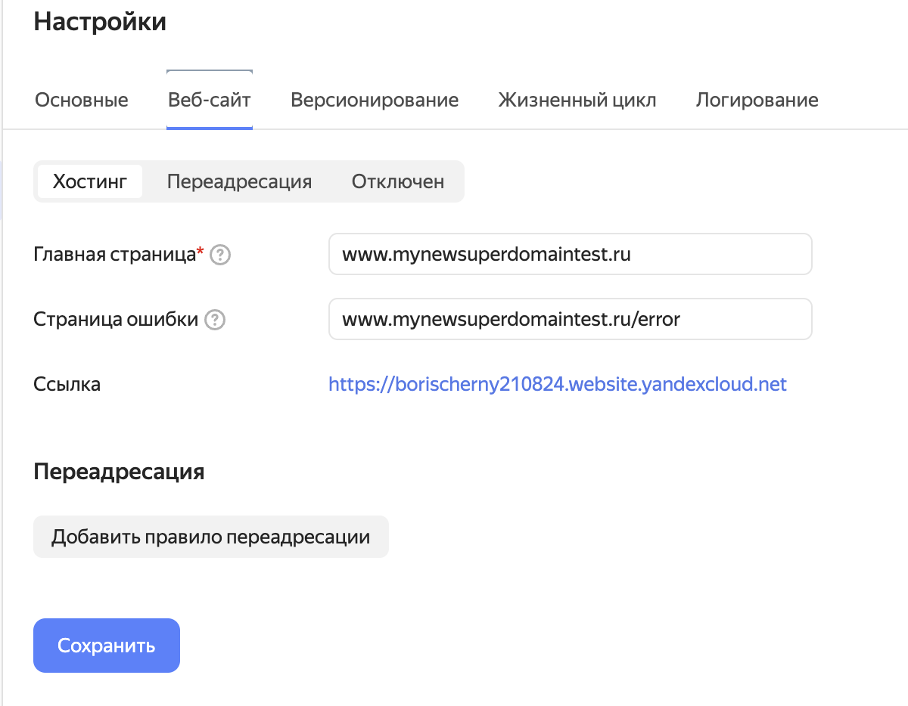
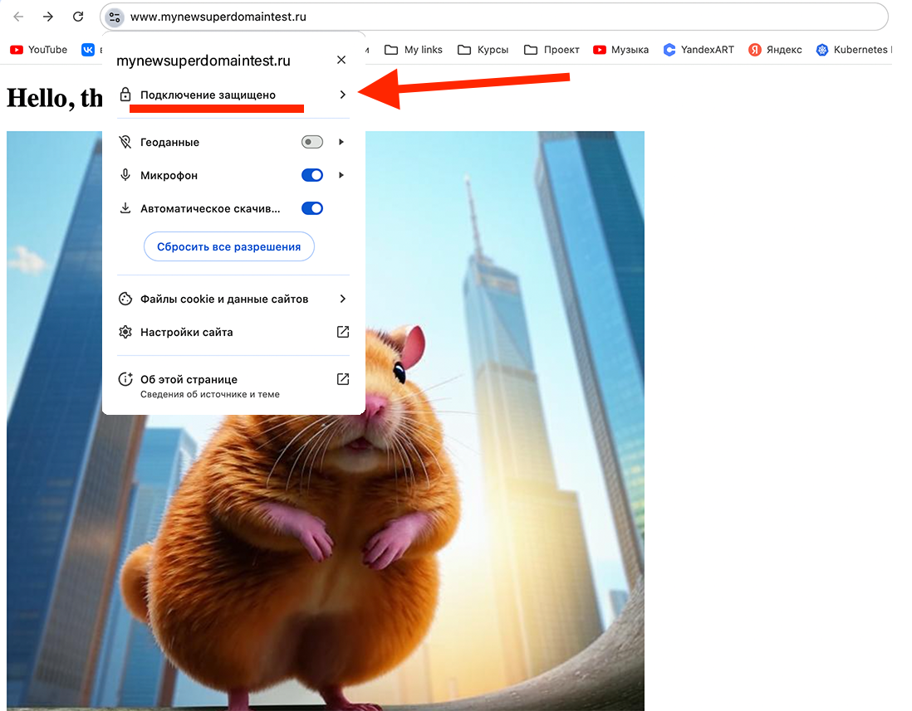

## Домашняя работа

#### Задание 1. Yandex Cloud

1) С помощью ключа в KMS необходимо зашифровать содержимое бакета:

- создать ключ в KMS;
- с помощью ключа зашифровать содержимое бакета, созданного ранее.

2) (Выполняется не в Terraform)* Создать статический сайт в Object Storage c собственным публичным адресом и сделать доступным по HTTPS:

- создать сертификат;
- создать статическую страницу в Object Storage и применить сертификат HTTPS;
- в качестве результата предоставить скриншот на страницу с сертификатом в заголовке (замочек).

#### Ответ

#### Задание 1: Создание ключа в KMS

##### 1) Создание ключа в KMS

Для начала создал ключ в KMS, используя terraform. Для этого описал код в файле `kms.tf`



##### 2) Шифрование содержимого бакета

Для шифрования содержимого бакета также использовал terraform, указав нужные сущности в файле  `storage.tf`



Задание 2: Создание статического сайта в Object Storage с HTTPS

Эти шаги выполняются вне Terraform.

#### Задание 2: Создание сертификата в Yandex Cloud

##### 1) Создание сертификата

1. Для создания сертификата перешёл в **Yandex Cloud Console**.

2. В разделе **Certificate Manager** создаю новый сертификат для моего нового домена `www.mynewsuperdomaintest.ru` (на базе **let's Encrypt**):



##### 2) Создание статической страницы и применение сертификата

1. Перешёл в раздел **Object Storage**:



2. Настроил ранннее созданный бакет в предыдущем задании (***clopro-homeworks_2***) на поддержку статического сайта:



После настроек назначил сертификат.

##### 3) Проверка и предоставление скриншота

1. Перешёл по публичному адресу моего сайта, убедился что сайт доступен по `HTTPS` - (значок замка рядом с сообщением `Подключение защищено`):



##### Финальные конфиги

```
-rw-------@ 1 boriscernyj  staff    55K 23 авг 15:55 image.jpg
-rw-r--r--  1 boriscernyj  staff   131B 30 авг 16:23 kms.tf
-rw-r--r--  1 boriscernyj  staff   2,1K 23 авг 15:54 main.tf
-rw-r--r--  1 boriscernyj  staff   399B 23 авг 15:37 outputs.tf
-rw-r--r--  1 boriscernyj  staff   555B 30 авг 16:27 storage.tf
-rw-r--r--  1 boriscernyj  staff   353B 23 авг 15:40 variables.tf
```
