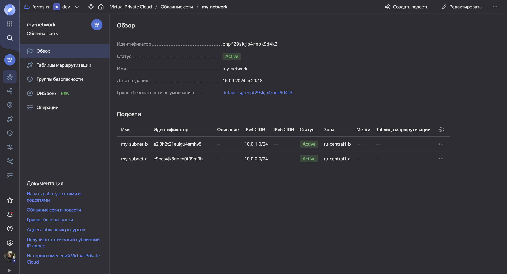
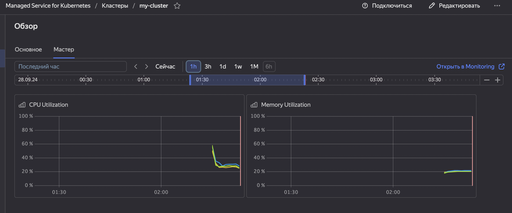

## Домашняя работа

#### Задание 1. Создание облачной инфраструктуры

##### 1) Создал сервисный аккаунт для terraform

С именем `terraform-sa`


Выставил ему роль `editor`


Создал статический ключ для сервисного аккаунта:


##### 2) Подготовил backend для Terraform

1. Перед созданием бакета создал для него сервисный аккаунт `object-storage-sa`, выдал для него роли `editor` и `storage.admin`


Вывод команды `terraform apply`:


Созданный bucket в Yandex Cloud:


##### 3) Создал VPC с подсетями в разных зонах доступности

Вывод команды `terraform apply`:


Созданная VPC `my-network` с двумя подсетями в разных зонах доступности: `my-subnet-a` и `my-subnet-b`:



##### 4) Убедился, что я могу выполнить команды `terraform destroy` и `terraform apply` без дополнительных ручных действий

Выполненная команда `terraform destroy`:


Выполненная команда `terraform apply`:


#### Задание 2. Создание Kubernetes кластера

##### 1) С помощью terraform resource для kubernetes создал региональный мастер kubernetes с размещением нод в разных 3 подсетях

Для начала подготовил сервис аккаунты с соответствующими ролями:


Кластер:


3 разные подсети:


##### 2) С помощью terraform resource для kubernetes создал node group

Группа нод


Разные подсети


Скриншот разных подсетей из настройки групп нод


##### 3) Работоспособный Kubernetes кластер

Кластер из yandex cloud работает, мастер отправляет метрики:



##### 4) В файле ~/.kube/config находятся данные для доступа к кластеру

Кластер инициализирован:


##### 5) Команда kubectl get pods --all-namespaces отрабатывает `просто идеально`


#### Задание 3. Создание тестового приложения

Я решил воспользоваться "Рекомендуемым вариантом", указанным в задании.

##### 1)  Создал отдельный git репозиторий с простым nginx конфигом, который отдаваёт статический контент

Создал публичный репозиторий ```configs``` в котором и разместил **nginx** конфиг, html-код и dockerfile собирающий образ приложения:


##### 2)  Подготовил Dockerfile для создания образа приложения


Он влкючает в себя конфигурацию nginx:


И директорию с html-страницей `html/index.html`, на которой будет написано `It works!`:


##### 3) Собрал образ

Собрал образ при помощи команды `docker build --platform linux/amd64 -t cr.yandex/crp581po20a0rccbh4g6/test-nginx-app:latest .`

Здесь стоит обратить внимание что использовался параметр `--platform linux/amd64` чтобы явно указать для какой платформы будет происходить сборка. Без этого параметра деплой образа в k8s (сервис Yandex Cloud) выдавал ошибку, видимо это связанно с особенностью серверной архитектуры самого Yandex Cloud. После указания флага всё заработало.


##### 4) Подключил Docker к Container Registry

Для этого использовал метод подключения `yc container registry configure-docker`


Так как при подключении через `docker login cr.yandex` я получал ошибку, где советовался метод описанный выше:

```
~ docker login cr.yandex

Authenticating with existing credentials...
ERROR: docker login is not supported with yc credential helper. Use 'yc container registry configure-docker --profile <PROFILE>' to set another profile or disable credential helper for given endpoint: https://cloud.yandex.ru/docs/container-registry/operations/authentication#ch-not-use
Error saving credentials: error storing credentials - err: exit status 1, out: ``
```

##### 5) Ссылка на Git репозиторий с тестовым приложением и Dockerfile

<https://github.com/falaning/configs>

##### 6) Мой регистри с собранным docker image

В качестве регистри я выбрал Yandex Container Registry, созданный также с помощью terraform.

Код terraform:


Регистри на Yandex Cloud:


#### Задание 4. Подготовка cистемы мониторинга и деплой приложения

##### 1) Задеплоил в кластер prometheus, grafana, alertmanager, экспортер основных метрик Kubernetes

Для этого вопсользовался пакетом `kube-prometheus`.

Задеплоил пакет:

`kubectl apply -f manifests`


Затем для того чтобы получить доступ к web запустил `port-forwarding` на `3000` порту:

`kubectl port-forward svc/grafana 3000:3000 -n monitoring`


Подключился по адресу `http://localhost:3000/`, авторизовался дефолт-кредами, получил доступ к `Grafana`:


Создал **playlist** с простыми **dashboards**, отображающие состояние кластера **kubernetes**:


##### 2) Задеплоил тестовое приложение (nginx сервер отдающий статическую страницу)

Для этого в репозитории `configs` создал манифест-файл `kubernetes/nginx/nginx.yaml`, который создаёт `deployment` моего `nginx-приложения` и `service` для **LoadBalancer** чтобы делать балансировку между двумя репликами приложения (для отказоустойчивости):


Применил манифест-файл и успешно создал deployment `my-nginx-app`,


состоящий из 2 подов:


Затем, чтобы подключиться к web-странице приложения, ввёл команду `kubectl get svc` и получил `EXTERNAL-IP` для подключения,


порт 80, так как в Dockerfile было прописано `EXPOSE 80`:


Затем подключился по этому IP-адресу через браузер, и увидел страницу моего web-приложения на которой, соответственно, написано `It works!`:


#### Задание 5. Установка и настройка CI/CD

Настроил ci/cd систему для автоматической сборки **docker image** и деплоя приложения при изменении кода.

В качестве системы выбрал `GitHub Actions`.

##### 1) Сделал автоматическую сборку docker образа при коммите в Github репозиторий с тестовым nginx-приложением

Для этого я написал **workflow** `/configs/.github/workflows/docker-build-and-push.yml`:


###### Какие поборол ошибки

Путём проб и ошибок успешно запустил его с 7 раза. Основные проблемы возникали сначала из-за ошибок в `yaml` синтаксе, затем **workflow** стал успешно запускаться но **push** в репозиторий создавал сразу 3 ***"images"*** вместо 1. Оказывается, это было из-за использования утилиты `docker buildx` в **workflow** (расширенной вресии `docker build`). Из-за своей специфики она создаёт во время сборки помимо **image** ещё 2 файла метаданных, которые тоже **push**ились в `container registry` (и соответственно воспринимались им как **images**).

Проблема решилась путём замены `docker buildx` на традиционный `docker build`, после чего **images** стали **push**иться и отображаться корректно.


Скриншот из `container registry` с **image**:


##### 2) Сделал автоматический деплой нового docker образа

Для этого я написал **workflow** `/configs/.github/workflows/deploy.yml`:


Благодаря этой строке кода я настроил так чтобы он срабатывал после `docker-build-and-push.yml`

```
on:
  workflow_run:
    workflows: ["Docker Build and Push"]
    types:
     - completed
```

Для работы этого **workflow** потребовалось создать новый **terraform file** `k8s_service_account.tf` который добавлял **service account** `github-actions-sa` специально для ***github_actions***, выдал ему соответствующие роли и применил изменения при помощи `terraform apply`.

В итоге вот такие секреты нужно было создать для **workflowфs**.

`KUBERNETES_SERVER` - для получения значения надо ввести команду `kubectl cluster-info` и из вывода взять ссылку которая идёт после `Kubernetes control plane is running at`, например `https://123.123.123.123`, затем положить её в этот секрет (т.е. в ***защищённую переменную Github***)

`KUBERNETES_TOKEN` - для его получения надо ввести команду `kubectl create token github-actions-sa -n default`, после чего скопировать длинный токен из вывода и положить в этот секрет.


###### Проверка приложения

Чтобы обновить приложение, я изменил код с `It works!` на `It works! Again :)`


Затем запушил изменения в репозиторий, оба **workflows** (`docker-build-and-push.yml` и `deploy.yml`) отработали правильно, в итоге приложение с новым кодом успешно задеплоилось в k8s кластер и теперь отображается на web-странице по тому-же IP-адресу:


Скриншот успешно отработавшего **workflow**:


###### Какие поборол ошибки

Как и с предыдущим **workflow** (`docker-build-and-push.yml`) пришлось несколько раз переписывать код, перепроводить `jobs`, и добавлять новые сущности.
Например, по-ходу следующих ошибок выяснилось следующее:

Ошибка №1:

```
E1007 14:16:27.315860    1793 memcache.go:238] couldn't get current server API group list: Get "***/api?timeout=32s": x509: certificate signed by unknown authority
```

Решилась тем что:

- Добавил параметр `--insecure-skip-tls-verify`

Ошибка №2:

```
Error from server (Forbidden): deployments.apps "my-nginx-app" is forbidden: User "system:serviceaccount:default:github-actions-sa" cannot get resource "deployments" in API group "apps" in the namespace "default"
```

Решилась тем что:

- Перезапустил кластер

Ошибка №3:

```
E1007 14:30:57.374837    1769 memcache.go:238] couldn't get current server API group list: the server has asked for the client to provide credentials
```

Решилась тем что:

- Обновил секреты `KUBERNETES_TOKEN` и `KUBERNETES_SERVER` (актуально после перезапуска кластера или, особенно, его пересборки)

Ошибка №4:

```
Error from server (NotFound): deployments.apps "my-nginx-app" not found
```

Решилась тем что:

- Перезапустил deployment `my-nginx-app`

#### Всё "что необходимое для сдачи задания"

1) Репозиторий с конфигурационными файлами Terraform и готовность продемонстрировать создание всех ресурсов с нуля.

<https://github.com/falaning/devops-netology/tree/main/homeworks/devops-diplom-yandexcloud> - основной репозиторий `devops-netology` с terraform кодом, прочими конфигами и самим дипломным проектом
<https://github.com/falaning/configs/tree/main> - второй репозиторий `configs` с Dockerfile, k8s манифестами (nginx-приложения и prometheus) html-страницей и nginx.conf
<https://github.com/falaning/configs/tree/main/.github/workflows> - мои **workflows** (на `configs`)

2) Пример pull request с комментариями созданными atlantis'ом или снимки экрана из Terraform Cloud или вашего CI-CD-terraform pipeline.

- В моём случае был выбран CI-CD, все примеры представленны в этой работе.

3) Репозиторий с конфигурацией ansible, если был выбран способ создания Kubernetes кластера при помощи ansible.

- Был выбран способ создания кластера через **Yandex Managed Service for Kubernetes**

4) Репозиторий с Dockerfile тестового приложения и ссылка на собранный docker image.

- Все репозитории указаны в пунтке (1)

5) Репозиторий с конфигурацией Kubernetes кластера

- Все репозитории указаны в пунтке (1)

6) Ссылка на тестовое приложение и веб интерфейс Grafana с данными доступа.

<http://84.201.146.152/> - тестовове приложение
<http://localhost:3000/> - так как в задании было указано сделать "Http доступ к web интерфейсу grafana" я решил хостить через localhost,
так как из-за особенностей платформы `YandexCloud` при динамичном перестроении кластера через **terraform** адреса обновляются, но неймспейсы остаются те-же. При необходимости готов продемонстрировать работу на камеру.

7) Все репозитории рекомендуется хранить на одном ресурсе (github, gitlab)

- Все репозитории хранятся на **github**
