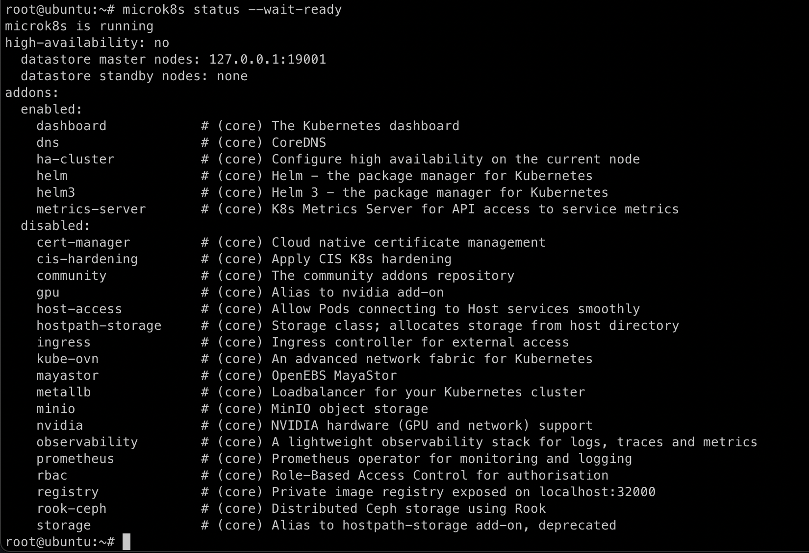
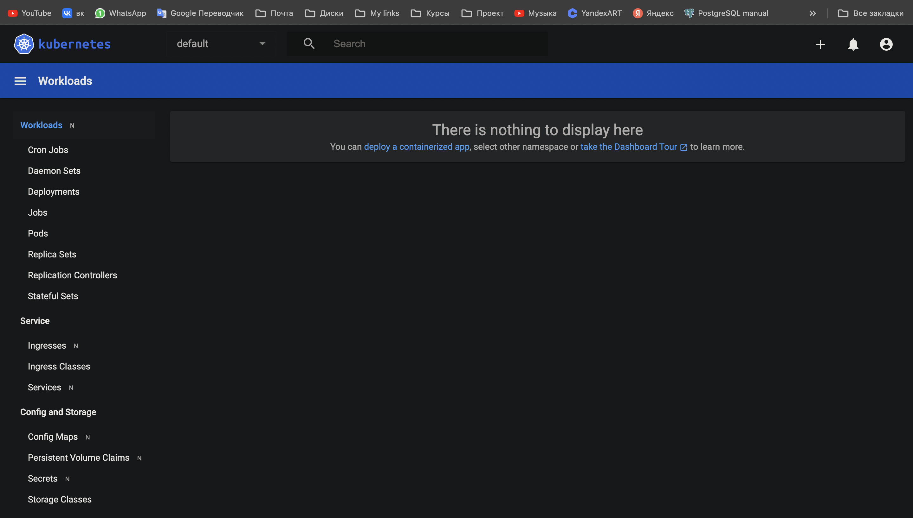
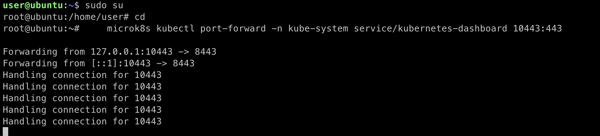
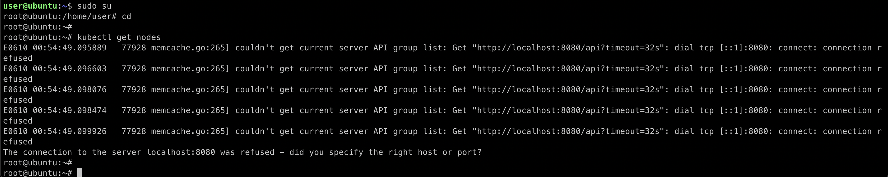

## Домашняя работа

#### Задание 1. Установка MicroK8S

#### Ответ

Установил `Mikrok8s`

Подключил `Dashboard`

#### Задание 2. Установка и настройка локального kubectl

#### Ответ

Включил `port-forward`

Установил kubectl. Вывод команды `kubectl get nodes`

