## Домашняя работа

#### Задание 1. Создать Pod с именем hello-world

1) Создать манифест (yaml-конфигурацию) Pod.
2) Использовать image - gcr.io/kubernetes-e2e-test-images/echoserver:2.2.
3) Подключиться локально к Pod с помощью kubectl port-forward и вывести значение (curl или в браузере).

#### Ответ

1) Создал манифест файл

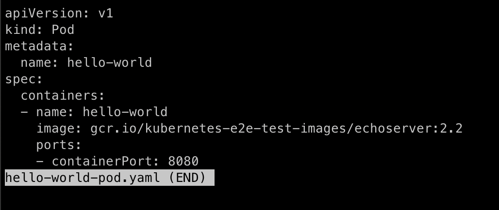

2) В нём использовать image `gcr.io/kubernetes-e2e-test-images/echoserver:2.2`.

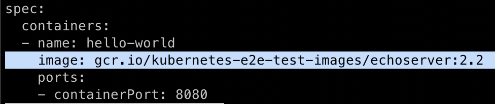

3) Подключился локально к Pod с помощью `kubectl port-forward`.

Port-forward:
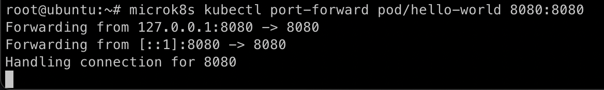

Curl:
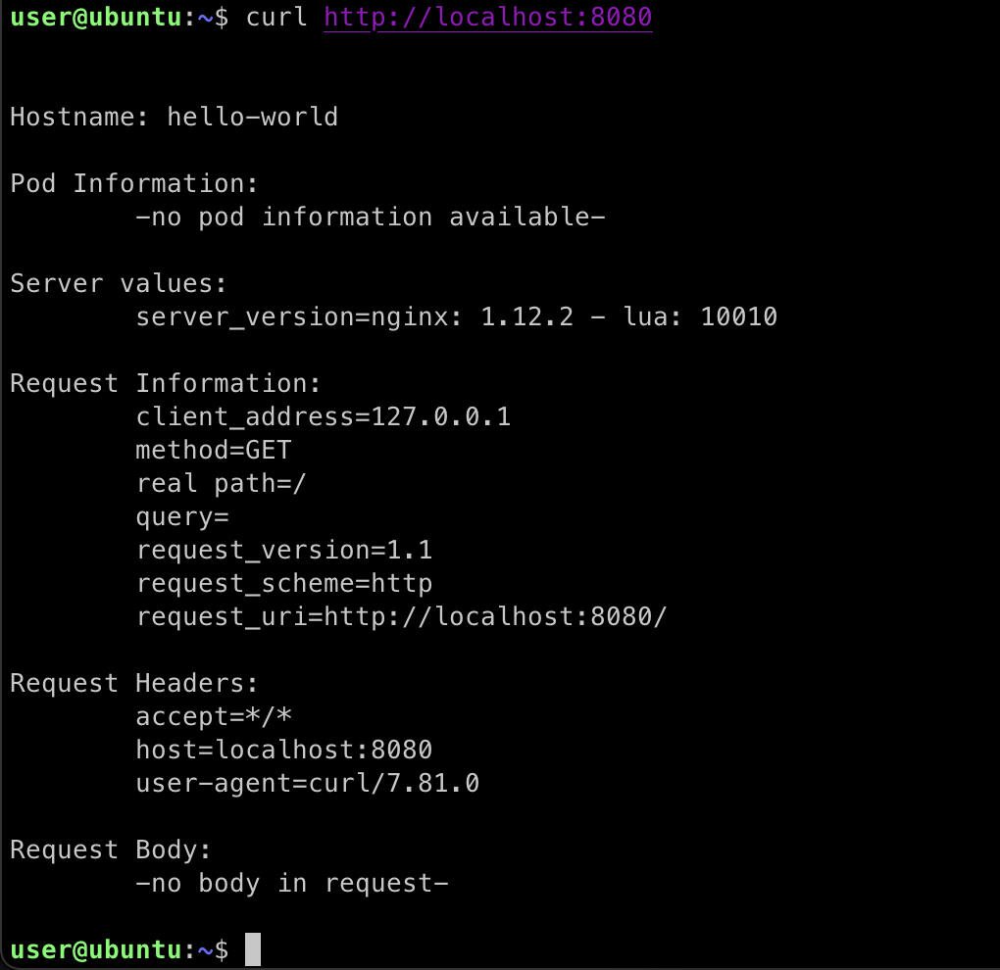

Также решил дополнителньо получить доступ к pod через браузер путём изменения типа сервиса на NodePort.

Для этого создал новый манифест для pod:

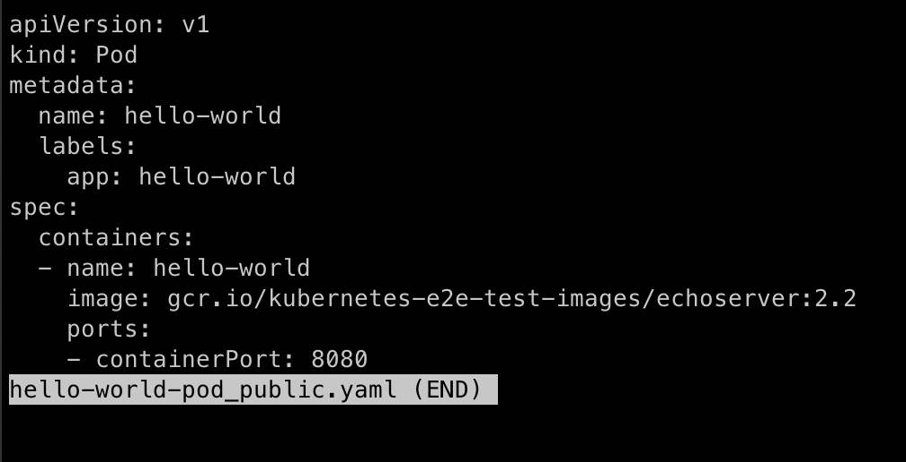

И ещё один новый манифест для сервиса:

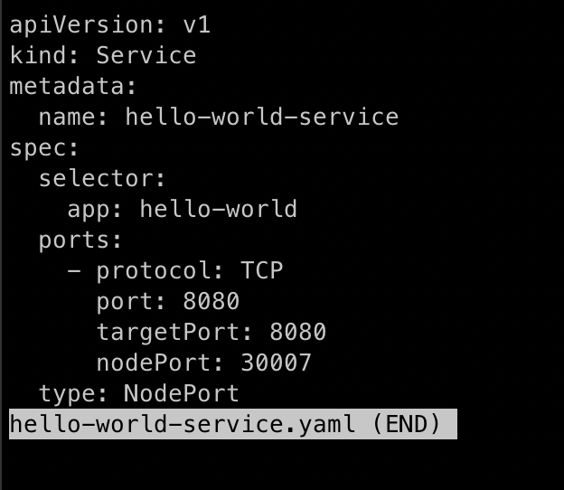

И в итоге получил доступ к pod через браузер, увидел эту страницу:

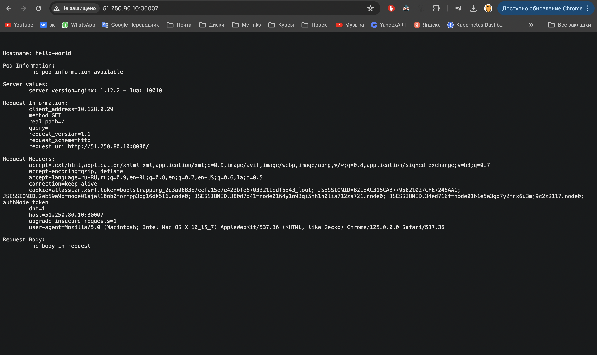

#### Задание 2. Создать Service и подключить его к Pod

1) Создать Pod с именем netology-web.
2) Использовать image — gcr.io/kubernetes-e2e-test-images/echoserver:2.2.
3) Создать Service с именем netology-svc и подключить к netology-web.
4) Подключиться локально к Service с помощью kubectl port-forward и вывести значение (curl или в браузере).

#### Ответ

1) Создал Pod с именем `netology-web`

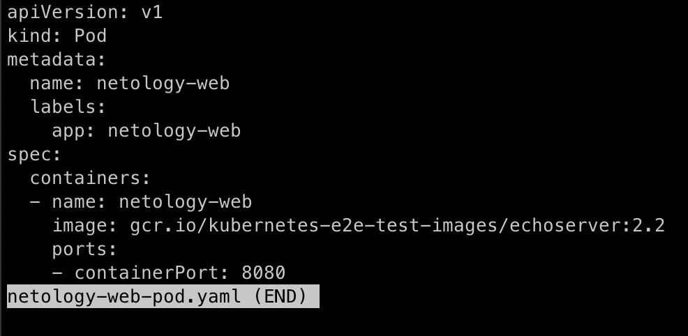

2) Использовал image — `gcr.io/kubernetes-e2e-test-images/echoserver:2.2`.

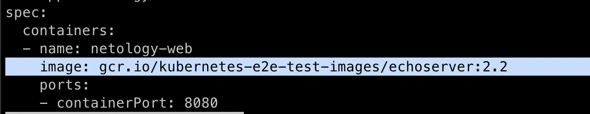

3) Создал Service с именем `netology-svc`,

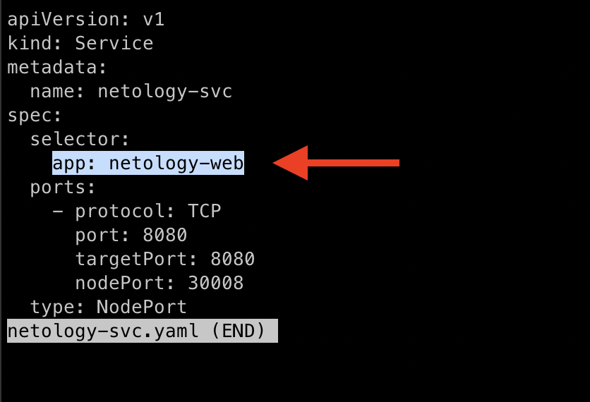

и подключил его к `netology-web` с помощью селектора:

```
spec:
  selector:
    app: netology-web
```

4) Подключился к Service с помощью метода изменения типа сервиса на `NodePort` (вместо port-forward) для того чтобы получить доступ к странице через браузер:

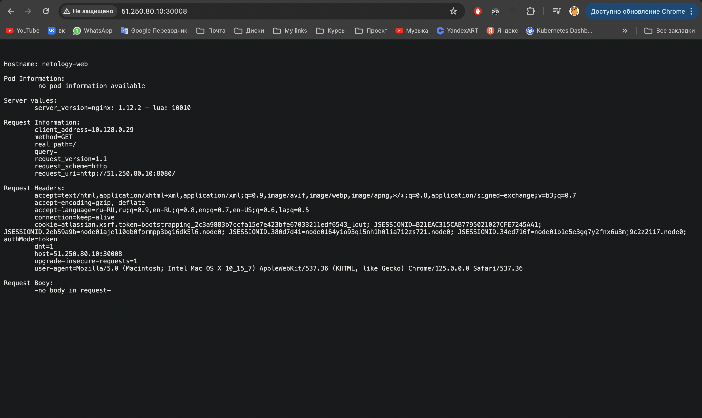

Список pods:

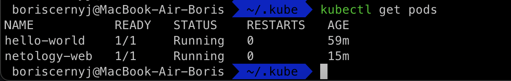
