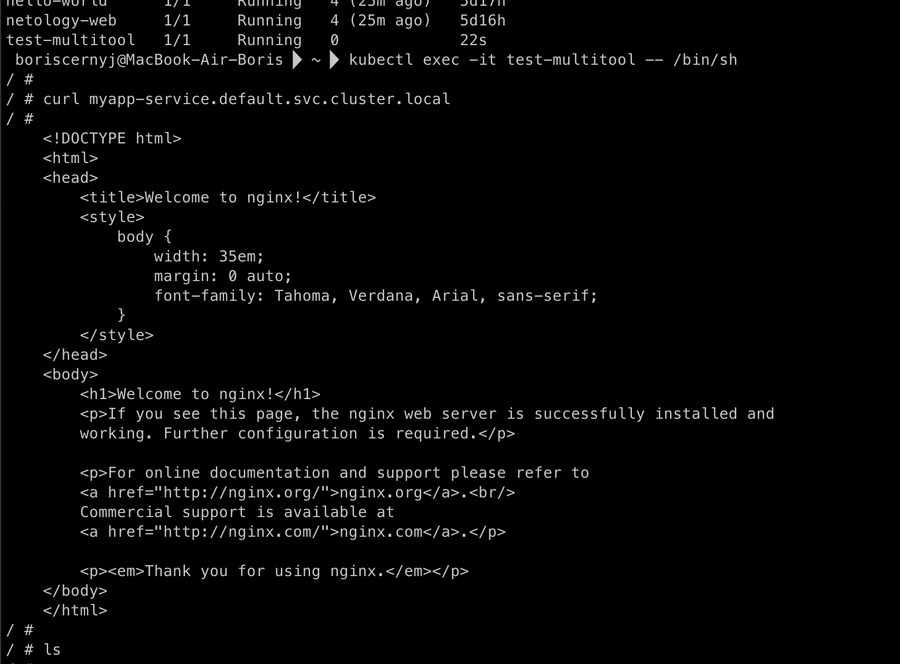

## Домашняя работа

#### Задание 1. Создать Deployment и обеспечить доступ к репликам приложения из другого Pod

1) Создать Deployment приложения, состоящего из двух контейнеров — nginx и multitool. Решить возникшую ошибку.
2) После запуска увеличить количество реплик работающего приложения до 2.
3) Продемонстрировать количество подов до и после масштабирования.
4) Создать Service, который обеспечит доступ до реплик приложений из п.1.
5) Создать отдельный Pod с приложением multitool и убедиться с помощью curl, что из пода есть доступ до приложений из п.1.

#### Ответ

1) Создать Deployment приложения с контейнерами `nginx` и `multitool`:


Попутно решил возникшую ошибку: она была связанна с тем что оба контейнера использовали 80й порт, так как multitool тоже имеет свой nginx. Вот лог с ошибками внутри контейнера multitool:

```
==================================================================

2024/06/19 23:39:04 [emerg] 1#1: bind() to 0.0.0.0:80 failed (98: Address in use)
nginx: [emerg] bind() to 0.0.0.0:80 failed (98: Address in use)
2024/06/19 23:39:04 [emerg] 1#1: bind() to 0.0.0.0:80 failed (98: Address in use)
nginx: [emerg] bind() to 0.0.0.0:80 failed (98: Address in use)
2024/06/19 23:39:04 [emerg] 1#1: bind() to 0.0.0.0:80 failed (98: Address in use)
nginx: [emerg] bind() to 0.0.0.0:80 failed (98: Address in use)
2024/06/19 23:39:04 [emerg] 1#1: bind() to 0.0.0.0:80 failed (98: Address in use)
nginx: [emerg] bind() to 0.0.0.0:80 failed (98: Address in use)
2024/06/19 23:39:04 [emerg] 1#1: bind() to 0.0.0.0:80 failed (98: Address in use)
nginx: [emerg] bind() to 0.0.0.0:80 failed (98: Address in use)
2024/06/19 23:39:04 [emerg] 1#1: still could not bind()
nginx: [emerg] still could not bind()
```

После указания другого порта (8080) для nginx оба контейнера запустились успешно:


2) Увеличил количество реплик работающего приложения до 2.

Для этого можно просто изменить поле `replicas` в манифесте и заново применить его, либо использовать команду (я использовал команду):

`kubectl scale deployment myapp --replicas=2`

3) Количество подов до и после масштабирования.

До:


После:


4) Создал Service, который обеспечивает доступ до реплик приложений:

Манифест `service.yaml`:


Сервисы:


5) Создал отдельный Pod с приложением `multitool` и убедиться с помощью curl, что из пода есть доступ до приложений из п.1:


Curl из pod `test-multitool`:



#### Задание 2. Создать Deployment и обеспечить старт основного контейнера при выполнении условий

1) Создать Deployment приложения nginx и обеспечить старт контейнера только после того, как будет запущен сервис этого приложения.
2) Убедиться, что nginx не стартует. В качестве Init-контейнера взять busybox.
3) Создать и запустить Service. Убедиться, что Init запустился.
4) Продемонстрировать состояние пода до и после запуска сервиса.

#### Ответ

1) Создать манифест `nginx-deployment.yaml`. Этот манифест создает Deployment с одним репликой пода, где Init-контейнер busybox ждет, пока не появится DNS-запись для сервиса nginx-service.


2) Убедился, что nginx не стартует (в качестве Init-контейнера взял busybox):
Init-контейнер init-busybox запускается и под зависает в состоянии `Init:0/1`, так как сервис еще не создан.


3) Создал сервис для nginx:


Убедиться, что Init запустился


4) Cостояние пода до запуска сервиса:


Cостояние пода после запуска сервиса:


