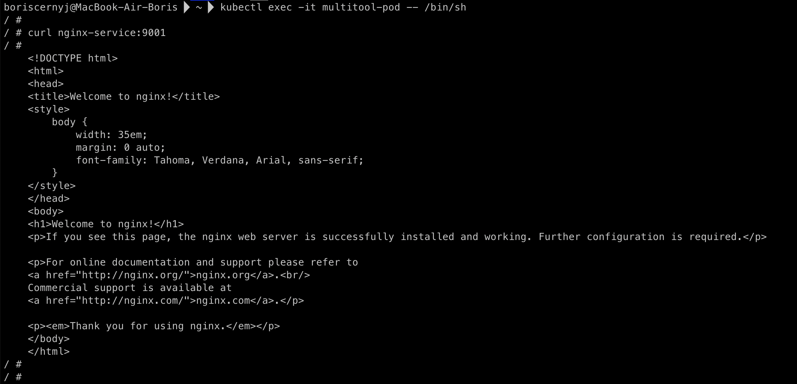
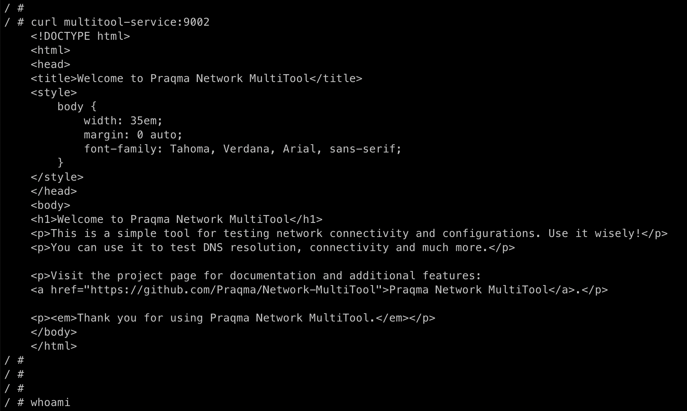
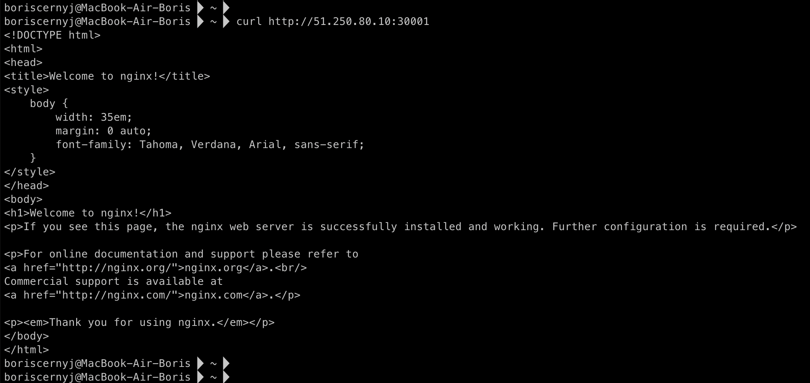

## Домашняя работа

#### Задание 1. Создать Deployment и обеспечить доступ к контейнерам приложения по разным портам из другого Pod внутри кластера

1) Создать Deployment приложения, состоящего из двух контейнеров (nginx и multitool), с количеством реплик 3 шт.
2) Создать Service, который обеспечит доступ внутри кластера до контейнеров приложения из п.1 по порту 9001 — nginx 80, по 9002 — multitool 8080.
3) Создать отдельный Pod с приложением multitool и убедиться с помощью curl, что из пода есть доступ до приложения из п.1 по разным портам в разные контейнеры.
4) Продемонстрировать доступ с помощью curl по доменному имени сервиса.
5) Предоставить манифесты Deployment и Service в решении, а также скриншоты или вывод команды п.4.

#### Задание 2. Создать Service и обеспечить доступ к приложениям снаружи кластера

1) Создать отдельный Service приложения из Задания 1 с возможностью доступа снаружи кластера к nginx, используя тип NodePort.
2) Продемонстрировать доступ с помощью браузера или curl с локального компьютера.
3) Предоставить манифест и Service в решении, а также скриншоты или вывод команды п.2.

#### Ответ

#### Задание 1

1) Создал Deployment с названием *multi-app*, в котором будет два контейнера: *nginx* и *multitool*. В каждом поде будет два контейнера, и количество реплик будет 3:

Deployment описал в файле `deployment.yaml`:

```
apiVersion: apps/v1
kind: Deployment
metadata:
  name: multi-app
spec:
  replicas: 3
  selector:
    matchLabels:
      app: multi-app
  template:
    metadata:
      labels:
        app: multi-app
    spec:
      containers:
      - name: nginx
        image: nginx:latest
        ports:
        - containerPort: 80
      - name: multitool
        image: praqma/network-multitool:alpine-extra
        ports:
        - containerPort: 8080
```

2) Создал два Service для доступа к контейнерам, где:

- Один для доступа к *nginx* на порту **80** через порт **9001**.
- Второй для доступа к *multitool* на порту **8080** через порт **9002**.

Для этого создал манифест-файл `services.yaml`:

```
apiVersion: v1
kind: Service
metadata:
  name: nginx-service
spec:
  selector:
    app: multi-app
  ports:
    - protocol: TCP
      port: 9001
      targetPort: 80

---
apiVersion: v1
kind: Service
metadata:
  name: multitool-service
spec:
  selector:
    app: multi-app
  ports:
    - protocol: TCP
      port: 9002
      targetPort: 8080
```

3) Создал отдельный Pod с названием *multitool-pod*, чтобы из него протестировать доступность приложений.

Для этого создал файл `multitool-pod.yaml`:

```
apiVersion: v1
kind: Pod
metadata:
  name: multitool-pod
spec:
  containers:
  - name: multitool
    image: praqma/network-multitool:alpine-extra
    command: ["/bin/sh", "-c", "sleep 3600"]
```

В нём дополнительно прописал команду:

`/bin/sh -c sleep 3600`

Она используется для того, чтобы Pod с *multitool* просто "спал" 3600 секунд (1 час), вместо выполнения каких-то действий сразу. Это позволяет подключиться к этому Pod и выполнять команды вручную - а именно *curl*.

4) Продемонстрировать доступ с помощью curl

После создания всех ресурсов нужно выполнить проверки внутри *multitool-pod*. Для этого я подключился к этому поду и выполнил команду `curl` для проверки доступа:

Nginx:


Multitool:


5) Итоговая структура файлов:

1. `deployment.yaml` для создания Deployment.
2. `services.yaml` для создания Service.
3. `multitool-pod.yaml` для создания Pod с multitool.

Скриншоты п.4 предоставлены в п.4 выше.

#### Задание 2

1) Создал Service с типом NodePort.

Это позволит получить доступ через выбранный порт на узле Kubernetes снаружи кластера.

Манифест-файл `nodeport-service.yaml`:

```
apiVersion: v1
kind: Service
metadata:
  name: nginx-nodeport
spec:
  type: NodePort
  selector:
    app: multi-app
  ports:
  - protocol: TCP
    port: 80
    targetPort: 80
    nodePort: 30001
```

2) Доступ к приложению из терминала с помощью `curl`:



3) Итого добавил новый манифест-файл в общую структуру с другими манифест-файлами.

1. `nodeport-service.yaml` для внешнего NodePort Service.

Скриншоты вывода команды `curl` предоставлены в п.2

### Итоговые манифесты

Вот все манифесты, в том числе новый для NodePort:

1. `deployment.yaml` для Deployment.
2. `services.yaml` для внутренних Service.
3. `multitool-pod.yaml` для Pod с multitool.
4. `nodeport-service.yaml` для внешнего NodePort Service.

Все эти файлы предоставлены в директории `manifests`.
