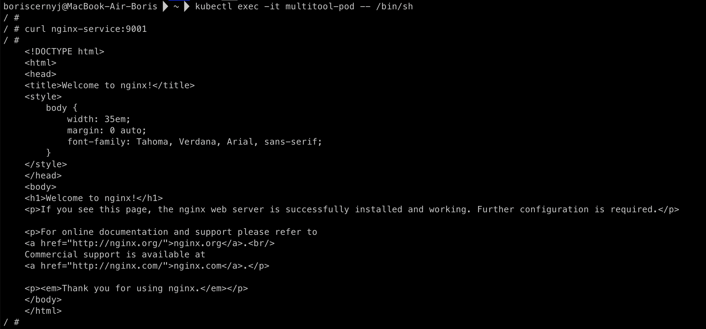

## Домашняя работа

#### Задание 1. Создать Deployment приложений backend и frontend

1) Создать Deployment приложения frontend из образа nginx с количеством реплик 3 шт.
2) Создать Deployment приложения backend из образа multitool.
3) Добавить Service, которые обеспечат доступ к обоим приложениям внутри кластера.
4) Продемонстрировать, что приложения видят друг друга с помощью Service.
5) Предоставить манифесты Deployment и Service в решении, а также скриншоты или вывод команды п.4.

#### Задание 2. Создать Ingress и обеспечить доступ к приложениям снаружи кластера

1) Включить Ingress-controller в MicroK8S.
2) Создать Ingress, обеспечивающий доступ снаружи по IP-адресу кластера MicroK8S так, чтобы при запросе только по адресу открывался frontend а при добавлении /api - backend.
3) Продемонстрировать доступ с помощью браузера или curl с локального компьютера.
4) Предоставить манифесты и скриншоты или вывод команды п.2.

#### Ответ

#### Задание 1

1) Создал манифест файл `frontend.yaml` для deployment ***frontend*** приложения, взяв образ nginx и установив количество реплик в размере 3 штук.

Манифест для Deployment:

```
apiVersion: apps/v1
kind: Deployment
metadata:
  name: frontend
spec:
  replicas: 3
  selector:
    matchLabels:
      app: frontend
  template:
    metadata:
      labels:
        app: frontend
    spec:
      containers:
        - name: nginx
          image: nginx:latest
          ports:
            - containerPort: 80
```

2) Создал deployment для ***backend*** приложения, описал его в файле `backend.yaml`, указав образ multitool.

Манифест файл:

```
apiVersion: apps/v1
kind: Deployment
metadata:
  name: backend
spec:
  replicas: 1
  selector:
    matchLabels:
      app: backend
  template:
    metadata:
      labels:
        app: backend
    spec:
      containers:
        - name: multitool
          image: wbitt/network-multitool:latest
          ports:
            - containerPort: 80
```

3) Добавил Service, которые обеспечивают доступ к обоим приложениям внутри моего кластера.
Для этого написал 2 манифест-файла для каждого приложения.

Frontend Service:

```
apiVersion: v1
kind: Service
metadata:
  name: frontend-service
spec:
  selector:
    app: frontend
  ports:
    - protocol: TCP
      port: 80
      targetPort: 80
```

Backend Service:

```
apiVersion: v1
kind: Service
metadata:
  name: backend-service
spec:
  selector:
    app: backend
  ports:
    - protocol: TCP
      port: 80
      targetPort: 80
```

4) Приложения Nginx и Multitool видят друг друга:

Вывод для `curl nginx`



Вывод для `curl multitool`


5) Предоставил манифесты Deployment и Service в решении, скриншоты команды из п.4 показаны выше.

#### Задание 2

1) Включил Ingress-controller в MicroK8S используя команду:

`microk8s enable ingress`

2) Создал Ingress, обеспечивающий доступ снаружи по IP-адресу кластера MicroK8S согласно условиям: при запросе только по адресу открывался frontend а при добавлении /api - backend.
Данный функционал реализован благодаря path и apthType в манифест файле:

```
- path: /api
  pathType: Prefix
```

Полный манифест файл `ingress.yaml`:

```
apiVersion: networking.k8s.io/v1
kind: Ingress
metadata:
  name: example-ingress
spec:
  rules:
  - host: 51.250.80.10
    http:
      paths:
      - path: /
        pathType: Prefix
        backend:
          service:
            name: frontend-service
            port:
              number: 80
      - path: /api
        pathType: Prefix
        backend:
          service:
            name: backend-service
            port:
              number: 80
```

3) Продемонстрировать доступ.
Для тестирования можно использовать `curl` для запросов к IP-адресу кластера, а именно:

`curl http://51.250.80.10` - для frontend


`curl http://51.250.80.10/api` - для backend


4) Предоставил манифесты и скриншоты команды из п.2 выше.

### Итоговые манифесты


Все эти файлы предоставлены в директории `manifests`.
