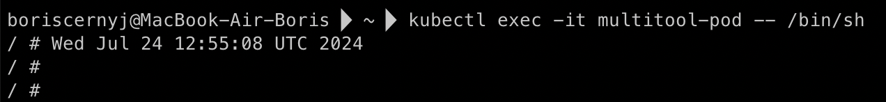
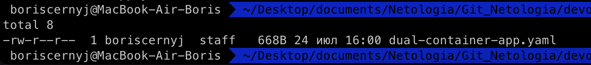
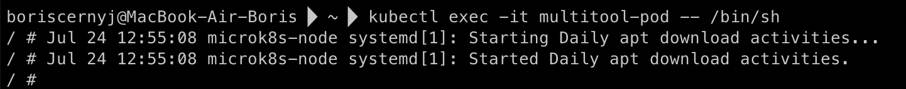
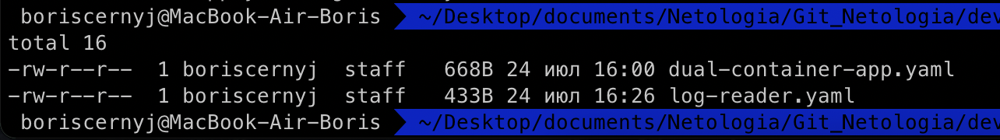

## Домашняя работа

#### Задание 1. Создать Deployment приложения, состоящего из двух контейнеров и обменивающихся данными

1) Создать Deployment приложения, состоящего из контейнеров busybox и multitool.
2) Сделать так, чтобы busybox писал каждые пять секунд в некий файл в общей директории.
3) Обеспечить возможность чтения файла контейнером multitool.
4) Продемонстрировать, что multitool может читать файл, который периодоически обновляется.
5) Предоставить манифесты Deployment в решении, а также скриншоты или вывод команды из п. 4.

#### Задание 2. Создать DaemonSet приложения, которое может прочитать логи ноды

1) Создать DaemonSet приложения, состоящего из multitool.
2) Обеспечить возможность чтения файла /var/log/syslog кластера MicroK8S.
3) Продемонстрировать возможность чтения файла изнутри пода.
4) Предоставить манифесты Deployment, а также скриншоты или вывод команды из п. 2.

#### Ответ

#### Задание 1

1) Создал Deployment с двумя контейнерами: busybox и multitool.

```
apiVersion: apps/v1
kind: Deployment
metadata:
  name: dual-container-app
spec:
  replicas: 1
  selector:
    matchLabels:
      app: dual-container
  template:
    metadata:
      labels:
        app: dual-container
    spec:
      volumes:
      - name: shared-data
        emptyDir: {}
      containers:
      - name: busybox
        image: busybox
        command: ["sh", "-c", "while true; do echo $(date) > /shared/data.txt; sleep 5; done"]
        volumeMounts:
        - name: shared-data
          mountPath: /shared
      - name: multitool
        image: wbitt/network-multitool
        volumeMounts:
        - name: shared-data
          mountPath: /shared
```

Этот манифест создаёт Deployment с именем `dual-container-app`, который развертывает один под с двумя контейнерами: **busybox** и **multitool**. Контейнер busybox каждые пять секунд пишет текущую дату в файл ***/shared/data.txt***, а контейнер multitool монтирует ту же директорию и может читать этот файл.


2) Сделал так, чтобы busybox писал каждые пять секунд в некий файл в общей директории.

В манифесте выше контейнер busybox использует команду:

`while true; do echo $(date) > /shared/data.txt; sleep 5; done`

Эта команда записывает текущую дату в файл ***/shared/data.txt*** каждые пять секунд.

3) Обеспечить возможность чтения файла контейнером multitool.

Контейнер multitool монтирует ту же директорию ***/shared***, что и busybox, поэтому он получает доступ для чтения этого файла.

4) Продемонстрировать, что multitool может читать файл, который периодически обновляется.

Использововал команду **kubectl exec**, чтобы выполнить команду из контейнера multitool и показать содержимое файла:



5) Текущие манифесты Deployment предоставлены в директории `manifests`:



Скриншоты вывода команды предоставлены в пункте 4.

#### Задание 2

1. Создал DaemonSet приложения, состоящего из **multitool**.

```
apiVersion: apps/v1
kind: DaemonSet
metadata:
  name: log-reader
spec:
  selector:
    matchLabels:
      app: log-reader
  template:
    metadata:
      labels:
        app: log-reader
    spec:
      containers:
      - name: multitool
        image: wbitt/network-multitool
        volumeMounts:
        - name: log-vol
          mountPath: /mnt/log
      volumes:
      - name: log-vol
        hostPath:
          path: /var/log
```

2) Обеспечить возможность чтения файла ***/var/log/syslog*** кластера MicroK8S.

В манифесте выше контейнеры внутри DaemonSet монтируют директорию ***/var/log*** хоста в директорию ***/mnt/log*** контейнера. Таким образом, multitool получает доступ к файлу ***/var/log/syslog***.

3) Продемонстрировать возможность чтения файла изнутри пода.

Команда для выполнения из контейнера multitool внутри DaemonSet:

`kubectl exec -it <pod-name> -- cat /mnt/log/syslog`



4) Манифесты Deployment:



Скриншоты вывода команды пункта 2 предоставлены в пункте 3.

### Итоговые манифесты

`-rw-r--r--  1 boriscernyj  staff   668B 24 июл 16:00 dual-container-app.yaml` - Deployment с двумя контейнерами: busybox и multitool.
`-rw-r--r--  1 boriscernyj  staff   433B 24 июл 16:26 log-reader.yaml` - DaemonSet приложения, состоящего из multitool.

Все эти файлы предоставлены в директории `manifests`.
