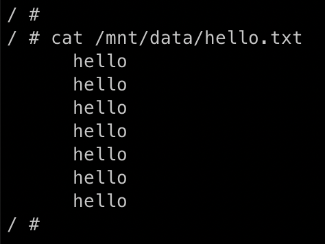
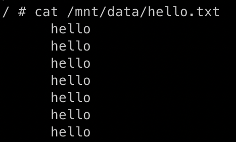

## Домашняя работа

#### Задание 1. Создать Deployment приложения, использующего локальный PV, созданный вручную

1) Создать Deployment приложения, состоящего из контейнеров busybox и multitool.
2) Создать PV и PVC для подключения папки на локальной ноде, которая будет использована в поде.
3) Продемонстрировать, что multitool может читать файл, в который busybox пишет каждые пять секунд в общей директории.
4) Удалить Deployment и PVC. Продемонстрировать, что после этого произошло с PV. Пояснить, почему.
5) Продемонстрировать, что файл сохранился на локальном диске ноды. Удалить PV. Продемонстрировать что произошло с файлом после удаления PV. Пояснить, почему.
6) Предоставить манифесты, а также скриншоты или вывод необходимых команд.

#### Задание 2. Создать Deployment приложения, которое может хранить файлы на NFS с динамическим созданием PV

1) Включить и настроить NFS-сервер на MicroK8S.
2) Создать Deployment приложения состоящего из multitool, и подключить к нему PV, созданный автоматически на сервере NFS.
3) Продемонстрировать возможность чтения и записи файла изнутри пода.
4) Предоставить манифесты, а также скриншоты или вывод необходимых команд.

#### Ответ

#### Задание 1

1) Создал Deployment приложения, состоящего из контейнеров **busybox** и **multitool**.

Для этого создал файл `deployment.yaml` с описанием деплоя:


2) Создал PV и PVC для подключения папки на локальной ноде, которая будет использована в поде.

Создал файлы `pv.yaml` и `pvc.yaml` для **Persistent Volume** и **Persistent Volume Claim**:

Файл `pv.yaml`


Файл `pvc.yaml`


3) Для того, чтобы продемонстрировать, что **multitool** может читать файл, в который **busybox** пишет каждые пять секунд в общей директории:

Можно зайти в контейнер **multitool** с помощью команды `kubectl exec` и там прочитать файл

```
kubectl exec -it $(kubectl get pod -l app=busy-multi-app -o jsonpath="{.items[0].metadata.name}") -c multitool -- /bin/sh
cat /data/hello.txt
```

В данном случае файл называется `/data/hello.txt`.

Здесь также передаётся другая команда как аргумент:

`kubectl get pod -l app=busy-multi-app -o jsonpath="{.items[0].metadata.name}"`

Файл `hello.txt` содержит строки, которые записываются контейнером **busybox** каждые пять секунд. Так как контейнер **busybox** выполняет команду `echo 'hello' >> /data/hello.txt` в бесконечном цикле, вывод выглядит так:


4) Удалил Deployment и PVC:

`kubectl delete deployment busy-multi-deployment`
`kubectl delete pvc my-local-pvc`

Посмотрел статус PV с помощью команды:

`kubectl get pv local-pv`

Здесь можно увидеть, что PV переходит в состояние **Released**, т.к. он больше не привязан к PVC. Файлы на PV остаются, так как PV сам по себе не удаляется автоматически.


5) Продемонстрировать, что файл сохранился на локальном диске ноды. Удалить PV. Продемонстрировать что произошло с файлом после удаления PV. Пояснить, почему.

Отправляемся на локальную ноду, и проверяем содержимое директории:

`cat /mnt/data/hello.txt`



Файлы все ещё на месте. Удаляем PV:

`kubectl delete pv local-pv`

Проверяем содержимое директории снова. Данные все еще на диске, так как удаление PV не удаляет данные на хосте.
**PV всего лишь метаданные, описывающие ресурс.**



6) Список всех созданных манифестов в **Задании 1**:

- deployment.yaml
- pv.yaml
- pvc.yaml

#### Задание 2

1) Включить и настроить NFS-сервер на MicroK8S.

Для этого вам нужно установить NFS-сервер на вашей ноде и настроить соответствующую директорию. Вот пример настройки:

Для этого использлвад следующие команды на ноде:

```
sudo apt-get update
sudo apt-get install -y nfs-kernel-server
sudo mkdir -p /srv/nfs/kubedata
sudo chown nobody:nogroup /srv/nfs/kubedata
sudo chmod 777 /srv/nfs/kubedata
echo "/srv/nfs/kubedata *(rw,sync,no_subtree_check,no_root_squash)" | sudo tee -a /etc/exports
sudo exportfs -a
sudo systemctl restart nfs-kernel-server
```

Также необходимо установить NFS provisioner для Kubernetes:

```
helm repo add nfs-subdir-external-provisioner https://kubernetes-sigs.github.io/nfs-subdir-external-provisioner/
helm install nfs-provisioner nfs-subdir-external-provisioner/nfs-subdir-external-provisioner --set nfs.server=51.250.80.10 --set nfs.path=/srv/nfs/kubedata
```

2) Создал Deployment приложения состоящего из multitool, и подключил к нему PV, созданный автоматически на сервере NFS.

Для этого создал файл `deployment-nfs.yaml` с описанием деплоя:


где `nfs-client` - имя класса хранения, который создается провиженером.

Далее применил манифесты:

`kubectl apply -f deployment-nfs.yaml`

3) Продемонстрировать возможность чтения и записи файла изнутри пода.

Проверяем запись и чтение данных командой:

`kubectl exec -it $(kubectl get pod -l app=nfs-multitool-app -o jsonpath="{.items[0].metadata.name}") -- /bin/sh
cat /data/hello.txt`


Здесь мы видим строки, добавленные контейнером **multitool**.

4) Cписок всех созданных манифестов в **Задании 2**:

- deployment-nfs.yaml

### Итоговые манифесты

Все эти файлы предоставлены в директории `manifests`.


