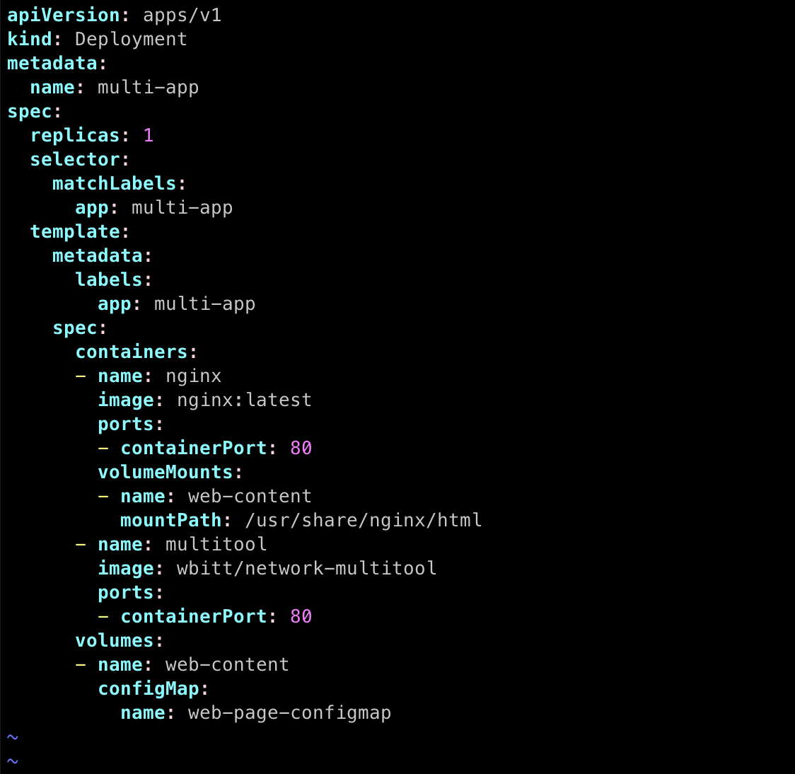
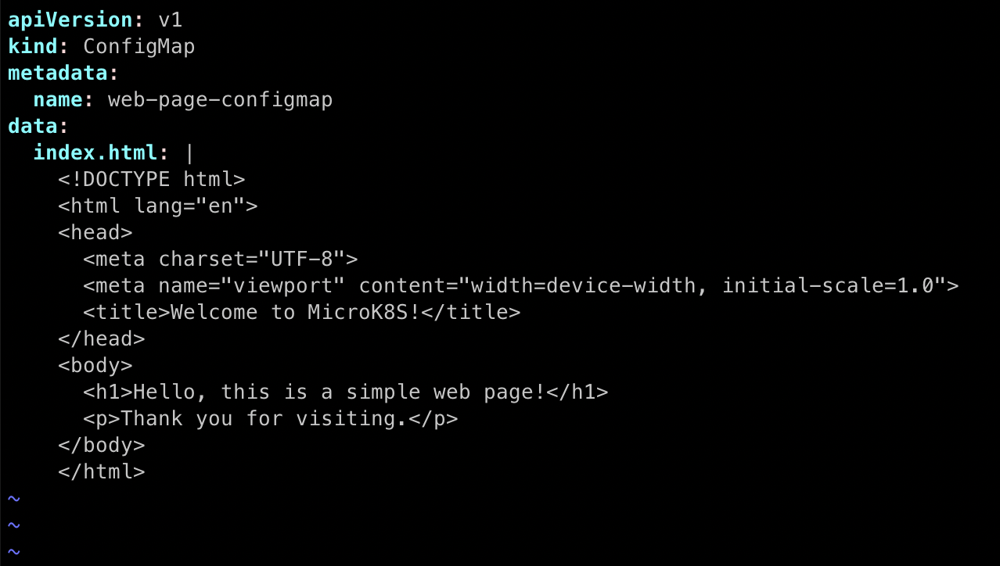
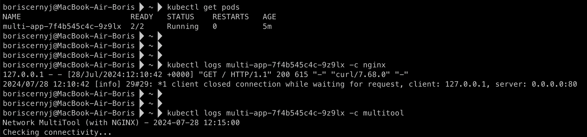
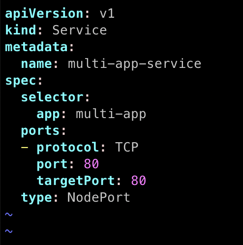
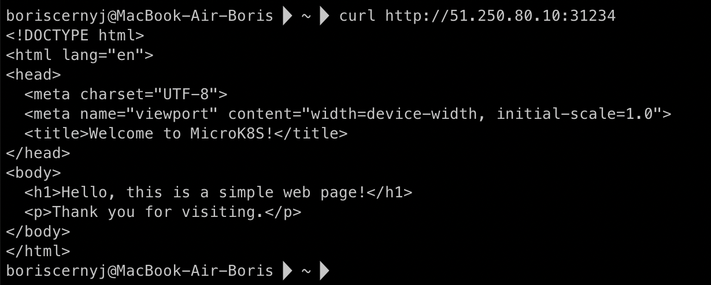
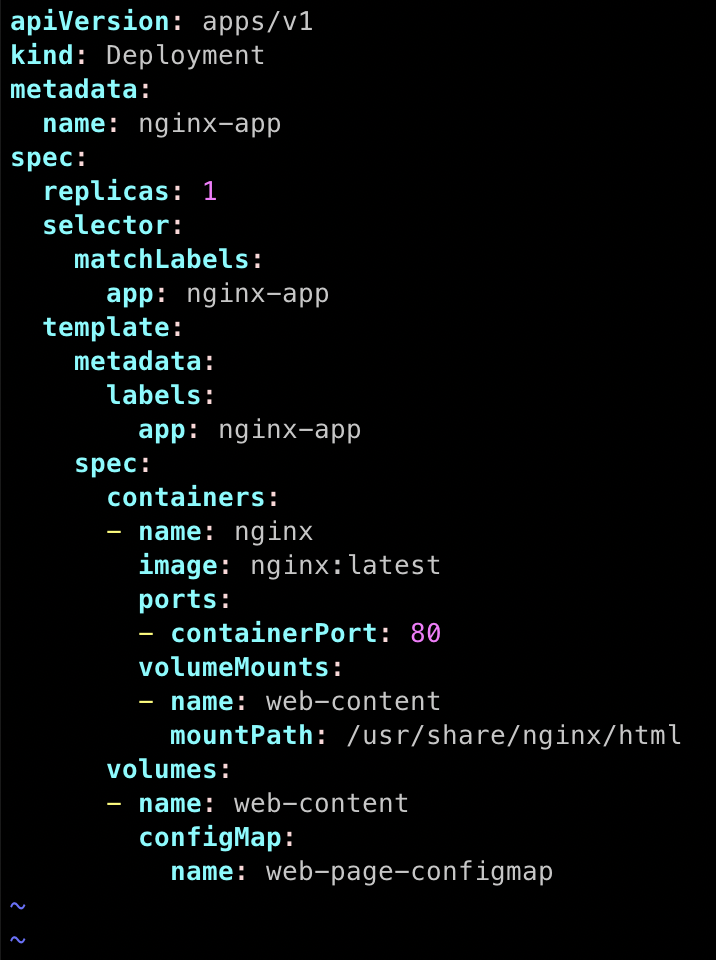
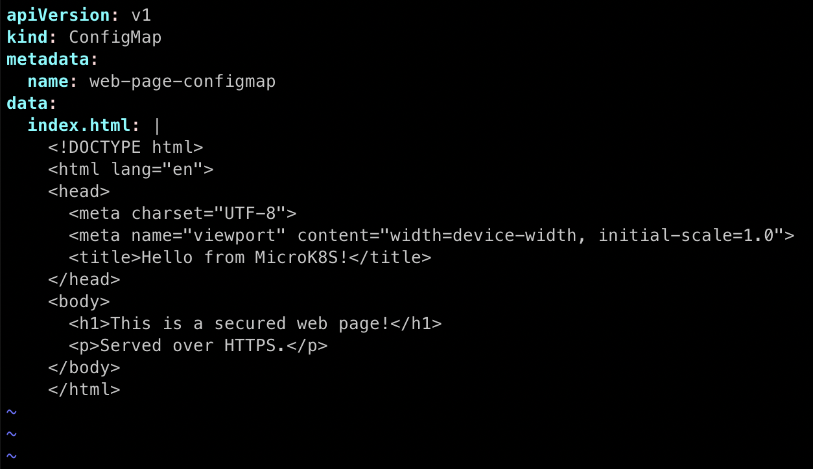
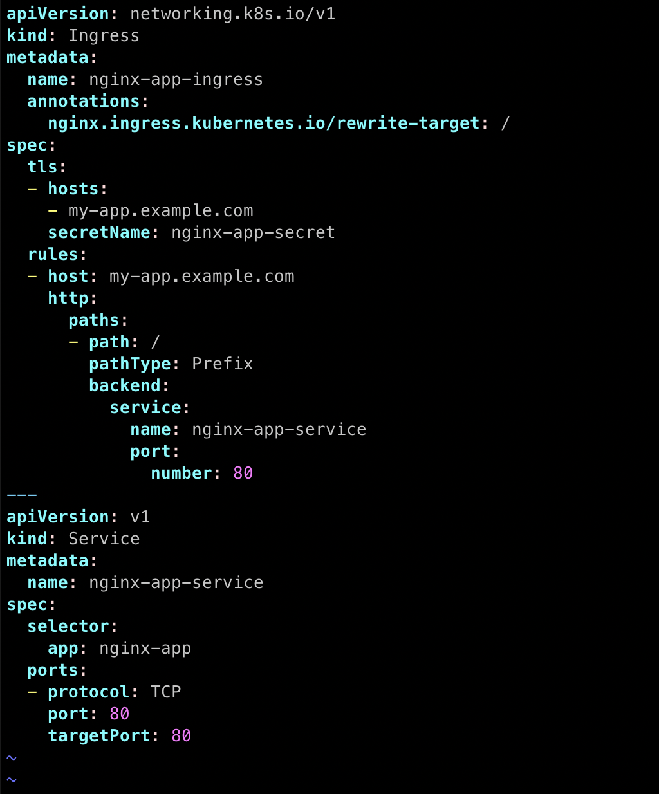
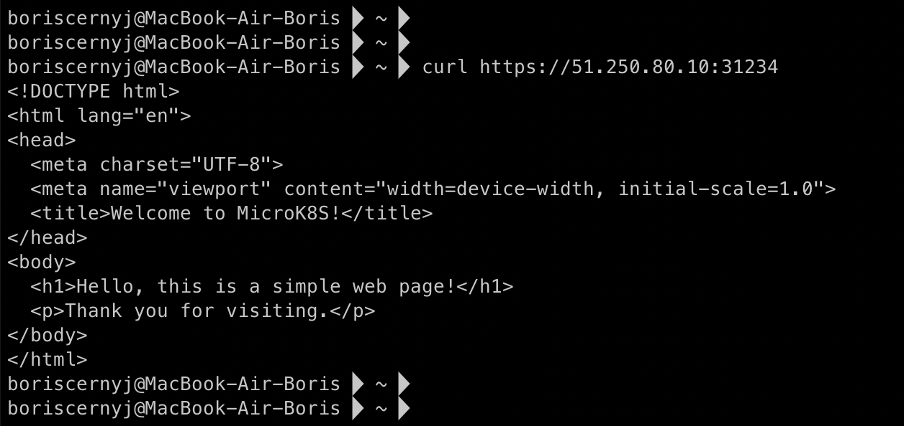
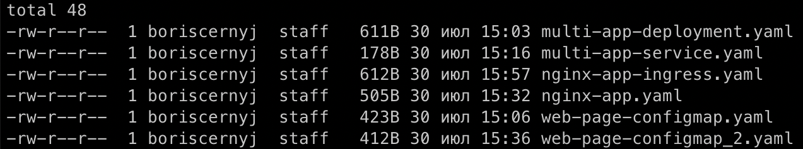

## Домашняя работа

#### Задание 1. Создать Deployment приложения и решить возникшую проблему с помощью ConfigMap. Добавить веб-страницу

1) Создать Deployment приложения, состоящего из контейнеров nginx и multitool.
2) Решить возникшую проблему с помощью ConfigMap.
3) Продемонстрировать, что pod стартовал и оба конейнера работают.
4) Сделать простую веб-страницу и подключить её к Nginx с помощью ConfigMap. Подключить Service и показать вывод curl или в браузере.
5) Предоставить манифесты, а также скриншоты или вывод необходимых команд.

#### Задание 2. Создать приложение с вашей веб-страницей, доступной по HTTPS

1) Создать Deployment приложения, состоящего из Nginx.
2) Создать собственную веб-страницу и подключить её как ConfigMap к приложению.
3) Выпустить самоподписной сертификат SSL. Создать Secret для использования сертификата.
4) Создать Ingress и необходимый Service, подключить к нему SSL в вид. Продемонстировать доступ к приложению по HTTPS.
5) Предоставить манифесты, а также скриншоты или вывод необходимых команд.

#### Ответ

#### Задание 1

1) Создал Deployment приложения:

Для этого создал файл `multi-app-deployment.yaml` с описанием деплоя:



2) Для решения проблемы создал **ConfigMap** веб-странице:



3) Pod стартовал, оба контейнера работают.

Команды для проверки:

**Смотрим список Pod'ов**
`kubectl get pods`

**Смотрим логи Pod'а для подтверждения запуска контейнеров**
`kubectl logs multi-app-7f4b545c4c-9z9lx -c nginx`
`kubectl logs multi-app-7f4b545c4c-9z9lx -c multitool`

**Скриншот с выводами команд:**



4) Подключил веб-страницу к `Nginx` с помощью ConfigMap, для этого создал Service:



Вывод **curl**:



5) Созданные для Задания 1 манифесты:

1. `multi-app-deployment.yaml`
2. `web-page-configmap.yaml`
3. `multi-app-service.yaml`

#### Задание 2

1) Создатл Deployment приложения, состоящего из `Nginx`.

Манифест `nginx-app.yaml`:



2) Создал ConfigMap для веб-страницы.

Манифест `web-page-configmap_2.png`:



3) Выпустил самоподписной сертификат, создал Secret.

Выпуск сертификата:

```
openssl req -x509 -nodes -days 365 -newkey rsa:2048
  -keyout tls.key -out tls.crt -subj "/CN=nginx-app/O=nginx-app"
```

Создание Secret:

```
kubectl create secret tls nginx-app-secret --cert=tls.crt --key=tls.key
```

4) Создал Ingress и Service для SSL.

Для этого создал манифест файл `nginx-app-ingress.png`:



Выполнил команду `curl`, но уже по `https` протоколу:



5) Созданные для Задания 2 манифесты:

1. `nginx-app-ingress.yaml`
2. `nginx-app.yaml`
3. `web-page-configmap_2.yaml`

### Итоговые манифесты

Все эти файлы предоставлены в директории `manifests`.


