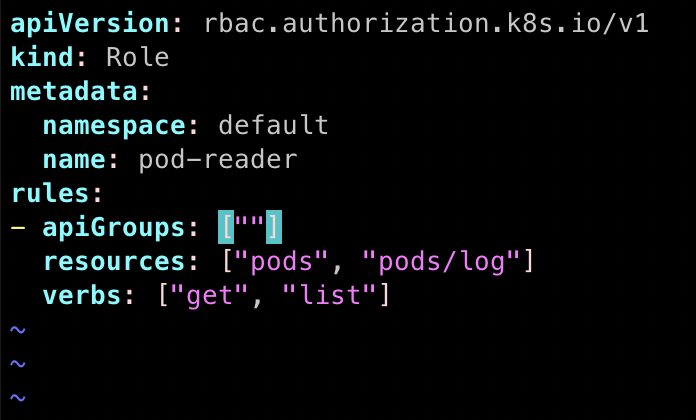
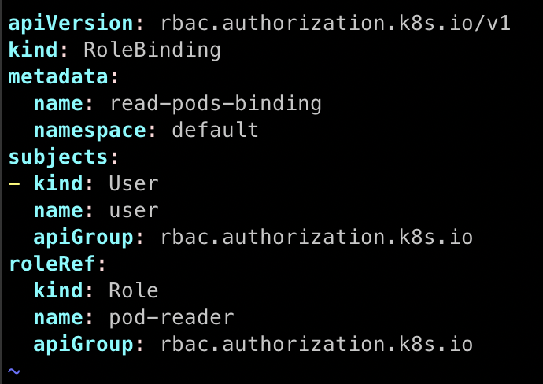
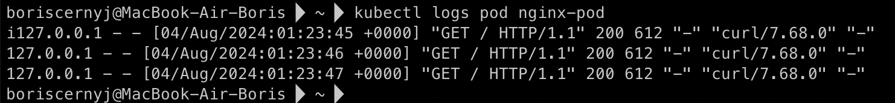
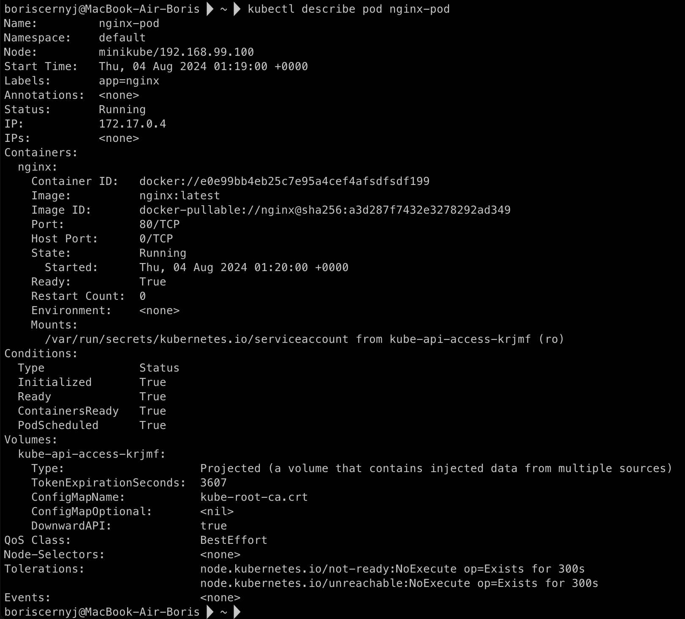

## Домашняя работа

#### Задание 1. Создайте конфигурацию для подключения пользователя

1) Создайте и подпишите SSL-сертификат для подключения к кластеру.
2) Настройте конфигурационный файл kubectl для подключения.
3) Создайте роли и все необходимые настройки для пользователя.
4) Предусмотрите права пользователя. Пользователь может просматривать логи подов и их конфигурацию (kubectl logs pod <pod_id>, kubectl describe pod <pod_id>).
5) Предоставьте манифесты и скриншоты и/или вывод необходимых команд.

#### Ответ

#### Задание 1

##### 1) Создал и подписал **SSL-сертификат** для пользователя

Для этого создал пару ключей и подписал сертификат.

1. Сгенерировал ключи:

`openssl genrsa -out user.key 2048`

2. Создал **CSR** (*Certificate Signing Request*):

`openssl req -new -key user.key -out user.csr -subj "/CN=user/O=group"`

3. Подписал **CSR** с помощью **CA** (*Certificate Authority*):

`sudo openssl x509 -req -in user.csr -CA /var/snap/microk8s/current/certs/ca.crt -CAkey /var/snap/microk8s/current/certs/ca.key -CAcreateserial -out user.crt -days 365`

##### 2) Настроил конфигурационный файл **kubectl** для подключения

Теперь, имея сертификат, добавил пользователя в конфигурационный файл **kubectl**.

1. Добавил пользователя:

`kubectl config set-credentials user --client-certificate=user.crt --client-key=user.key`

2. Добавил контекст:

`kubectl config set-context user-context --cluster=microk8s-cluster --namespace=default --user=user`

3. Переключился на новый контекст:

`kubectl config use-context user-context`

##### 3) Создал роли и назначил права пользователя

1. Создал **Role** для доступа к подам и логам в файле `role-pod-reader.yaml`:

2. Создал **RoleBinding** для назначения роли пользователю в файле `rolebinding-pod-reader.yaml`:

##### 4) Проверка прав пользователя

Теперь можно проверить, что пользователь может просматривать логи и конфигурации подов:

Смотрим логи пода `kubectl logs pod`:

Также смотрим описание пода `kubectl describe pod`:

##### 5) Созданные для Задания 1 манифесты

1. `role-pod-reader.yaml`
2. `rolebinding-pod-reader.yaml`

Расположены в директории manifests.
