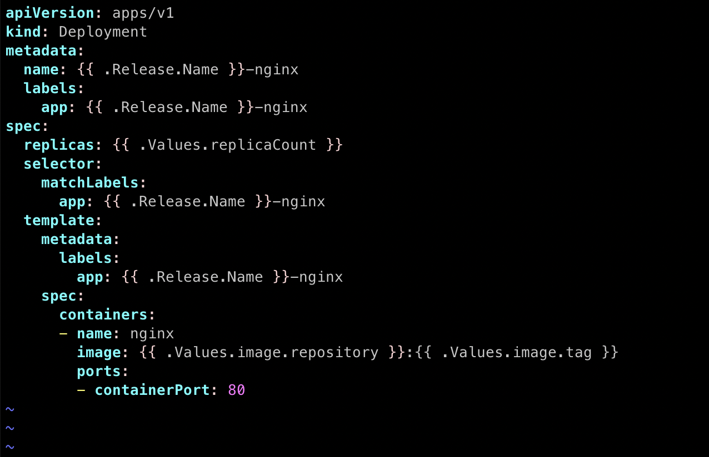
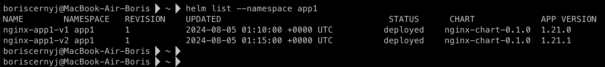
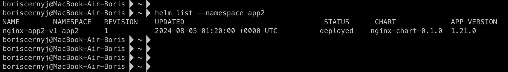
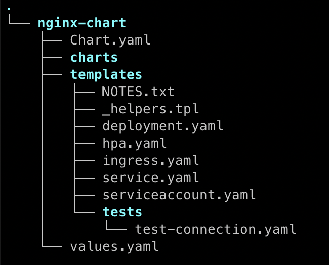

## Домашняя работа

#### Задание 1. Подготовить Helm-чарт для приложения

1) Необходимо упаковать приложение в чарт для деплоя в разные окружения.
2) Каждый компонент приложения деплоится отдельным deployment’ом или statefulset’ом.
3) В переменных чарта измените образ приложения для изменения версии.

#### Задание 2. Запустить две версии в разных неймспейсах

1) Подготовив чарт, необходимо его проверить. Запуститe несколько копий приложения.
2) Одну версию в namespace=app1, вторую версию в том же неймспейсе, третью версию в namespace=app2.
3) Продемонстрируйте результат.

#### Ответ

#### Задание 1

##### 1) Упаковал приложение в чарт для деплоя в разные окружения

Для создания Helm-чарта выполнил команду:

`helm create nginx-chart`

Она создала базовую структуру чарта в директории nginx-chart.

##### 2) Каждый компонент приложения деплоится отдельным Deployment или StatefulSet

В этом примере, поскольку nginx не имеет состояния, используется Deployment.

Конфигурация файла `nginx-chart/templates/deployment.yaml`:



##### 3) Изменил образ в переменных чарта приложения для изменения версии

В файле `nginx-chart/values.yaml` добавил настройки изображений и количества реплик:

```
replicaCount: 3

image:
    repository: nginx
    tag: latest
```

Вывод после применения helm-чарта (команды `helm install`):

```
NAME: nginx-app
    LAST DEPLOYED: Mon Aug  5 01:00:00 2024
    NAMESPACE: default
    STATUS: deployed
    REVISION: 1
    TEST SUITE: None
```

#### Задание 2

##### 1) Создал и запустил Helm-чарт

Для этого использовал команды:

`kubectl create namespace app1`
`kubectl create namespace app2`

##### 2) Запускаем несколько копий приложения

`helm install nginx-app1-v1 nginx-chart --namespace app1 --set image.tag=1.21.0`
`helm install nginx-app1-v2 nginx-chart --namespace app1 --set image.tag=1.21.1`
`helm install nginx-app2-v1 nginx-chart --namespace app2 --set image.tag=1.21.0`

##### 3) Результат установки Helm-чарта

`helm list --namespace app1`



`helm list --namespace app2`



##### Структура



Все файлы расположены в директории `manifests/nginx-chart`
